# EDS Database - Entity Relationship Diagram

Generated: 2026-01-09 11:57:45

Tables shown: 197 (with >= 1,000 rows)

---

## Tables Included

| Table | Rows | Primary Key |
|-------|------|-------------|
| OrderBookDetailOld | 187,630,151 | OrderBookDetailId |
| CrossRefs | 150,631,340 | CrossRefId |
| BidHeaderDetail | 123,789,710 | BidHeaderDetailId |
| BidHeaderDetail_Orig | 102,658,927 | BidHeaderDetailId |
| TransactionLog_HISTORY | 99,019,937 | SysId |
| BidResults_Orig | 55,592,743 | BidResultsId |
| ReportSessionLinks | 51,991,209 | RSLId |
| OrderBookDetail | 37,804,007 | OrderBookDetailId |
| TransactionLogCF | 33,703,467 | SysId |
| BidResults | 33,034,634 | BidResultsId |
| Detail | 30,842,286 | DetailId |
| Items | 30,153,956 | ItemId |
| BidRequestItems | 27,855,481 | BidRequestItemId |
| BidItems | 26,906,489 | BidItemId |
| DetailChanges | 26,502,061 | DetailChangeId |
| BidRequestItems_Orig | 25,521,585 | BidRequestItemId |
| PODetailItems | 24,327,549 | PODetailItemId |
| DebugMsgs | 20,848,697 | SysId |
| BidResultChanges | 18,229,521 | BRChangeId |
| CatalogTextParts | 17,179,537 | CatalogTextPartId |
| BidItems_Old | 16,238,384 | BidItemId |
| SessionTable | 12,395,973 | SessionId |
| Approvals | 7,825,030 | ApprovalId |
| allitems | 6,276,768 | *None* |
| ReportSession | 5,282,696 | RSId |
| DebugMsgs_Orig | 5,211,696 | sysid |
| BatchDetail | 5,020,036 | BatchDetailId |
| BidMgrTagFile | 4,338,798 | BidMgrTagFileId |
| UserAccounts | 3,329,159 | UserAccountId |
| DetailChangeLog | 2,924,942 | DetailChangeId |
| DetailNotifications | 2,779,169 | DetailNotificationId |
| Audit | 2,568,656 | AuditId |
| PO | 2,462,030 | POId |
| Requisitions | 2,078,556 | RequisitionId |
| RequisitionChangeLog | 1,938,491 | RequisitionChangeId |
| BidRequestPriceRanges | 1,897,760 | BidRequestPriceRangeId |
| ImageLog | 1,788,706 | imageLogId |
| Images | 1,736,177 | imageId |
| TaskSchedule | 1,544,400 | TaskScheduleId |
| VendorUploads | 1,533,266 | UploadId |
| BidMappedItems | 1,456,772 | BidMappedItemId |
| EmailBlastLog | 1,437,244 | EmailBlastLogId |
| BudgetAccounts | 1,399,990 | BudgetAccountId |
| BidProductLinePrices | 1,323,391 | BidProductLinePriceId |
| BidAnswersJournal | 1,253,422 | BidAnswerJournalId |
| RTK_ReportItems | 1,006,140 | RTK_ReportItemsId |
| ImportDetail | 882,935 | ImportDetailId |
| DMSVendorBidDocuments | 736,489 | Id |
| PendingApprovals | 567,122 | SysId |
| BidAnswers | 546,401 | BidAnswerId |

*...and 147 more tables*

---

## Core Tables ERD

```mermaid
erDiagram
    OrderBookDetailOld {
        int OrderBookDetailId PK
        int OrderBookId
        tinyint Active
        int ItemId
        int BidItemId
        int Weight
    }
    CrossRefs {
        int CrossRefId PK
        int CrossRefId_Old
        tinyint Active
        int ItemId
        varchar VendorItemCode
        int CatalogId
    }
    BidHeaderDetail {
        int BidHeaderDetailId PK
        int BidHeaderId
        int DetailId
        int BidRequestItemId
        int Quantity
        datetime DateAdded
    }
    BidHeaderDetail_Orig {
        int BidHeaderDetailId PK
        int BidHeaderId
        int DetailId
        int BidRequestItemId
        int Quantity
        datetime DateAdded
    }
    TransactionLog_HISTORY {
        int SysId PK
        datetime2 RequestStart "NOT NULL"
        datetime2 RequestEnd
        varchar SessionId
        varchar TargetServer
        varchar URL
    }
    BidResults_Orig {
        int BidResultsId PK
        int BidImportId
        int BidHeaderId
        int BidRequestItemId
        int CategoryId
        int DistrictId
    }
    ReportSessionLinks {
        int RSLId PK
        int RSId
        int IntId
        int AuxId
    }
    OrderBookDetail {
        int OrderBookDetailId PK
        int OrderBookId
        tinyint Active
        int ItemId
        int BidItemId
        int Weight
    }
    TransactionLogCF {
        int SysId PK
        datetime2 RequestStart
        datetime2 RequestEnd
        varchar SessionId
        varchar TargetServer
        varchar URL
    }
    BidResults {
        int BidResultsId PK
        int BidImportId
        int BidHeaderId
        int BidRequestItemId
        int CategoryId
        int DistrictId
    }
    Detail {
        int DetailId PK
        int RequisitionId
        int CatalogId
        int ItemId
        tinyint AddendumItem
        varchar ItemCode
    }
    Items {
        int ItemId PK
        tinyint Active
        int CategoryId
        varchar ItemCode
        varchar Description
        int UnitId
    }
    BidRequestItems {
        int BidRequestItemId PK
        int BidRequestItemId_OLD
        int BidHeaderId
        int ItemId
        int BidRequest
        tinyint Active
    }
    BidItems {
        int BidItemId PK
        int BidItemId_Old
        int BidId
        int ItemId
        money Price
        varchar Alternate
    }
    DetailChanges {
        int DetailChangeId PK
        int DetailId
        datetime ChangeDate
        int OrigQty
        int NewQty
        int RequisitionId
    }
    BidRequestItems_Orig {
        int BidRequestItemId PK
        int BidRequestItemId_OLD
        int BidHeaderId
        int ItemId
        int BidRequest
        tinyint Active
    }
    PODetailItems {
        int PODetailItemId PK
        int POId
        int DetailId
        int ItemId
        int Quantity
        int BidItemId
    }
    DebugMsgs {
        int SysId PK
        datetime LogDate
        varchar Msg
    }
    BidResultChanges {
        int BRChangeId PK
        int BidResultsId
        datetime ChangeDate
        int PrevActive
        money PrevUnitPrice
        int NewActive
    }
    CatalogTextParts {
        int CatalogTextPartId PK
        int CatalogTextId "NOT NULL"
        int BaseOffset
        varchar TextPart
    }
    BidItems_Old {
        int BidItemId PK
        int BidId
        int ItemId
        money Price
        varchar Alternate
        int BidQuantity
    }
    SessionTable {
        int SessionId PK
        int DistrictId
        int SchoolId
        int UserId "NOT NULL"
        int RequisitionId
        int POId
    }
    Approvals {
        int ApprovalId PK
        int ApprovalById
        tinyint Level
        int StatusId
        int RequisitionId
        datetime ApprovalDate
    }
    allitems {
        int BidHeaderId
        int ItemId
        varchar ItemCode
        varchar Description
        varchar UnitCode
        varchar VendorItemCode
    }
    ReportSession {
        int RSId PK
        varchar RSData
        datetime ReportStarted
        datetime ReportEnded
        int ReportProcessorId
        int ReportOption
    }
    DebugMsgs_Orig {
        int sysid PK
        datetime LogDate
        varchar Msg
    }
    BatchDetail {
        int BatchDetailId PK
        tinyint Active
        int BatchBookId
        int BatchId "NOT NULL"
        int RecordNumber
        char Type
    }
    BidMgrTagFile {
        int BidMgrTagFileId PK
        int Usr
        int Tbl
        int Ptr
        char Val
        char OrigVal
    }
    UserAccounts {
        int UserAccountId PK
        tinyint Active
        int AccountId
        int BudgetId
        int BudgetAccountId
        int UserId
    }
    DetailChangeLog {
        int DetailChangeId PK
        int DetailId "NOT NULL"
        int RequisitionId "NOT NULL"
        int ItemId "NOT NULL"
        int OrigQty
        int NewQty
    }

    Detail ||--o{ PODetailItems : "DetailId"
    OrderBookDetail ||--o{ OrderBookDetailOld : "OrderBookDetailId"
    Items ||--o{ OrderBookDetailOld : "ItemId"
    BidItems ||--o{ OrderBookDetailOld : "BidItemId"
    CrossRefs ||--o{ CrossRefs : "CrossRefId"
    Items ||--o{ CrossRefs : "ItemId"
    Detail ||--o{ BidHeaderDetail : "DetailId"
    BidRequestItems ||--o{ BidHeaderDetail : "BidRequestItemId"
    BidHeaderDetail ||--o{ BidHeaderDetail_Orig : "BidHeaderDetailId"
    Detail ||--o{ BidHeaderDetail_Orig : "DetailId"
    BidRequestItems ||--o{ BidHeaderDetail_Orig : "BidRequestItemId"
    BidResults ||--o{ BidResults_Orig : "BidResultsId"
    BidRequestItems ||--o{ BidResults_Orig : "BidRequestItemId"
    Items ||--o{ BidResults_Orig : "ItemId"
    Items ||--o{ OrderBookDetail : "ItemId"
    BidItems ||--o{ OrderBookDetail : "BidItemId"
    BidRequestItems ||--o{ BidResults : "BidRequestItemId"
    Items ||--o{ BidResults : "ItemId"
    Items ||--o{ Detail : "ItemId"
    Items ||--o{ Items : "ItemId"
    BidRequestItems ||--o{ BidRequestItems : "BidRequestItemId"
    Items ||--o{ BidRequestItems : "ItemId"
    BidItems ||--o{ BidItems : "BidItemId"
    Items ||--o{ BidItems : "ItemId"
    DetailChanges ||--o{ DetailChanges : "DetailChangeId"
    Detail ||--o{ DetailChanges : "DetailId"
    Items ||--o{ DetailChanges : "ItemId"
    BidRequestItems ||--o{ BidRequestItems_Orig : "BidRequestItemId"
    Items ||--o{ BidRequestItems_Orig : "ItemId"
    PODetailItems ||--o{ PODetailItems : "PODetailItemId"
    Items ||--o{ PODetailItems : "ItemId"
    BidItems ||--o{ PODetailItems : "BidItemId"
    BidResults ||--o{ BidResultChanges : "BidResultsId"
    CatalogTextParts ||--o{ CatalogTextParts : "CatalogTextPartId"
    BidItems ||--o{ BidItems_Old : "BidItemId"
    Items ||--o{ BidItems_Old : "ItemId"
    Approvals ||--o{ Approvals : "ApprovalId"
    Items ||--o{ allitems : "ItemId"
    UserAccounts ||--o{ UserAccounts : "UserAccountId"
    DetailChanges ||--o{ DetailChangeLog : "DetailChangeId"
    Detail ||--o{ DetailChangeLog : "DetailId"
    Items ||--o{ DetailChangeLog : "ItemId"
```

---

## Bidding System ERD

```mermaid
erDiagram
    BidHeaderDetail {
        int BidHeaderDetailId PK
        int BidHeaderId
        int DetailId
        int BidRequestItemId
        int Quantity
    }
    BidHeaderDetail_Orig {
        int BidHeaderDetailId PK
        int BidHeaderId
        int DetailId
        int BidRequestItemId
        int Quantity
    }
    BidResults_Orig {
        int BidResultsId PK
        int BidImportId
        int BidHeaderId
        int BidRequestItemId
        int CategoryId
    }
    BidResults {
        int BidResultsId PK
        int BidImportId
        int BidHeaderId
        int BidRequestItemId
        int CategoryId
    }
    BidRequestItems {
        int BidRequestItemId PK
        int BidRequestItemId_OLD
        int BidHeaderId
        int ItemId
        int BidRequest
    }
    BidItems {
        int BidItemId PK
        int BidItemId_Old
        int BidId
        int ItemId
        money Price
    }
    BidRequestItems_Orig {
        int BidRequestItemId PK
        int BidRequestItemId_OLD
        int BidHeaderId
        int ItemId
        int BidRequest
    }
    BidResultChanges {
        int BRChangeId PK
        int BidResultsId
        datetime ChangeDate
        int PrevActive
        money PrevUnitPrice
    }
    BidItems_Old {
        int BidItemId PK
        int BidId
        int ItemId
        money Price
        varchar Alternate
    }
    BidMgrTagFile {
        int BidMgrTagFileId PK
        int Usr
        int Tbl
        int Ptr
        char Val
    }

```

---

## Relationships Summary

### Defined Foreign Keys

| From Table | Column | To Table | To Column |
|------------|--------|----------|----------|
| BidRequestManufacturer | BidHeaderId | BidHeaders | BidHeaderId |
| BudgetAccounts | BudgetId | Budgets | BudgetId |
| BudgetAccounts | AccountId | Accounts | AccountId |
| UserAccounts | AccountId | Accounts | AccountId |
| UserAccounts | BudgetId | Budgets | BudgetId |
| UserAccounts | BudgetAccountId | BudgetAccounts | BudgetAccountId |
| MSDSDetail | MSDSID | MSDS | MSDSId |
| VendorQueryTandMDetail | VendorQueryTandMId | VendorQueryTandM | VendorQueryTandMId |
| VendorQueryTandMStatus | VendorQueryTandMId | VendorQueryTandM | VendorQueryTandMId |
| Catalog | VendorId | Vendors | VendorId |
| Requisitions | BudgetId | Budgets | BudgetId |
| Accounts | SchoolId | School | SchoolId |
| PO | RequisitionId | Requisitions | RequisitionId |
| PO | VendorId | Vendors | VendorId |
| DistrictVendor | VendorId | Vendors | VendorId |
| BidAnswersJournal | BidAnswerId | BidAnswers | BidAnswerId |
| BidQuestions | BidTradeId | BidTrades | BidTradeId |
| PODetailItems | POId | PO | POId |
| PODetailItems | DetailId | Detail | DetailId |

### Implied Relationships (by naming convention)

| From Table | Column | To Table | Implied |
|------------|--------|----------|--------|
| OrderBookDetailOld | OrderBookDetailId | OrderBookDetail | OrderBookDetailId → OrderBookDetailId |
| OrderBookDetailOld | OrderBookId | OrderBooks | OrderBookId → OrderBookId |
| OrderBookDetailOld | ItemId | Items | ItemId → ItemId |
| OrderBookDetailOld | BidItemId | BidItems | BidItemId → BidItemId |
| OrderBookDetailOld | CatalogId | Catalog | CatalogId → CatalogId |
| CrossRefs | CrossRefId | CrossRefs | CrossRefId → CrossRefId |
| CrossRefs | ItemId | Items | ItemId → ItemId |
| CrossRefs | CatalogId | Catalog | CatalogId → CatalogId |
| BidHeaderDetail | BidHeaderId | BidHeaders | BidHeaderId → BidHeaderId |
| BidHeaderDetail | DetailId | Detail | DetailId → DetailId |
| BidHeaderDetail | BidRequestItemId | BidRequestItems | BidRequestItemId → BidRequestItemId |
| BidHeaderDetail_Orig | BidHeaderDetailId | BidHeaderDetail | BidHeaderDetailId → BidHeaderDetailId |
| BidHeaderDetail_Orig | BidHeaderId | BidHeaders | BidHeaderId → BidHeaderId |
| BidHeaderDetail_Orig | DetailId | Detail | DetailId → DetailId |
| BidHeaderDetail_Orig | BidRequestItemId | BidRequestItems | BidRequestItemId → BidRequestItemId |
| BidResults_Orig | BidResultsId | BidResults | BidResultsId → BidResultsId |
| BidResults_Orig | BidImportId | BidImports | BidImportId → BidImportId |
| BidResults_Orig | BidHeaderId | BidHeaders | BidHeaderId → BidHeaderId |
| BidResults_Orig | BidRequestItemId | BidRequestItems | BidRequestItemId → BidRequestItemId |
| BidResults_Orig | ItemId | Items | ItemId → ItemId |
| OrderBookDetail | OrderBookId | OrderBooks | OrderBookId → OrderBookId |
| OrderBookDetail | ItemId | Items | ItemId → ItemId |
| OrderBookDetail | BidItemId | BidItems | BidItemId → BidItemId |
| OrderBookDetail | CatalogId | Catalog | CatalogId → CatalogId |
| BidResults | BidImportId | BidImports | BidImportId → BidImportId |
| BidResults | BidHeaderId | BidHeaders | BidHeaderId → BidHeaderId |
| BidResults | BidRequestItemId | BidRequestItems | BidRequestItemId → BidRequestItemId |
| BidResults | ItemId | Items | ItemId → ItemId |
| Detail | RequisitionId | Requisitions | RequisitionId → RequisitionId |
| Detail | CatalogId | Catalog | CatalogId → CatalogId |
| Detail | ItemId | Items | ItemId → ItemId |
| Items | ItemId | Items | ItemId → ItemId |
| Items | UnitId | Units | UnitId → UnitId |
| Items | HeadingId | Headings | HeadingId → HeadingId |
| BidRequestItems | BidRequestItemId | BidRequestItems | BidRequestItemId → BidRequestItemId |
| BidRequestItems | BidHeaderId | BidHeaders | BidHeaderId → BidHeaderId |
| BidRequestItems | ItemId | Items | ItemId → ItemId |
| BidItems | BidItemId | BidItems | BidItemId → BidItemId |
| BidItems | BidId | Bids | BidId → BidId |
| BidItems | ItemId | Items | ItemId → ItemId |
| DetailChanges | DetailChangeId | DetailChanges | DetailChangeId → DetailChangeId |
| DetailChanges | DetailId | Detail | DetailId → DetailId |
| DetailChanges | RequisitionId | Requisitions | RequisitionId → RequisitionId |
| DetailChanges | ItemId | Items | ItemId → ItemId |
| BidRequestItems_Orig | BidRequestItemId | BidRequestItems | BidRequestItemId → BidRequestItemId |
| BidRequestItems_Orig | BidHeaderId | BidHeaders | BidHeaderId → BidHeaderId |
| BidRequestItems_Orig | ItemId | Items | ItemId → ItemId |
| PODetailItems | PODetailItemId | PODetailItems | PODetailItemId → PODetailItemId |
| PODetailItems | POId | PO | POId → POId |
| PODetailItems | DetailId | Detail | DetailId → DetailId |

*...and 267 more*
