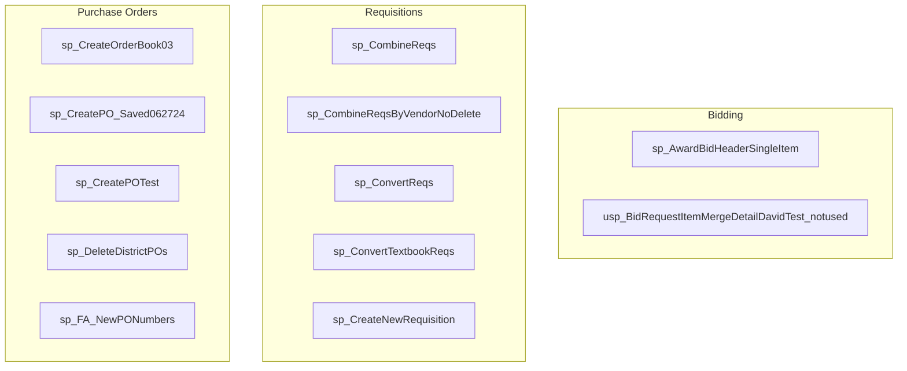

# EDS Database - Root Procedure Analysis

Generated: 2026-01-09 12:13:37

Root procedures are entry points that call other procedures but are not called by any.
These represent the main business operations and workflows.

---

## Summary

**Total Root Procedures:** 77

| Category | Count |
|----------|-------|
| Bidding | 2 |
| Other | 35 |
| Purchase Orders | 11 |
| Requisitions | 29 |

---

## Bidding (2 procedures)

### sp_AwardBidHeaderSingleItem

*Award processing procedure for Single*

- **Schema:** dbo
- **Created:** 2015-08-05 15:03:27.490000
- **Modified:** 2015-08-05 15:03:27.490000
- **Parameters:** 2
  - `@pBidHeaderId` int
  - `@pItemId` int
- **Calls:** sp_AwardBidHeader
- **Tables accessed:** Awards, BidHeaders, BidImportCatalogList, BidImports, BidItems, BidResults, Catalog, CrossRefs, PO, detail
  - *...and 5 more*

### usp_BidRequestItemMergeDetailDavidTest_notused

*Bid request processing for uMergeDavidTest_notused*

- **Schema:** dbo
- **Created:** 2015-08-30 12:26:23.237000
- **Modified:** 2019-08-16 15:17:34.253000
- **Parameters:** 1
  - `@BidRequestItemId` int
- **Calls:** usp_BidMatchRefs
- **Tables accessed:** BidHeaders, BidRequestItems, Items, Units

---

## Requisitions (29 procedures)

### sp_CombineReqs

*Stored procedure: CombineReqs*

- **Schema:** dbo
- **Created:** 2007-06-04 10:46:17.263000
- **Modified:** 2015-07-10 13:36:30.773000
- **Parameters:** 6
  - `@pRSId` int
  - `@pRSId` int
  - `@pDelete` tinyint
  - `@pDelete` tinyint
  - `@rRequisitionId` int (OUTPUT)
  - `@rRequisitionId` int (OUTPUT)
- **Calls:** sp_DeleteRequisitionWithDetail, sp_UpdateReq
- **Tables accessed:** Approvals, ApprovalsHistory, DebugMsgs, ReportSession, ReportSessionLinks, Requisitions, School, detail

### sp_CombineReqs

*Stored procedure: CombineReqs*

- **Schema:** EDSIQWebUser
- **Created:** 2003-01-08 20:30:11.700000
- **Modified:** 2009-03-25 06:55:28.363000
- **Parameters:** 6
  - `@pRSId` int
  - `@pRSId` int
  - `@pDelete` tinyint
  - `@pDelete` tinyint
  - `@rRequisitionId` int (OUTPUT)
  - `@rRequisitionId` int (OUTPUT)
- **Calls:** sp_DeleteRequisitionWithDetail, sp_NewRequisitionId, sp_UpdateReq
- **Tables accessed:** Approvals, Detail, ReportSession, ReportSessionLinks, Requisitions, School

### sp_CombineReqsByVendorNoDelete

*Vendor management procedure for CombineReqsByNoDelete*

- **Schema:** dbo
- **Created:** 2008-06-16 09:52:45.997000
- **Modified:** 2015-03-24 14:59:07.783000
- **Parameters:** 3
  - `@pSessionId` int
  - `@pRSId` int
  - `@rRequisitionId` int (OUTPUT)
- **Calls:** sp_NewRequisitionId, sp_UpdateReq
- **Tables accessed:** DebugMsgs, Detail, ReportSessionLinks, Requisitions, School, SessionTable, Vendors

### sp_CombineReqsNoDelete

*Stored procedure: CombineReqsNoDelete*

- **Schema:** EDSIQWebUser
- **Created:** 2003-06-03 12:45:57.357000
- **Modified:** 2009-03-25 06:55:28.457000
- **Parameters:** 2
  - `@pRSId` int
  - `@rRequisitionId` int (OUTPUT)
- **Calls:** sp_NewRequisitionId, sp_UpdateReq
- **Tables accessed:** Detail, ReportSession, ReportSessionLinks, Requisitions, School

### sp_ConvertReqs

*Stored procedure: ConvertReqs*

- **Schema:** dbo
- **Created:** 2002-03-20 22:18:07.060000
- **Modified:** 2022-04-01 08:49:58.957000
- **Parameters:** 2
  - `@pSessionId` int
  - `@pRSId` int
- **Calls:** sp_CreatePO, sp_RefreshDistrictVendors
- **Tables accessed:** Budgets, DebugMsgs, ReportSessionLinks, Requisitions, Users

### sp_ConvertTextbookReqs

*Stored procedure: ConvertTextbookReqs*

- **Schema:** dbo
- **Created:** 2002-06-12 15:13:07.530000
- **Modified:** 2009-07-16 13:30:14.573000
- **Parameters:** 3
  - `@pSessionId` int
  - `@pRSId` int
  - `@pBidHeaderId` int
- **Calls:** sp_CreateNewPO, sp_RefreshDistrictVendors, sp_UpdatePOAmounts
- **Tables accessed:** Approvals, Detail, PODetailItems, ReportSessionLinks, Requisitions, SessionTable, StatusTable, Users

### sp_CreateNewRequisition

*Create new CreateNew*

- **Schema:** dbo
- **Created:** 2001-08-24 14:40:45.073000
- **Modified:** 2014-10-07 17:53:21.727000
- **Parameters:** 3
  - `@pSessionId` int
  - `@pCatalogId` int
  - `@ReqId` int (OUTPUT)
- **Calls:** sp_NewRequisitionId
- **Tables accessed:** Budgets, CXmlSession, Catalog, DistrictCategories, Requisitions, SessionTable, Users

### sp_CreateNewRequisitionV

*Create new CreateNewV*

- **Schema:** dbo
- **Created:** 2013-02-06 22:02:01.173000
- **Modified:** 2014-10-07 17:53:24.200000
- **Parameters:** 4
  - `@pSessionId` int
  - `@pCategoryId` int
  - `@pVendorId` int
  - `@ReqId` int (OUTPUT)
- **Calls:** sp_NewRequisitionId
- **Tables accessed:** Bids, BidsCatalogList, Budgets, CXmlSession, Catalog, DistrictCategories, Requisitions, SessionTable, Users

### sp_CreateNewRequisitionVendor

*Create new CreateNew*

- **Schema:** dbo
- **Created:** 2012-04-11 21:23:14.273000
- **Modified:** 2025-04-16 03:31:15.297000
- **Parameters:** 5
  - `@pSessionId` int
  - `@pCategoryId` int
  - `@pVendorId` int
  - `@pBudgetId` int
  - `@ReqId` int (OUTPUT)
- **Calls:** sp_NewRequisitionId
- **Tables accessed:** Budgets, CXmlSession, DistrictCategories, Requisitions, SessionTable, Users

### sp_CreateNewRequisitionVendor_bk20250416

*Create new CreateNew_bk20250416*

- **Schema:** dbo
- **Created:** 2025-04-15 22:37:30.350000
- **Modified:** 2025-04-15 22:37:30.350000
- **Parameters:** 5
  - `@pSessionId` int
  - `@pCategoryId` int
  - `@pVendorId` int
  - `@pBudgetId` int
  - `@ReqId` int (OUTPUT)
- **Calls:** sp_NewRequisitionId
- **Tables accessed:** Budgets, CXmlSession, DistrictCategories, Requisitions, SessionTable, Users

### sp_DeleteEmptyReqs

*Delete record from DeleteEmptyReqs*

- **Schema:** EDSIQWebUser
- **Created:** 2003-01-09 16:38:54.450000
- **Modified:** 2014-01-06 16:40:17.927000
- **Calls:** sp_DeleteRequisition
- **Tables accessed:** Approvals, ApprovalsHistory, Budgets, DebugMsgs, Detail, Requisitions

### sp_DeleteRequisitionRestricted

*Delete record from DeleteRestricted*

- **Schema:** dbo
- **Created:** 2002-05-28 13:09:15.107000
- **Modified:** 2017-05-11 15:15:45.783000
- **Parameters:** 3
  - `@pSessionId` int
  - `@pReportSessionId` int
  - `@rStatus` int (OUTPUT)
- **Calls:** sp_UpdateReq
- **Tables accessed:** Approvals, ApprovalsHistory, Detail, PO, ReportSession, ReportSessionLinks, Requisitions, StatusTable

### sp_DeleteRequisitionWithItems

*Delete record from DeleteWiths*

- **Schema:** EDSIQWebUser
- **Created:** 2003-03-13 11:26:51.937000
- **Modified:** 2009-03-25 06:55:28.753000
- **Parameters:** 3
  - `@pSessionId` int
  - `@pRequisitionId` int
  - `@rStatus` int (OUTPUT)
- **Calls:** sp_UpdateReq
- **Tables accessed:** Detail, PO, Requisitions

### sp_DistrictRequisitionDetail

*Requisition procedure for District*

- **Schema:** dbo
- **Created:** 2003-12-11 16:55:27.730000
- **Modified:** 2025-03-03 18:46:38.420000
- **Parameters:** 1
  - `@pRSId` int
- **Calls:** sp_CreateNewDistrictReqNumber
- **Tables accessed:** Awards, BidHeaders, Budgets, Detail, ReportSessionLinks, Requisitions, School, UserAccounts, Users, Vendors
  - *...and 5 more*

### sp_FA_DeleteRequisition

*Requisition procedure for FA_Delete*

- **Schema:** dbo
- **Created:** 2013-03-13 10:41:06.793000
- **Modified:** 2025-04-16 03:31:13.683000
- **Parameters:** 3
  - `@pSessionId` int
  - `@pRequisitionId` int
  - `@rStatus` int (OUTPUT)
- **Calls:** sp_UpdateReq
- **Tables accessed:** Approvals, ApprovalsHistory, Detail, PO, Requisitions, SessionTable

### sp_FA_DeleteRequisition_bk20250416

*Requisition procedure for FA_Delete_bk20250416*

- **Schema:** dbo
- **Created:** 2025-04-15 22:25:26.927000
- **Modified:** 2025-04-15 22:25:26.927000
- **Parameters:** 3
  - `@pSessionId` int
  - `@pRequisitionId` int
  - `@rStatus` int (OUTPUT)
- **Calls:** sp_UpdateReq
- **Tables accessed:** Approvals, ApprovalsHistory, Detail, PO, Requisitions, SessionTable

### sp_HoldRequisition

*Requisition procedure for Hold*

- **Schema:** dbo
- **Created:** 2002-03-06 16:39:54.483000
- **Modified:** 2013-07-02 16:11:06.803000
- **Parameters:** 2
  - `@pSessionId` varchar
  - `@pRequisitionId` varchar
- **Calls:** sp_DeleteZeros, sp_RefreshPendingApprovals
- **Tables accessed:** Approvals, Requisitions, SessionTable, StatusTable, Users

### sp_MakeReq

*Stored procedure: MakeReq*

- **Schema:** dbo
- **Created:** 2002-07-30 19:17:59.950000
- **Modified:** 2015-11-24 23:37:35.827000
- **Parameters:** 1
  - `@pImportId` int
- **Calls:** sp_BatchVerify
- **Tables accessed:** BatchDetail, Batches, ImportDetail

### sp_ProcessCopyRequests

*Processing procedure for Requests*

- **Schema:** dbo
- **Created:** 2004-10-26 19:36:05.830000
- **Modified:** 2009-03-25 06:55:28.537000
- **Calls:** sp_CopyReqs
- **Tables accessed:** CopyRequests, ReportSessionLinks

### sp_SubmitRequisition

*Requisition procedure for Submit*

- **Schema:** dbo
- **Created:** 2001-08-24 14:40:45.503000
- **Modified:** 2019-11-13 07:27:40.527000
- **Parameters:** 2
  - `@pSessionId` varchar
  - `@pRequisitionId` varchar
- **Calls:** sp_DeleteZeros, sp_RefreshPendingApprovals
- **Tables accessed:** Approvals, CXmlSession, Detail, Requisitions, SessionTable, StatusTable, UserAccounts, Users

### sp_SubmitRequisitionNew

*Requisition procedure for SubmitNew*

- **Schema:** dbo
- **Created:** 2004-12-30 12:37:11.473000
- **Modified:** 2009-03-25 06:55:28.270000
- **Parameters:** 3
  - `@pSessionId` int
  - `@pRequisitionId` int
  - `@rStatus` int
- **Calls:** sp_RefreshPendingApprovals
- **Tables accessed:** Approvals, BudgetAccounts, Detail, Requisitions, SessionTable, StatusTable, UserAccounts, Users

### sp_UpdateAllReqs

*Update existing record in UpdateAllReqs*

- **Schema:** dbo
- **Created:** 2002-02-25 16:53:50.763000
- **Modified:** 2009-03-25 06:55:28.270000
- **Parameters:** 1
  - `@pDistrictId` int
- **Calls:** sp_UpdateReq
- **Tables accessed:** district, requisitions, school

### sp_UpdateReqDetailItem

*Update existing record in UpdateReq*

- **Schema:** dbo
- **Created:** 2002-03-11 15:26:20.357000
- **Modified:** 2009-03-25 06:55:28.380000
- **Parameters:** 1
  - `@pItemId` int
- **Calls:** sp_UpdateReq
- **Tables accessed:** Detail, Requisitions, School, StatusTable

### sp_UpdateReqDetailPricePlan

*Update existing record in UpdateReqPlan*

- **Schema:** dbo
- **Created:** 2002-05-29 14:49:00.810000
- **Modified:** 2009-03-25 06:55:28.223000
- **Parameters:** 1
  - `@pPricePlanId` int
- **Calls:** sp_UpdateReq
- **Tables accessed:** Detail, Requisitions, School, StatusTable

### sp_UpdateReqHeader

*Update existing record in UpdateReqHeader*

- **Schema:** dbo
- **Created:** 2001-10-12 10:53:56.250000
- **Modified:** 2009-03-25 06:55:28.380000
- **Parameters:** 6
  - `@pChangeField` varchar
  - `@pSessionId` int
  - `@pRequisitionId` int
  - `@pCharField` varchar
  - `@pChar2Field` varchar
  - `@pIntField` int
- **Calls:** sp_UpdateReq
- **Tables accessed:** Awards, AwardsCatalogList, Budgets, Detail, DistrictPP, Requisitions, School, SessionTable, UserAccounts, Users
  - *...and 5 more*

### usp_CopyRequisition

*Requisition procedure for u*

- **Schema:** dbo
- **Created:** 2025-03-26 17:45:26.217000
- **Modified:** 2025-08-11 11:44:01.123000
- **Parameters:** 3
  - `@SessionId` int
  - `@BudgetId` int
  - `@RequisitionId` int
- **Calls:** sp_NewRequisitionId
- **Tables accessed:** BudgetAccounts, Budgets, Detail, DistrictCategories, Items, Requisitions, School, SessionTable, UserAccounts, Users
  - *...and 2 more*

### usp_SearchItemsByReqHKDSDavid

*Item management procedure for usByReqHKDSDavid*

- **Schema:** dbo
- **Created:** 2020-06-09 16:03:49.093000
- **Modified:** 2020-06-09 17:20:06.727000
- **Parameters:** 6
  - `@pRequisitionId` int
  - `@pVendorId` int
  - `@pHeadingId` bigint
  - `@pFilter` varchar
  - `@pDistrictId` int
  - `@pDSHeadingId` bigint
- **Calls:** usp_SearchItemsByReqHKDS
- **Tables accessed:** BidHeaders, Budgets, Detail, DistrictPP, Headings, Keywords, PPCategory, PricingConsolidatedOrderCounts, Requisitions, Vendors
  - *...and 2 more*

### usp_SearchItemsByReqHKDSError

*Item management procedure for usByReqHKDSError*

- **Schema:** dbo
- **Created:** 2020-06-08 12:51:31.027000
- **Modified:** 2020-06-08 12:51:31.027000
- **Parameters:** 6
  - `@pRequisitionId` int
  - `@pVendorId` int
  - `@pHeadingId` bigint
  - `@pFilter` varchar
  - `@pDistrictId` int
  - `@pDSHeadingId` bigint
- **Calls:** usp_SearchItemsByReqHKDS, usp_SearchItemsByReqHKDSTest
- **Tables accessed:** BidHeaders, Budgets, Detail, DistrictPP, Headings, Keywords, PPCategory, PricingConsolidatedOrderCounts, Requisitions, Vendors
  - *...and 2 more*

### usp_SearchItemsByReqHKDS_David

*Item management procedure for usByReqHKDS_David*

- **Schema:** dbo
- **Created:** 2020-04-16 11:47:58.260000
- **Modified:** 2020-04-16 11:47:58.260000
- **Parameters:** 6
  - `@pRequisitionId` int
  - `@pVendorId` int
  - `@pHeadingId` bigint
  - `@pFilter` varchar
  - `@pDistrictId` int
  - `@pDSHeadingId` bigint
- **Calls:** usp_SearchItemsByReqHKDS, usp_SearchItemsByReqHKDSTest
- **Tables accessed:** BidHeaders, Budgets, Detail, DistrictPP, Headings, Keywords, PPCategory, PricingConsolidatedOrderCounts, Requisitions, Vendors
  - *...and 2 more*

---

## Purchase Orders (11 procedures)

### sp_CreateOrderBook03

*Create new CreateBook03*

- **Schema:** dbo
- **Created:** 2003-08-24 14:30:09.390000
- **Modified:** 2015-11-24 23:37:38.077000
- **Parameters:** 2
  - `@pBidHeaderId` int
  - `@pAwardId` int
- **Calls:** sp_CreateOrderBook
- **Tables accessed:** BidHeaders, BidImports, BidItems, BidResults, Catalog, CrossRefs, Detail, Headings, OrderBookDetail, Requisitions
  - *...and 6 more*

### sp_CreatePOTest

*Create new CreateTest*

- **Schema:** dbo
- **Created:** 2024-06-27 18:20:41.237000
- **Modified:** 2024-06-27 18:20:41.237000
- **Parameters:** 2
  - `@pSessionId` int
  - `@pRequisitionId` int
- **Calls:** sp_CreateNewPO, sp_UpdatePOAmounts
- **Tables accessed:** Approvals, BidHeaders, BidItems, Detail, PO, PODetailItems, Requisitions, School, SessionTable, Vendors
  - *...and 7 more*

### sp_CreatePO_Saved062724

*Create new Create_Saved062724*

- **Schema:** dbo
- **Created:** 2024-06-27 18:44:50.310000
- **Modified:** 2024-06-27 18:44:50.310000
- **Parameters:** 2
  - `@pSessionId` int
  - `@pRequisitionId` int
- **Calls:** sp_CreateNewPO, sp_UpdatePOAmounts
- **Tables accessed:** Approvals, BidHeaders, BidItems, Detail, PO, PODetailItems, Requisitions, School, SessionTable, Vendors
  - *...and 7 more*

### sp_DeleteDistrictBudgetPOs

*Delete record from DeleteDistrictBudgets*

- **Schema:** EDSIQWebUser
- **Created:** 2002-08-14 11:59:37.500000
- **Modified:** 2009-03-25 06:55:28.677000
- **Parameters:** 2
  - `@pDistrictId` int
  - `@pBudgetId` int
- **Calls:** sp_DeletePO
- **Tables accessed:** PO, Requisitions, School

### sp_DeleteDistrictPOs

*Delete record from DeleteDistricts*

- **Schema:** dbo
- **Created:** 2002-04-16 16:01:15.840000
- **Modified:** 2009-03-25 06:55:28.550000
- **Parameters:** 3
  - `@pDistrictId` int
  - `@pBudgetId` int
  - `@pCategoryId` int
- **Calls:** sp_DeletePO
- **Tables accessed:** Budgets, PO, Requisitions

### sp_DeletePOList

*Delete record from Delete*

- **Schema:** EDSIQWebUser
- **Created:** 2003-05-02 09:50:18.560000
- **Modified:** 2009-03-25 06:55:28.380000
- **Parameters:** 1
  - `@pRSId` int
- **Calls:** sp_DeletePO
- **Tables accessed:** PO, ReportSessionLinks

### sp_FA_NewPONumbers

*Purchase order procedure for FA_NewNumbers*

- **Schema:** dbo
- **Created:** 2012-06-14 00:08:08.827000
- **Modified:** 2012-06-14 00:08:08.827000
- **Parameters:** 4
  - `@sessionID` int
  - `@RSID` int
  - `@budgetID` int
  - `@nextNumber` int
- **Calls:** sp_FA_RequisitionsForPurchaseOrderModal

### sp_FA_SavePOs

*Purchase order procedure for FA_Saves*

- **Schema:** dbo
- **Created:** 2012-06-13 23:59:03.643000
- **Modified:** 2014-01-10 17:09:15.490000
- **Parameters:** 6
  - `@pSessionId` int
  - `@poTempID` int
  - `@pRequisitionId` int
  - `@poGenerationMethod` varchar
  - `@poEnd` int
  - `@created` int (OUTPUT)
- **Calls:** sp_FA_CreatePO
- **Tables accessed:** Awards, District, NextNumber, PO, POTemp, POTempDetails, Requisitions, School

### sp_OrderBookMaint

*Order processing procedure for BookMaint*

- **Schema:** dbo
- **Created:** 2003-10-08 21:02:13.577000
- **Modified:** 2015-11-24 23:37:31.960000
- **Parameters:** 15
  - `@pSessionId` int
  - `@pOrderBookId` int
  - `@pCategoryId` int
  - `@pPricePlanId` int
  - `@pDistrictId` int
  - `@pAwardId` int
  - `@pCategoryDescription` varchar
  - `@pPricePlanDescription` varchar
  - `@pMarkup` varchar
  - `@pAction` tinyint
  - `@pCopyMode` varchar
  - `@pActive` int
  - `@pUseParentCatalog` int
  - `@pKeepZeroPages` int
  - `@pOrderBookYear` int
- **Calls:** sp_CopyToBudgetBook
- **Tables accessed:** Awards, BidHeaders, BidItems, Bids, Budgets, Detail, Items, OrderBookDetail, Requisitions, SessionTable
  - *...and 3 more*

### usp_EmailBlastProcessOrderDetailChangeNotifications

*Order processing procedure for uChangeNotifications*

- **Schema:** dbo
- **Created:** 2022-03-28 16:17:18.447000
- **Modified:** 2022-04-01 10:36:19.437000
- **Parameters:** 2
  - `@pTemplateRequisitionerEmailBlastId` int
  - `@pTemplateApproverEmailBlastId` int
- **Calls:** usp_EmailBlastSetNotificationBlastHTMLApprover, usp_EmailBlastSetNotificationBlastHTMLRequisitioner
- **Tables accessed:** DetailNotifications, EmailBlast, Notifications

### usp_GetPODetail

*Retrieve record(s) from uGet*

- **Schema:** dbo
- **Created:** 2025-06-05 14:22:47.843000
- **Modified:** 2025-09-11 16:06:24.730000
- **Parameters:** 1
  - `@POId` int
- **Calls:** usp_GetPODetail_Test
- **Tables accessed:** PO, PODetailItems, Units, VendorOrders

---

## Other (35 procedures)

### dt_addtosourcecontrol_u

*Stored procedure: dt addtosourcecontrol u*

- **Schema:** dbo
- **Created:** 2006-08-29 12:12:36.473000
- **Modified:** 2006-08-29 12:12:36.473000
- **Parameters:** 5
  - `@vchSourceSafeINI` nvarchar
  - `@vchProjectName` nvarchar
  - `@vchComment` nvarchar
  - `@vchLoginName` nvarchar
  - `@vchPassword` nvarchar
- **Calls:** dt_addtosourcecontrol

### dt_checkinobject_u

*Check/verify procedure for dt_checkinobject_u*

- **Schema:** dbo
- **Created:** 2006-08-29 12:12:36.490000
- **Modified:** 2006-08-29 12:12:36.490000
- **Parameters:** 10
  - `@chObjectType` char
  - `@vchObjectName` nvarchar
  - `@vchComment` nvarchar
  - `@vchLoginName` nvarchar
  - `@vchPassword` nvarchar
  - `@iVCSFlags` int
  - `@iActionFlag` int
  - `@txStream1` text
  - `@txStream2` text
  - `@txStream3` text
- **Calls:** dt_checkinobject

### dt_checkoutobject_u

*Check/verify procedure for dt_checkoutobject_u*

- **Schema:** dbo
- **Created:** 2006-08-29 12:12:36.507000
- **Modified:** 2006-08-29 12:12:36.507000
- **Parameters:** 7
  - `@chObjectType` char
  - `@vchObjectName` nvarchar
  - `@vchComment` nvarchar
  - `@vchLoginName` nvarchar
  - `@vchPassword` nvarchar
  - `@iVCSFlags` int
  - `@iActionFlag` int
- **Calls:** dt_checkoutobject

### dt_displayoaerror_u

*Stored procedure: dt displayoaerror u*

- **Schema:** dbo
- **Created:** 2006-08-29 12:12:36.473000
- **Modified:** 2006-08-29 12:12:36.473000
- **Parameters:** 2
  - `@iObject` int
  - `@iresult` int
- **Calls:** dt_displayoaerror

### dt_getpropertiesbyid_vcs_u

*Stored procedure: dt getpropertiesbyid vcs u*

- **Schema:** dbo
- **Created:** 2006-08-29 12:12:36.473000
- **Modified:** 2006-08-29 12:12:36.473000
- **Parameters:** 3
  - `@id` int
  - `@property` varchar
  - `@value` nvarchar (OUTPUT)
- **Calls:** dt_getpropertiesbyid_vcs

### dt_isundersourcecontrol_u

*Stored procedure: dt isundersourcecontrol u*

- **Schema:** dbo
- **Created:** 2006-08-29 12:12:36.507000
- **Modified:** 2006-08-29 12:12:36.507000
- **Parameters:** 3
  - `@vchLoginName` nvarchar
  - `@vchPassword` nvarchar
  - `@iWhoToo` int
- **Calls:** dt_isundersourcecontrol

### dt_removefromsourcecontrol

*Move procedure for dt_removefromsourcecontrol*

- **Schema:** dbo
- **Created:** 2006-08-29 12:12:36.460000
- **Modified:** 2006-08-29 12:12:36.460000
- **Calls:** dt_droppropertiesbyid

### dt_setpropertybyid_u

*Stored procedure: dt setpropertybyid u*

- **Schema:** dbo
- **Created:** 2006-08-29 12:12:36.210000
- **Modified:** 2006-08-29 12:12:36.210000
- **Parameters:** 4
  - `@id` int
  - `@property` varchar
  - `@uvalue` nvarchar
  - `@lvalue` image
- **Calls:** dt_generateansiname

### dt_validateloginparams_u

*Login/authentication procedure for dt_validateloginparams_u*

- **Schema:** dbo
- **Created:** 2006-08-29 12:12:36.507000
- **Modified:** 2006-08-29 12:12:36.507000
- **Parameters:** 2
  - `@vchLoginName` nvarchar
  - `@vchPassword` nvarchar
- **Calls:** dt_validateloginparams

### dt_whocheckedout_u

*Check/verify procedure for dt_whocheckedout_u*

- **Schema:** dbo
- **Created:** 2006-08-29 12:12:36.520000
- **Modified:** 2006-08-29 12:12:36.520000
- **Parameters:** 4
  - `@chObjectType` char
  - `@vchObjectName` nvarchar
  - `@vchLoginName` nvarchar
  - `@vchPassword` nvarchar
- **Calls:** dt_whocheckedout

### sp_AddDistrict

*Add new record to AddDistrict*

- **Schema:** dbo
- **Created:** 2001-10-08 22:30:33.253000
- **Modified:** 2022-07-21 13:12:26.847000
- **Parameters:** 21
  - `@pSessionId` int
  - `@pDistrictId` int
  - `@pDistrictCode` varchar
  - `@pDistrictName` varchar
  - `@pDistrictAddr1` varchar
  - `@pDistrictAddr2` varchar
  - `@pDistrictAddr3` varchar
  - `@pDistrictCity` varchar
  - `@pDistrictState` varchar
  - `@pDistrictZip` varchar
  - `@pPhoneNumber` varchar
  - `@pFax` varchar
  - `@pEMail` varchar
  - `@pNextCometId` int
  - `@pApprovalLevel` int
  - `@pBAName` varchar
  - `@pUseGrossPrices` tinyint
  - `@pPOLayoutId` int
  - `@pAccountingFormatId` int
  - `@pTextbookPercentage` varchar
  - `@rDistrictId` int (OUTPUT)
- **Calls:** sp_SetBudgetYear
- **Tables accessed:** Budgets, CSRep, District, SessionTable

### sp_AddISBN

*Add new record to AddISBN*

- **Schema:** dbo
- **Created:** 2002-04-30 23:32:40.577000
- **Modified:** 2013-01-28 22:25:07.427000
- **Parameters:** 10
  - `@pSessionId` int
  - `@pISBN` varchar
  - `@pTitle` varchar
  - `@pCopyrightYear` int
  - `@pEditionId` int
  - `@pPublisherId` int
  - `@pPublisherCost` varchar
  - `@pRequisitionId` int
  - `@pQuantity` int
  - `@rItemId` int (OUTPUT)
- **Calls:** sp_ISBNAdd
- **Tables accessed:** Category, CrossRefs, Items, Requisitions, SessionTable, Units

### sp_AttemptLogin

*Login/authentication procedure for Attempt*

- **Schema:** dbo
- **Created:** 2001-08-24 14:40:44.753000
- **Modified:** 2025-03-26 09:00:48.497000
- **Parameters:** 6
  - `@rtDistrictCode` char
  - `@rtCometId` varchar
  - `@rtUserName` varchar
  - `@rtPassword` varchar
  - `@rtResolutionX` int
  - `@rtResolutionY` int
- **Calls:** sp_SetDistrictAndBudgetYear
- **Tables accessed:** CSRep, District, School, SessionTable, Users

### sp_BatchConvertNew

*Batch processing procedure for ConvertNew*

- **Schema:** dbo
- **Created:** 2009-02-26 10:25:33.367000
- **Modified:** 2009-03-25 06:55:28.350000
- **Parameters:** 2
  - `@pSessionId` int
  - `@pBatchId` int
- **Calls:** sp_NewRequisitionId, sp_UpdateReq
- **Tables accessed:** Approvals, BatchBook, BatchDetail, Batches, Budgets, Detail, Requisitions, StatusTable, TaskSchedule, Users

### sp_BatchLoad

*Batch processing procedure for Load*

- **Schema:** dbo
- **Created:** 2001-08-28 15:08:57.787000
- **Modified:** 2015-11-24 23:37:34.710000
- **Parameters:** 1
  - `@pSourceFile` varchar
- **Calls:** sp_BatchVerify
- **Tables accessed:** BatchDetail, Batches

### sp_BatchProcess

*Batch processing procedure for data*

- **Schema:** dbo
- **Created:** 2002-11-21 14:58:45.920000
- **Modified:** 2009-03-25 06:55:28.660000
- **Calls:** sp_BatchVerify
- **Tables accessed:** Batches

### sp_BatchQueue

*Batch processing procedure for data*

- **Schema:** dbo
- **Created:** 2002-11-21 14:53:58.873000
- **Modified:** 2015-11-24 23:37:40.680000
- **Parameters:** 1
  - `@pSourceFile` varchar
- **Calls:** sp_BatchVerify
- **Tables accessed:** BatchDetail, Batches

### sp_CXmlLogin

*Login/authentication procedure for CXml*

- **Schema:** dbo
- **Created:** 2008-01-23 12:43:15.687000
- **Modified:** 2024-10-18 06:40:48.047000
- **Parameters:** 23
  - `@pDistrict` varchar
  - `@pUserNumber` varchar
  - `@pUserName` varchar
  - `@pPassword` varchar
  - `@pBuyerReqCode` varchar
  - `@pBuyerUserName` varchar
  - `@pBuyerUserNumber` varchar
  - `@pBuyerPassword` varchar
  - `@pBuyerAccountCode` varchar
  - `@pBuyerBudgetYear` varchar
  - `@pOrigReqId` varchar
  - `@pPayloadId` varchar
  - `@pFromDomain` varchar
  - `@pFromIdentity` varchar
  - `@pToDomain` varchar
  - `@pToIdentity` varchar
  - `@pSenderDomain` varchar
  - `@pSenderIdentity` varchar
  - `@pBuyerCookie` varchar
  - `@pBrowserFormPost` varchar
  - `@pFromUserAgent` varchar
  - `@pCategoryId` varchar
  - `@pMode` int
- **Calls:** sp_NewRequisitionId
- **Tables accessed:** BudgetAccounts, Budgets, DebugMsgs, District, PO, Requisitions, School, SessionTable, UserAccounts, Users
  - *...and 3 more*

### sp_CometLoad

*Stored procedure: CometLoad*

- **Schema:** dbo
- **Created:** 2002-02-19 08:08:40.577000
- **Modified:** 2015-11-24 23:37:34.373000
- **Parameters:** 3
  - `@pSourceFile` varchar
  - `@pDistrictCode` varchar
  - `@pCategoryCode` varchar
- **Calls:** sp_BatchVerify
- **Tables accessed:** BatchDetail, Batches

### sp_ConvertReadyBatches

*Batch processing procedure for ConvertReadyes*

- **Schema:** EDSIQWebUser
- **Created:** 2003-02-11 19:54:47.873000
- **Modified:** 2009-03-25 06:55:28.600000
- **Calls:** sp_BatchConvert
- **Tables accessed:** BatchDetail, Batches

### sp_EnhancedSearchItem

*Item management procedure for Enhanced*

- **Schema:** dbo
- **Created:** 2020-06-08 14:39:41.710000
- **Modified:** 2024-07-12 09:40:43.500000
- **Parameters:** 7
  - `@pSessionId` int
  - `@pCategoryId` int
  - `@pCatalogId` int
  - `@pSearchBy` int
  - `@pSearchStart` varchar
  - `@pSearchEnd` varchar
  - `@pSearchPrev` tinyint
- **Calls:** sp_SearchItems
- **Tables accessed:** SearchSets, SessionTable

### sp_FA_AttemptLogin

*Login/authentication procedure for FA_Attempt*

- **Schema:** dbo
- **Created:** 2012-06-14 00:06:32.173000
- **Modified:** 2024-10-18 03:57:04.120000
- **Parameters:** 3
  - `@rtDistrictCode` varchar
  - `@rtCometId` varchar
  - `@rtPassword` varchar
- **Calls:** sp_SetDistrictAndBudgetYear
- **Tables accessed:** CSRep, DebugMsgs, District, School, SessionTable, Users

### sp_FA_AttemptLogin_BK_20241018_Before_EncryptedPassword

*Login/authentication procedure for FA_Attempt_BK_20241018_Before_Encrypted*

- **Schema:** dbo
- **Created:** 2024-10-18 03:17:08.343000
- **Modified:** 2024-10-18 03:17:39.573000
- **Parameters:** 3
  - `@rtDistrictCode` varchar
  - `@rtCometId` varchar
  - `@rtPassword` varchar
- **Calls:** sp_SetDistrictAndBudgetYear
- **Tables accessed:** CSRep, DebugMsgs, District, School, SessionTable, Users

### sp_MergeAwards

*Award processing procedure for Merges*

- **Schema:** dbo
- **Created:** 2002-05-28 11:12:44.250000
- **Modified:** 2009-03-25 06:55:28.690000
- **Parameters:** 2
  - `@pSourceAwardId` int
  - `@pDestAwardId` int
- **Calls:** sp_MergeBids
- **Tables accessed:** Awards, BidItems, Prices

### sp_MultiBatchLoad

*Batch processing procedure for MultiLoad*

- **Schema:** EDSIQWebUser
- **Created:** 2002-09-23 10:28:01.700000
- **Modified:** 2015-11-24 23:37:34.047000
- **Parameters:** 2
  - `@pCategory` char
  - `@pSourceFile` varchar
- **Calls:** sp_BatchVerify
- **Tables accessed:** BatchDetail, Batches

### sp_Reaward_script

*Award processing procedure for Reaward_script*

- **Schema:** dbo
- **Created:** 2005-04-06 12:04:01.433000
- **Modified:** 2009-03-25 06:55:28.503000
- **Calls:** sp_AwardBidHeader, sp_CreateOrderBook
- **Tables accessed:** BidHeaders

### sp_UpdateAllListPrices

*Update existing record in UpdateAlls*

- **Schema:** dbo
- **Created:** 2012-10-12 13:06:31.580000
- **Modified:** 2012-10-12 13:06:31.580000
- **Calls:** sp_UpdateListPrices
- **Tables accessed:** BidHeaders, Category

### sp_easyadd

*Stored procedure: easyadd*

- **Schema:** dbo
- **Created:** 2001-08-24 14:40:45.713000
- **Modified:** 2013-05-22 14:41:19.023000
- **Parameters:** 5
  - `@pSessionId` int
  - `@pRequisitionId` int
  - `@pItemCode` varchar
  - `@pCatalogId` varchar
  - `@pQuantity` int
- **Calls:** sp_EDSItems, sp_ReqAdd
- **Tables accessed:** CXmlSession, Catalog, District, DistrictVendor, Requisitions, SessionTable

### usp_GetVendorPricing

*Retrieve record(s) from uGetPricing*

- **Schema:** dbo
- **Created:** 2021-03-31 09:15:55.260000
- **Modified:** 2021-03-31 09:15:55.260000
- **Parameters:** 1
  - `@pBidHeaderId` int
- **Calls:** usp_SearchItemsByReqHKDS, usp_SetPricing
- **Tables accessed:** BidHeaders, BidImports, BidItems, BidMappedItems, Catalog, CrossRefs, Detail, Headings, Keywords, Requisitions
  - *...and 7 more*

### usp_MakeZ$

*Stored procedure: uMakeZ$*

- **Schema:** dbo
- **Created:** 2022-12-02 15:36:26.127000
- **Modified:** 2023-12-01 08:13:51.520000
- **Calls:** sp_BidCopyChangePP
- **Tables accessed:** BidHeaders

### usp_MakeZC

*Stored procedure: uMakeZC*

- **Schema:** dbo
- **Created:** 2022-12-02 15:35:16.937000
- **Modified:** 2022-12-03 20:51:20.270000
- **Calls:** sp_AwardBidHeader, sp_BidCopyChangePP
- **Tables accessed:** BidHeaders, BidImports, BidItems, BidRequestItems, BidResults, Bids

### usp_SearchItems_SearchDataDB

*Item management procedure for us_DataDB*

- **Schema:** dbo
- **Created:** 2019-10-16 07:14:11.507000
- **Modified:** 2019-10-16 07:35:16.450000
- **Parameters:** 6
  - `@pRequisitionId` int
  - `@pVendorId` int
  - `@pHeadingId` bigint
  - `@pFilter` varchar
  - `@pDistrictId` int
  - `@pDSHeadingId` bigint
- **Calls:** usp_SearchItemsByReqHKDS
- **Tables accessed:** BidHeaders, Budgets, Detail, DistrictPP, Headings, Keywords, PPCategory, PricingConsolidatedOrderCounts, Requisitions, Vendors
  - *...and 2 more*

### usp_SetPricing_SearchDataDB

*Search procedure for uSetPricing_DataDB*

- **Schema:** dbo
- **Created:** 2019-10-16 07:17:55.180000
- **Modified:** 2019-11-01 12:45:14.770000
- **Parameters:** 1
  - `@pBidHeaderId` int
- **Calls:** usp_SearchItemsByReqHKDS, usp_SetPricing
- **Tables accessed:** BidHeaders, BidImports, BidItems, BidMappedItems, Catalog, CrossRefs, Detail, Headings, Keywords, Requisitions
  - *...and 7 more*

### usp_getSDSDocsAll

*Retrieve record(s) from ugetSDSDocsAll*

- **Schema:** dbo
- **Created:** 2022-09-14 18:34:46.163000
- **Modified:** 2022-09-14 18:35:26.530000
- **Calls:** usp_getSDSDocsDistrict, usp_getSDSDocsSchool, usp_getSDSDocsUser
- **Tables accessed:** SafetyDataSheets

### x_TestErrorHandling

*Stored procedure: x TestErrorHandling*

- **Schema:** dbo
- **Created:** 2016-04-27 22:11:28.560000
- **Modified:** 2016-04-27 22:37:36.787000
- **Calls:** Log_ProcedureCall

---

## Call Chain Analysis

Root procedures ranked by call chain complexity:

| Procedure | Direct Calls | Tables | Parameters |
|-----------|--------------|--------|------------|
| sp_CreatePO_Saved062724 | 2 | 17 | 2 |
| sp_CreatePOTest | 2 | 17 | 2 |
| usp_GetVendorPricing | 2 | 17 | 1 |
| usp_SetPricing_SearchDataDB | 2 | 17 | 1 |
| sp_CreateOrderBook03 | 1 | 16 | 2 |
| sp_AwardBidHeaderSingleItem | 1 | 15 | 2 |
| sp_DistrictRequisitionDetail | 1 | 15 | 1 |
| sp_UpdateReqHeader | 1 | 15 | 6 |
| sp_CXmlLogin | 1 | 13 | 23 |
| sp_OrderBookMaint | 1 | 13 | 15 |
| usp_SearchItemsByReqHKDS_David | 2 | 12 | 6 |
| usp_SearchItemsByReqHKDSError | 2 | 12 | 6 |
| usp_CopyRequisition | 1 | 12 | 3 |
| usp_SearchItems_SearchDataDB | 1 | 12 | 6 |
| usp_SearchItemsByReqHKDSDavid | 1 | 12 | 6 |
| sp_BatchConvertNew | 2 | 10 | 2 |
| sp_ConvertTextbookReqs | 3 | 8 | 3 |
| sp_CombineReqs | 2 | 8 | 6 |
| sp_CreateNewRequisitionV | 1 | 9 | 4 |
| sp_SubmitRequisition | 2 | 8 | 2 |
| sp_CombineReqsByVendorNoDelete | 2 | 7 | 3 |
| sp_DeleteRequisitionRestricted | 1 | 8 | 3 |
| sp_FA_SavePOs | 1 | 8 | 6 |
| sp_SubmitRequisitionNew | 1 | 8 | 3 |
| sp_CombineReqs | 3 | 6 | 6 |
| sp_CreateNewRequisition | 1 | 7 | 3 |
| sp_easyadd | 2 | 6 | 5 |
| usp_MakeZC | 2 | 6 | 0 |
| sp_AddISBN | 1 | 6 | 10 |
| sp_ConvertReqs | 2 | 5 | 2 |

---

## Main Workflows

