# EDS Database - Stored Procedure Dependencies

Generated: 2026-01-09 12:07:11

---

## Summary

| Metric | Count |
|--------|-------|
| Total Stored Procedures | 395 |
| SPs that call other SPs | 129 |
| Root SPs (callers, not called) | 72 |
| Leaf SPs (don't call others) | 264 |
| Unique table accesses | 156 |

---

## Most Accessed Tables

Tables accessed by the most stored procedures:

| Table | SPs Accessing |
|-------|---------------|
| Requisitions | 147 |
| Budgets | 99 |
| Detail | 93 |
| Users | 85 |
| BidHeaders | 80 |
| District | 71 |
| Items | 62 |
| SessionTable | 61 |
| Category | 55 |
| CrossRefs | 48 |
| School | 48 |
| Bids | 47 |
| UserAccounts | 46 |
| Vendors | 45 |
| PO | 45 |
| BidItems | 44 |
| Catalog | 40 |
| BidResults | 40 |
| Approvals | 39 |
| BudgetAccounts | 38 |
| Accounts | 37 |
| BidImports | 34 |
| BidRequestItems | 33 |
| ReportSessionLinks | 32 |
| Units | 26 |

---

## Stored Procedure Call Chains

Procedures that call other procedures:

```mermaid
flowchart LR
    sp_ConvertTextbookReqs["sp_ConvertTextbookReqs"] --> sp_RefreshDistrictVendors["sp_RefreshDistrictVendors"]
    sp_ConvertTextbookReqs["sp_ConvertTextbookReqs"] --> sp_UpdatePOAmounts["sp_UpdatePOAmounts"]
    sp_ConvertTextbookReqs["sp_ConvertTextbookReqs"] --> sp_CreateNewPO["sp_CreateNewPO"]
    usp_getSDSDocsAll["usp_getSDSDocsAll"] --> usp_getSDSDocsUser["usp_getSDSDocsUser"]
    usp_getSDSDocsAll["usp_getSDSDocsAll"] --> usp_getSDSDocsDistrict["usp_getSDSDocsDistrict"]
    usp_getSDSDocsAll["usp_getSDSDocsAll"] --> usp_getSDSDocsSchool["usp_getSDSDocsSchool"]
    usp_getSDSDocsDistrict["usp_getSDSDocsDistrict"] --> usp_getSDSDocsUser["usp_getSDSDocsUser"]
    usp_getSDSDocsDistrict["usp_getSDSDocsDistrict"] --> usp_getSDSDocsDistrict["usp_getSDSDocsDistrict"]
    usp_getSDSDocsDistrict["usp_getSDSDocsDistrict"] --> usp_getSDSDocsSchool["usp_getSDSDocsSchool"]
    sp_CombineReqs["sp_CombineReqs"] --> sp_DeleteRequisitionWithDetail["sp_DeleteRequisitionWithDetail"]
    sp_CombineReqs["sp_CombineReqs"] --> sp_UpdateReq["sp_UpdateReq"]
    sp_CombineReqs["sp_CombineReqs"] --> sp_NewRequisitionId["sp_NewRequisitionId"]
    sp_ConvertReqs["sp_ConvertReqs"] --> sp_RefreshDistrictVendors["sp_RefreshDistrictVendors"]
    sp_ConvertReqs["sp_ConvertReqs"] --> sp_CreatePO["sp_CreatePO"]
    sp_CreatePO["sp_CreatePO"] --> sp_UpdatePOAmounts["sp_UpdatePOAmounts"]
    sp_CreatePO["sp_CreatePO"] --> sp_CreateNewPO["sp_CreateNewPO"]
    sp_CreatePO_Saved062724["sp_CreatePO_Saved062724"] --> sp_UpdatePOAmounts["sp_UpdatePOAmounts"]
    sp_CreatePO_Saved062724["sp_CreatePO_Saved062724"] --> sp_CreateNewPO["sp_CreateNewPO"]
    sp_CreatePOTest["sp_CreatePOTest"] --> sp_UpdatePOAmounts["sp_UpdatePOAmounts"]
    sp_CreatePOTest["sp_CreatePOTest"] --> sp_CreateNewPO["sp_CreateNewPO"]
    sp_easyadd["sp_easyadd"] --> sp_ReqAdd["sp_ReqAdd"]
    sp_easyadd["sp_easyadd"] --> sp_EDSItems["sp_EDSItems"]
    usp_CopyRequisition["usp_CopyRequisition"] --> sp_NewRequisitionId["sp_NewRequisitionId"]
    usp_CopyRequisition["usp_CopyRequisition"] --> usp_CopyRequisition["usp_CopyRequisition"]
    usp_EmailBlastProcessOrderDetailChangeNotifications["usp_EmailBlastProcessOrderDetailChangeNotifications"] --> usp_EmailBlastSetNotificationBlastHTMLRequisitioner["usp_EmailBlastSetNotificationBlastHTMLRequisitioner"]
    usp_EmailBlastProcessOrderDetailChangeNotifications["usp_EmailBlastProcessOrderDetailChangeNotifications"] --> usp_EmailBlastSetNotificationBlastHTMLApprover["usp_EmailBlastSetNotificationBlastHTMLApprover"]
    sp_CopyReq["sp_CopyReq"] --> sp_NewRequisitionId["sp_NewRequisitionId"]
    sp_CopyReq["sp_CopyReq"] --> sp_UpdateReqDetail["sp_UpdateReqDetail"]
    sp_CopyReqs["sp_CopyReqs"] --> sp_CopyReqsBulk["sp_CopyReqsBulk"]
    sp_CopyReqs["sp_CopyReqs"] --> sp_CopyReq["sp_CopyReq"]
    dt_addtosourcecontrol["dt_addtosourcecontrol"] --> dt_displayoaerror["dt_displayoaerror"]
    dt_addtosourcecontrol["dt_addtosourcecontrol"] --> dt_setpropertybyid["dt_setpropertybyid"]
    dt_checkinobject["dt_checkinobject"] --> dt_getpropertiesbyid_vcs["dt_getpropertiesbyid_vcs"]
    dt_checkinobject["dt_checkinobject"] --> dt_displayoaerror["dt_displayoaerror"]
    dt_checkoutobject["dt_checkoutobject"] --> dt_getpropertiesbyid_vcs["dt_getpropertiesbyid_vcs"]
    dt_checkoutobject["dt_checkoutobject"] --> dt_displayoaerror["dt_displayoaerror"]
    dt_isundersourcecontrol["dt_isundersourcecontrol"] --> dt_getpropertiesbyid_vcs["dt_getpropertiesbyid_vcs"]
    dt_isundersourcecontrol["dt_isundersourcecontrol"] --> dt_displayoaerror["dt_displayoaerror"]
    dt_validateloginparams["dt_validateloginparams"] --> dt_getpropertiesbyid_vcs["dt_getpropertiesbyid_vcs"]
    dt_validateloginparams["dt_validateloginparams"] --> dt_displayoaerror["dt_displayoaerror"]
    dt_whocheckedout["dt_whocheckedout"] --> dt_getpropertiesbyid_vcs["dt_getpropertiesbyid_vcs"]
    dt_whocheckedout["dt_whocheckedout"] --> dt_displayoaerror["dt_displayoaerror"]
    sp_AwardBidHeader["sp_AwardBidHeader"] --> Log_ProcedureCall["Log_ProcedureCall"]
    sp_AwardBidHeader["sp_AwardBidHeader"] --> sp_AwardBidHeader["sp_AwardBidHeader"]
    sp_BatchConvert["sp_BatchConvert"] --> sp_UpdateReq["sp_UpdateReq"]
    sp_BatchConvert["sp_BatchConvert"] --> sp_NewRequisitionId["sp_NewRequisitionId"]
    sp_BatchConvertNew["sp_BatchConvertNew"] --> sp_UpdateReq["sp_UpdateReq"]
    sp_BatchConvertNew["sp_BatchConvertNew"] --> sp_NewRequisitionId["sp_NewRequisitionId"]
    sp_CombineReqs["sp_CombineReqs"] --> sp_DeleteRequisitionWithDetail["sp_DeleteRequisitionWithDetail"]
    sp_CombineReqs["sp_CombineReqs"] --> sp_UpdateReq["sp_UpdateReq"]
    sp_CombineReqsByVendorNoDelete["sp_CombineReqsByVendorNoDelete"] --> sp_UpdateReq["sp_UpdateReq"]
    sp_CombineReqsByVendorNoDelete["sp_CombineReqsByVendorNoDelete"] --> sp_NewRequisitionId["sp_NewRequisitionId"]
    sp_CXmlLogin["sp_CXmlLogin"] --> sp_CXmlLogin["sp_CXmlLogin"]
    sp_CXmlLogin["sp_CXmlLogin"] --> sp_NewRequisitionId["sp_NewRequisitionId"]
    sp_HoldRequisition["sp_HoldRequisition"] --> sp_DeleteZeros["sp_DeleteZeros"]
    sp_HoldRequisition["sp_HoldRequisition"] --> sp_RefreshPendingApprovals["sp_RefreshPendingApprovals"]
    sp_Reaward_script["sp_Reaward_script"] --> sp_CreateOrderBook["sp_CreateOrderBook"]
    sp_Reaward_script["sp_Reaward_script"] --> sp_AwardBidHeader["sp_AwardBidHeader"]
    sp_SubmitRequisition["sp_SubmitRequisition"] --> sp_DeleteZeros["sp_DeleteZeros"]
    sp_SubmitRequisition["sp_SubmitRequisition"] --> sp_RefreshPendingApprovals["sp_RefreshPendingApprovals"]
    usp_GetPODetail["usp_GetPODetail"] --> usp_GetPODetail["usp_GetPODetail"]
    usp_GetPODetail["usp_GetPODetail"] --> usp_GetPODetail_Test["usp_GetPODetail_Test"]
    usp_GetVendorPricing["usp_GetVendorPricing"] --> usp_SetPricing["usp_SetPricing"]
    usp_GetVendorPricing["usp_GetVendorPricing"] --> usp_SearchItemsByReqHKDS["usp_SearchItemsByReqHKDS"]
```

*Showing top 30 of 129 calling procedures*

---

## Core Table Access Patterns

Which procedures access the most critical tables:

```mermaid
flowchart TD
    classDef tableStyle fill:#e1f5fe,stroke:#01579b
    classDef spStyle fill:#fff3e0,stroke:#e65100

    Requisitions[("Requisitions")]
    class Requisitions tableStyle
    _sp_FA_UpdateRequisitionStatus["_sp_FA_UpdateRequisitionStatus"] --> Requisitions
    class _sp_FA_UpdateRequisitionStatus spStyle
    sp_AddISBN["sp_AddISBN"] --> Requisitions
    class sp_AddISBN spStyle
    sp_AddMSRPItem["sp_AddMSRPItem"] --> Requisitions
    class sp_AddMSRPItem spStyle
    Budgets[("Budgets")]
    class Budgets tableStyle
    sp_AddDistrict["sp_AddDistrict"] --> Budgets
    class sp_AddDistrict spStyle
    sp_ApproveReq["sp_ApproveReq"] --> Budgets
    class sp_ApproveReq spStyle
    sp_BatchConvert["sp_BatchConvert"] --> Budgets
    class sp_BatchConvert spStyle
    Detail[("Detail")]
    class Detail tableStyle
    sp_AddMSRPItem["sp_AddMSRPItem"] --> Detail
    class sp_AddMSRPItem spStyle
    sp_BatchConvert["sp_BatchConvert"] --> Detail
    class sp_BatchConvert spStyle
    sp_BatchConvertNew["sp_BatchConvertNew"] --> Detail
    class sp_BatchConvertNew spStyle
    Users[("Users")]
    class Users tableStyle
    sp_AddMSRPItem["sp_AddMSRPItem"] --> Users
    class sp_AddMSRPItem spStyle
    sp_AddSchool["sp_AddSchool"] --> Users
    class sp_AddSchool spStyle
    sp_ApproveReq["sp_ApproveReq"] --> Users
    class sp_ApproveReq spStyle
    BidHeaders[("BidHeaders")]
    class BidHeaders tableStyle
    bid2xls["bid2xls"] --> BidHeaders
    class bid2xls spStyle
    bid2xlsTest["bid2xlsTest"] --> BidHeaders
    class bid2xlsTest spStyle
    sp_AwardBidHeader["sp_AwardBidHeader"] --> BidHeaders
    class sp_AwardBidHeader spStyle
    District[("District")]
    class District tableStyle
    sp_AddDistrict["sp_AddDistrict"] --> District
    class sp_AddDistrict spStyle
    sp_AddMSRPItem["sp_AddMSRPItem"] --> District
    class sp_AddMSRPItem spStyle
    sp_ApproveReq["sp_ApproveReq"] --> District
    class sp_ApproveReq spStyle
    Items[("Items")]
    class Items tableStyle
    sp_AddISBN["sp_AddISBN"] --> Items
    class sp_AddISBN spStyle
    sp_AddMSRPItem["sp_AddMSRPItem"] --> Items
    class sp_AddMSRPItem spStyle
    sp_AwardBidHeader["sp_AwardBidHeader"] --> Items
    class sp_AwardBidHeader spStyle
    SessionTable[("SessionTable")]
    class SessionTable tableStyle
    sp_AddDistrict["sp_AddDistrict"] --> SessionTable
    class sp_AddDistrict spStyle
    sp_AddISBN["sp_AddISBN"] --> SessionTable
    class sp_AddISBN spStyle
    sp_AddSchool["sp_AddSchool"] --> SessionTable
    class sp_AddSchool spStyle
    Category[("Category")]
    class Category tableStyle
    sp_AddISBN["sp_AddISBN"] --> Category
    class sp_AddISBN spStyle
    sp_AwardBidHeader["sp_AwardBidHeader"] --> Category
    class sp_AwardBidHeader spStyle
    sp_AwardBidHeaderSingleItem["sp_AwardBidHeaderSingleItem"] --> Category
    class sp_AwardBidHeaderSingleItem spStyle
    CrossRefs[("CrossRefs")]
    class CrossRefs tableStyle
    sp_AddISBN["sp_AddISBN"] --> CrossRefs
    class sp_AddISBN spStyle
    sp_AddMSRPItem["sp_AddMSRPItem"] --> CrossRefs
    class sp_AddMSRPItem spStyle
    sp_AwardBidHeader["sp_AwardBidHeader"] --> CrossRefs
    class sp_AwardBidHeader spStyle
```

---

## Detailed Dependencies

### SPs with Most Dependencies

| Procedure | Total Deps | SP Calls | Tables | Views |
|-----------|------------|----------|--------|-------|
| sp_AwardBidHeader | 36 | 2 | 30 | 4 |
| sp_BatchVerify | 24 | 0 | 24 | 0 |
| sp_BatchVerifyBook | 23 | 0 | 23 | 0 |
| sp_VendorOverrideLine | 22 | 0 | 22 | 0 |
| usp_GetPOs | 22 | 1 | 21 | 0 |
| usp_SetPricing | 22 | 2 | 18 | 2 |
| sp_SearchItemsByReqHK | 21 | 0 | 21 | 0 |
| usp_GetVendorPricing | 21 | 2 | 17 | 2 |
| usp_SetPricing_SearchDataDB | 21 | 2 | 17 | 2 |
| sp_CreateOrderBook | 20 | 1 | 19 | 0 |
| sp_CreateOrderBookTest | 19 | 0 | 19 | 0 |
| sp_CreatePO_Saved062724 | 19 | 2 | 17 | 0 |
| sp_CreatePOTest | 19 | 2 | 17 | 0 |
| sp_FA_CreatePO | 19 | 1 | 18 | 0 |
| sp_BatchVerifyForce | 18 | 0 | 18 | 0 |
| sp_CreatePO | 18 | 2 | 16 | 0 |
| sp_DistrictRequisitionDetail | 18 | 1 | 15 | 2 |
| sp_VendorOverride | 18 | 0 | 18 | 0 |
| sp_VendorOverrideOld | 18 | 0 | 18 | 0 |
| sp_CreateOrderBook03 | 17 | 1 | 16 | 0 |
| sp_AwardBidHeaderSingleItem | 16 | 1 | 15 | 0 |
| sp_CCAddAddendaItem | 16 | 0 | 16 | 0 |
| sp_ImportVendorsBid | 16 | 0 | 15 | 1 |
| sp_UpdateReqHeader | 16 | 1 | 15 | 0 |
| usp_ChangeBidHeaderNumber | 16 | 0 | 16 | 0 |
| usp_GetPOs_Test | 16 | 0 | 15 | 1 |
| sp_CXmlLogin | 15 | 2 | 13 | 0 |
| usp_SearchItemsByReqHKDS | 15 | 1 | 13 | 1 |
| usp_SearchItemsByReqHKDS_David | 15 | 2 | 12 | 1 |
| usp_SearchItemsByReqHKDSDavid | 15 | 2 | 12 | 1 |
| usp_SearchItemsByReqHKDSError | 15 | 2 | 12 | 1 |
| sp_MSRPExporter | 14 | 0 | 14 | 0 |
| sp_OrderBookMaint | 14 | 1 | 13 | 0 |
| usp_CopyRequisition | 14 | 2 | 12 | 0 |
| usp_OrderEZVendors | 14 | 1 | 13 | 0 |
| usp_RestoreBidHeaderNumber | 14 | 0 | 14 | 0 |
| usp_SearchItems_SearchDataDB | 14 | 1 | 12 | 1 |
| usp_SearchItemsByReqHKDSTest | 14 | 1 | 12 | 1 |
| sp_ExportMSRPBid | 13 | 0 | 13 | 0 |
| sp_VerifyForPO | 13 | 0 | 13 | 0 |
| sp_BatchConvert | 12 | 2 | 10 | 0 |
| sp_BatchConvertNew | 12 | 2 | 10 | 0 |
| sp_BidCompareSummary | 12 | 1 | 11 | 0 |
| sp_MasterBudgetBook | 12 | 0 | 12 | 0 |
| usp_getSDSDocsDistrict | 12 | 3 | 9 | 0 |
| usp_SDSDocs | 12 | 1 | 8 | 3 |
| sp_ConvertTextbookReqs | 11 | 3 | 8 | 0 |
| sp_CopyReqBulk | 11 | 1 | 10 | 0 |
| sp_FA_ApproveReq | 11 | 0 | 11 | 0 |
| usp_BidRequestItemMergeDetail_notused | 11 | 0 | 11 | 0 |

---

### Root Procedures (Entry Points)

These procedures call others but are not called by any procedure:

- `dt_addtosourcecontrol_u`
- `dt_checkoutobject_u`
- `dt_getpropertiesbyid_vcs_u`
- `dt_isundersourcecontrol_u`
- `dt_removefromsourcecontrol`
- `dt_validateloginparams_u`
- `sp_AddDistrict`
- `sp_AttemptLogin`
- `sp_AwardBidHeaderSingleItem`
- `sp_BatchLoad`
- `sp_BatchProcess`
- `sp_CombineReqsByVendorNoDelete`
- `sp_CombineReqsNoDelete`
- `sp_CometLoad`
- `sp_CreateNewRequisition`
- `sp_CreateNewRequisitionV`
- `sp_CreateNewRequisitionVendor_bk20250416`
- `sp_CreateOrderBook03`
- `sp_CreatePO_Saved062724`
- `sp_DeleteDistrictBudgetPOs`
- `sp_DeleteEmptyReqs`
- `sp_DeletePOList`
- `sp_DeleteRequisitionRestricted`
- `sp_DeleteRequisitionWithItems`
- `sp_EnhancedSearchItem`
- `sp_FA_AttemptLogin`
- `sp_FA_AttemptLogin_BK_20241018_Before_EncryptedPassword`
- `sp_FA_DeleteRequisition`
- `sp_FA_NewPONumbers`
- `sp_FA_SavePOs`
- `sp_HoldRequisition`
- `sp_MakeReq`
- `sp_MergeAwards`
- `sp_MultiBatchLoad`
- `sp_OrderBookMaint`
- `sp_ProcessCopyRequests`
- `sp_Reaward_script`
- `sp_SubmitRequisitionNew`
- `sp_UpdateAllListPrices`
- `sp_UpdateAllReqs`
- `sp_UpdateReqDetailItem`
- `sp_UpdateReqDetailPricePlan`
- `sp_UpdateReqHeader`
- `usp_BidRequestItemMergeDetailDavidTest_notused`
- `usp_EmailBlastProcessOrderDetailChangeNotifications`
- `usp_MakeZ$`
- `usp_MakeZC`
- `usp_SearchItemsByReqHKDS_David`
- `usp_getSDSDocsAll`
- `x_TestErrorHandling`

*...and 22 more*

---

## Domain-Specific Dependency Diagrams

### Bidding System Procedures

```mermaid
flowchart TD
    classDef bidSP fill:#c8e6c9,stroke:#2e7d32

    sp_AwardBid["sp_AwardBid"]
    class sp_AwardBid bidSP
    sp_AwardBidHeader["sp_AwardBidHeader"]
    class sp_AwardBidHeader bidSP
    sp_AwardBidHeader --> Log_ProcedureCall
    sp_AwardBidHeader --> sp_AwardBidHeader
    sp_AwardBidHeaderSingleItem["sp_AwardBidHeaderSingleItem"]
    class sp_AwardBidHeaderSingleItem bidSP
    sp_AwardBidHeaderSingleItem --> sp_AwardBidHeader
    sp_BidCompare["sp_BidCompare"]
    class sp_BidCompare bidSP
    sp_BidCompareDiscount["sp_BidCompareDiscount"]
    class sp_BidCompareDiscount bidSP
    sp_BidCompareSame["sp_BidCompareSame"]
    class sp_BidCompareSame bidSP
    sp_BidCompareSummary["sp_BidCompareSummary"]
    class sp_BidCompareSummary bidSP
    sp_BidCompareSummary --> sp_BidCompareSummary
    sp_BidCopy["sp_BidCopy"]
    class sp_BidCopy bidSP
    sp_BidCopyChangePP["sp_BidCopyChangePP"]
    class sp_BidCopyChangePP bidSP
    sp_BidCopyWithIncrease["sp_BidCopyWithIncrease"]
    class sp_BidCopyWithIncrease bidSP
    sp_BidCopyWithIncrease --> sp_BidCopyWithIncrease
    sp_CopyBidImport["sp_CopyBidImport"]
    class sp_CopyBidImport bidSP
    sp_CopyMSRPVers2Bid["sp_CopyMSRPVers2Bid"]
    class sp_CopyMSRPVers2Bid bidSP
    sp_CopyMSRPVers2BidBackup["sp_CopyMSRPVers2BidBackup"]
    class sp_CopyMSRPVers2BidBackup bidSP
    sp_CopyMSRPVers2BidBackup_2014_10_29["sp_CopyMSRPVers2BidBackup-2014-10-29"]
    class sp_CopyMSRPVers2BidBackup_2014_10_29 bidSP
    sp_CopyMSRPVers2BidUsingCursorSave["sp_CopyMSRPVers2BidUsingCursorSave"]
    class sp_CopyMSRPVers2BidUsingCursorSave bidSP
    sp_CopyMSRPVers2BidUsingCursorSave2["sp_CopyMSRPVers2BidUsingCursorSave2"]
    class sp_CopyMSRPVers2BidUsingCursorSave2 bidSP
    sp_CopyMSRPVers3Bid["sp_CopyMSRPVers3Bid"]
    class sp_CopyMSRPVers3Bid bidSP
    sp_CopyMSRPVers4Bid["sp_CopyMSRPVers4Bid"]
    class sp_CopyMSRPVers4Bid bidSP
    sp_CreateBidFromRequest["sp_CreateBidFromRequest"]
    class sp_CreateBidFromRequest bidSP
    sp_CreateBidHeaderDetail["sp_CreateBidHeaderDetail"]
    class sp_CreateBidHeaderDetail bidSP
```

### Reporting Procedures

```mermaid
flowchart TD
    classDef rptSP fill:#ffecb3,stroke:#ff8f00

    sp_FA_CreateReportSession["sp_FA_CreateReportSession"]
    class sp_FA_CreateReportSession rptSP
    sp_FA_CreateReportSessionLinks["sp_FA_CreateReportSessionLinks"]
    class sp_FA_CreateReportSessionLinks rptSP
    sp_NewReportSession["sp_NewReportSession"]
    class sp_NewReportSession rptSP
    sp_ReportReqData["sp_ReportReqData"]
    class sp_ReportReqData rptSP
    sp_RTK_AddReportItems["sp_RTK_AddReportItems"]
    class sp_RTK_AddReportItems rptSP
    usp_DetailedIdentityColumnsReport["usp_DetailedIdentityColumnsReport"]
    class usp_DetailedIdentityColumnsReport rptSP
```

