# EDS Database - Trigger Documentation

Generated: 2026-01-09 12:14:19

---

## Summary

| Metric | Count |
|--------|-------|
| Total Triggers | 52 |
| Tables with Triggers | 44 |
| Disabled Triggers | 2 |
| INSTEAD OF Triggers | 0 |
| AFTER Triggers | 52 |

### Event Types

- INSERT triggers: 45
- UPDATE triggers: 39
- DELETE triggers: 10

---

## Trigger Dependency Diagram

```mermaid
flowchart TD
    classDef tableStyle fill:#e3f2fd,stroke:#1565c0
    classDef triggerStyle fill:#fff3e0,stroke:#ef6c00
    classDef disabledStyle fill:#f5f5f5,stroke:#9e9e9e,stroke-dasharray: 5 5
    classDef spStyle fill:#e8f5e9,stroke:#2e7d32

    Approvals["Approvals"]
    class Approvals tableStyle
    trig_Approvals["trig_Approvals\n(INSERT/UPDATE/DELETE)"]
    class trig_Approvals triggerStyle
    Approvals --> trig_Approvals
    AwardsCatalogList["AwardsCatalogList"]
    class AwardsCatalogList tableStyle
    trig_AwardsCatalogListUpdate["trig_AwardsCatalogListUpdate\n(INSERT/UPDATE)"]
    class trig_AwardsCatalogListUpdate triggerStyle
    AwardsCatalogList --> trig_AwardsCatalogListUpdate
    BidAnswers["BidAnswers"]
    class BidAnswers tableStyle
    BidAnswers_trig["BidAnswers_trig\n(INSERT)"]
    class BidAnswers_trig triggerStyle
    BidAnswers --> BidAnswers_trig
    BidHeaders["BidHeaders"]
    class BidHeaders tableStyle
    trig_BidHeadersDateCreated["trig_BidHeadersDateCreated\n(INSERT)"]
    class trig_BidHeadersDateCreated triggerStyle
    BidHeaders --> trig_BidHeadersDateCreated
    BidImportCatalogList["BidImportCatalogList"]
    class BidImportCatalogList tableStyle
    trig_BICLUpdate["trig_BICLUpdate\n(INSERT/UPDATE)"]
    class trig_BICLUpdate triggerStyle
    BidImportCatalogList --> trig_BICLUpdate
    BidImports["BidImports"]
    class BidImports tableStyle
    trig_BidImportUpdate["trig_BidImportUpdate\n(INSERT/UPDATE)"]
    class trig_BidImportUpdate triggerStyle
    BidImports --> trig_BidImportUpdate
    BidItems["BidItems"]
    class BidItems tableStyle
    trig_BidItemsUpdate["trig_BidItemsUpdate\n(UPDATE)"]
    class trig_BidItemsUpdate triggerStyle
    BidItems --> trig_BidItemsUpdate
    BidItems_Old["BidItems_Old"]
    class BidItems_Old tableStyle
    trig_BidItemsUpdate_old["trig_BidItemsUpdate_old\n(UPDATE)"]
    class trig_BidItemsUpdate_old triggerStyle
    BidItems_Old --> trig_BidItemsUpdate_old
    BidMSRPResults["BidMSRPResults"]
    class BidMSRPResults tableStyle
    trig_BidMSRPResults["trig_BidMSRPResults\n(INSERT/UPDATE)"]
    class trig_BidMSRPResults triggerStyle
    BidMSRPResults --> trig_BidMSRPResults
    BidRequestItems_Orig["BidRequestItems_Orig"]
    class BidRequestItems_Orig tableStyle
    trig_BidRequestItems["trig_BidRequestItems\n(INSERT/UPDATE)"]
    class trig_BidRequestItems triggerStyle
    BidRequestItems_Orig --> trig_BidRequestItems
    BidRequestManufacturer["BidRequestManufacturer"]
    class BidRequestManufacturer tableStyle
    trig_BidRequestManufacturer["trig_BidRequestManufacturer\n(INSERT/UPDATE)"]
    class trig_BidRequestManufacturer triggerStyle
    BidRequestManufacturer --> trig_BidRequestManufacturer
    BidResults["BidResults"]
    class BidResults tableStyle
    trig_BidResultsUpdate["trig_BidResultsUpdate\n(INSERT/UPDATE)"]
    class trig_BidResultsUpdate triggerStyle
    BidResults --> trig_BidResultsUpdate
    Bids["Bids"]
    class Bids tableStyle
    trig_BidsUpdate["trig_BidsUpdate\n(INSERT/UPDATE)"]
    class trig_BidsUpdate triggerStyle
    Bids --> trig_BidsUpdate
    BidsCatalogList["BidsCatalogList"]
    class BidsCatalogList tableStyle
    trig_BCLUpdate["trig_BCLUpdate\n(INSERT/UPDATE)"]
    class trig_BCLUpdate triggerStyle
    BidsCatalogList --> trig_BCLUpdate
    BudgetAccounts["BudgetAccounts"]
    class BudgetAccounts tableStyle
    trig_BudgetAccountUpdate["trig_BudgetAccountUpdate\n(INSERT/UPDATE)"]
    class trig_BudgetAccountUpdate triggerStyle
    BudgetAccounts --> trig_BudgetAccountUpdate
    Budgets["Budgets"]
    class Budgets tableStyle
    trig_BudgetsUpdate["trig_BudgetsUpdate\n(INSERT/UPDATE)"]
    class trig_BudgetsUpdate triggerStyle
    Budgets --> trig_BudgetsUpdate
    Catalog["Catalog"]
    class Catalog tableStyle
    trig_CatalogCreateDate["trig_CatalogCreateDate\n(INSERT)"]
    class trig_CatalogCreateDate triggerStyle
    Catalog --> trig_CatalogCreateDate
    trig_CatalogPostDate["trig_CatalogPostDate\n(UPDATE)"]
    class trig_CatalogPostDate triggerStyle
    Catalog --> trig_CatalogPostDate
    Category["Category"]
    class Category tableStyle
    TRIG_CategoryCode["TRIG_CategoryCode\n(INSERT/UPDATE)"]
    class TRIG_CategoryCode triggerStyle
    Category --> TRIG_CategoryCode
    TRIG_DistrictCategoriesCategory["TRIG_DistrictCategoriesCategory\n(INSERT/DELETE)"]
    class TRIG_DistrictCategoriesCategory triggerStyle
    Category --> TRIG_DistrictCategoriesCategory
    CopyRequests["CopyRequests"]
    class CopyRequests tableStyle
    trig_CopyInsert["trig_CopyInsert\n(INSERT)"]
    class trig_CopyInsert triggerStyle
    CopyRequests --> trig_CopyInsert
    CrossRefs["CrossRefs"]
    class CrossRefs tableStyle
    trig_CrossRefs["trig_CrossRefs\n(INSERT/UPDATE)"]
    class trig_CrossRefs triggerStyle
    CrossRefs --> trig_CrossRefs
```

*Showing 20 of 44 tables with triggers*

---

## Triggers by Table

### Approvals

**trig_Approvals**
- Type: AFTER INSERT, UPDATE, DELETE
- Pattern: Cascade Update
- Modified: 2015-12-23 00:29:56.267000
- References tables: Requisitions

### AwardsCatalogList

**trig_AwardsCatalogListUpdate**
- Type: AFTER INSERT, UPDATE
- Pattern: Cascade Update
- Modified: 2009-03-25 06:55:28.443000
- References tables: Awards

### BidAnswers

**BidAnswers_trig**
- Type: AFTER INSERT
- Pattern: Other
- Modified: 2015-12-21 00:22:40.837000
- References tables: BidImportCounties, BidImports, BidTradeCounties

### BidHeaders

**trig_BidHeadersDateCreated**
- Type: AFTER INSERT
- Pattern: Cascade Update
- Modified: 2022-01-14 11:53:21.857000

### BidImportCatalogList

**trig_BICLUpdate**
- Type: AFTER INSERT, UPDATE
- Pattern: Cascade Update
- Modified: 2015-12-21 00:42:22.903000

### BidImports

**trig_BidImportUpdate**
- Type: AFTER INSERT, UPDATE
- Pattern: Cascade Update
- Modified: 2018-10-04 18:33:49.513000
- References tables: BidHeaders

### BidItems

**trig_BidItemsUpdate**
- Type: AFTER UPDATE
- Pattern: Cascade Update
- Modified: 2018-03-19 06:18:38.797000

### BidItems_Old

**trig_BidItemsUpdate_old**
- Type: AFTER UPDATE
- Pattern: Cascade Update
- Modified: 2018-03-19 06:17:56.470000
- References tables: BidItems

### BidMSRPResults

**trig_BidMSRPResults**
- Type: AFTER INSERT, UPDATE
- Pattern: Cascade Update
- Modified: 2015-12-21 00:44:02.843000
- References tables: BidHeaders

### BidRequestItems_Orig

**trig_BidRequestItems**
- Type: AFTER INSERT, UPDATE
- Pattern: Cascade Update
- Modified: 2021-08-14 09:18:57.590000
- References tables: BidHeaders, BidRequestItems

### BidRequestManufacturer

**trig_BidRequestManufacturer**
- Type: AFTER INSERT, UPDATE
- Pattern: Cascade Update
- Modified: 2015-12-21 00:45:34.290000
- References tables: BidHeaders

### BidResults

**trig_BidResultsUpdate**
- Type: AFTER INSERT, UPDATE
- Pattern: Cascade Update
- Modified: 2025-07-09 19:33:55.710000

### Bids

**trig_BidsUpdate**
- Type: AFTER INSERT, UPDATE
- Pattern: Cascade Update
- Modified: 2009-03-25 06:55:28.677000

### BidsCatalogList

**trig_BCLUpdate**
- Type: AFTER INSERT, UPDATE
- Pattern: Cascade Update
- Modified: 2009-03-25 06:55:28.253000
- References tables: Bids

### BudgetAccounts

**trig_BudgetAccountUpdate**
- Type: AFTER INSERT, UPDATE
- Pattern: Cascade Update
- Modified: 2025-06-26 11:42:47.357000
- References tables: Requisitions

### Budgets

**trig_BudgetsUpdate**
- Type: AFTER INSERT, UPDATE
- Pattern: Cascade Update
- Modified: 2023-12-13 11:30:38.267000
- References tables: DistrictContacts, DistrictContinuances

### Catalog

**trig_CatalogCreateDate**
- Type: AFTER INSERT
- Pattern: Cascade Update
- Modified: 2020-03-05 19:21:37.190000

**trig_CatalogPostDate**
- Type: AFTER UPDATE
- Pattern: Cascade Update
- Modified: 2020-03-05 19:21:37.193000

### Category

**TRIG_CategoryCode**
- Type: AFTER INSERT, UPDATE
- Pattern: Cascade Update
- Modified: 2009-09-09 14:43:42.690000
- References tables: Catalog

**TRIG_DistrictCategoriesCategory**
- Type: AFTER INSERT, DELETE
- Pattern: Other
- Modified: 2009-03-25 06:55:28.707000
- References tables: District, DistrictCategories

### CopyRequests

**trig_CopyInsert**
- Type: AFTER INSERT
- Pattern: Cascade Update
- Modified: 2009-03-25 06:55:28.287000

### CrossRefs

**trig_CrossRefs**
- Type: AFTER INSERT, UPDATE
- Pattern: Cascade Update
- Modified: 2025-08-26 15:37:33.967000
- References tables: Catalog

### DMSVendorBidDocuments

**trig_DMSVendorBidDocuments**
- Type: AFTER INSERT, UPDATE
- Pattern: Cascade Update
- Modified: 2026-01-09 11:19:31.923000

### DMSVendorDocuments

**trig_DMSVendorDocuments**
- Type: AFTER INSERT, UPDATE
- Pattern: Cascade Update
- Modified: 2026-01-09 11:19:32.960000

### Detail

**trig_DetailAuditDelete** *(DISABLED)*
- Type: AFTER DELETE
- Pattern: Audit/Logging
- Modified: 2018-01-08 12:49:58.947000
- References tables: DetailChanges

**trig_DetailAuditUpdate** *(DISABLED)*
- Type: AFTER INSERT, UPDATE
- Pattern: Audit/Logging
- Modified: 2018-01-08 12:50:03.907000
- References tables: DetailChanges

**trig_DetailDelete**
- Type: AFTER DELETE
- Pattern: Cascade Update
- Modified: 2025-06-26 11:42:17.350000
- References tables: Approvals, PO, Requisitions

**trig_DetailUpdate**
- Type: AFTER INSERT, UPDATE
- Pattern: Cascade Update
- Modified: 2025-06-26 11:41:58.743000
- References tables: Approvals, Awards, BidHeaders, BidItems, BidManufacturers, Bids, BidsCatalogList, Budgets, Catalog, Category, CrossRefs, DetailNotifications, DistrictCategories, DistrictPP, FreezeItems, FreezeItems2015, Headings, Items, Keywords, MappedItems, PO, PPCategory, Requisitions, Units

### District

**TRIG_District**
- Type: AFTER INSERT, UPDATE
- Pattern: Cascade Update
- Modified: 2019-08-23 11:21:13.980000

**TRIG_DistrictCategories**
- Type: AFTER INSERT, DELETE
- Pattern: Other
- Modified: 2019-08-01 13:34:54.210000
- References tables: BidHeaders, Category, DistrictCategories

### DistrictCategories

**trig_DCUpdate**
- Type: AFTER INSERT, UPDATE
- Pattern: Cascade Update
- Modified: 2017-02-22 17:10:43.290000
- References tables: DistrictNotifications

### DistrictCharges

**trig_DistrictCharges**
- Type: AFTER UPDATE
- Pattern: Cascade Update
- Modified: 2023-11-27 10:55:33.580000

### DistrictNotes

**trig_DistrictNotes**
- Type: AFTER INSERT, UPDATE
- Pattern: Cascade Update
- Modified: 2018-05-30 17:48:44.700000

### DistrictProposedCharges

**trig_DistrictProposedCharges**
- Type: AFTER INSERT, UPDATE, DELETE
- Pattern: Cascade Update
- Modified: 2023-11-13 14:38:40.027000
- References tables: Budgets, DistrictCharges, DistrictContacts, DistrictContinuances

### Headings

**trig_Headings**
- Type: AFTER INSERT, UPDATE
- Pattern: Cascade Update
- Modified: 2019-08-03 22:13:42.087000

### Items

**trig_Items**
- Type: AFTER INSERT, UPDATE
- Pattern: Cascade Update
- Modified: 2021-03-09 22:08:52.393000
- References tables: Budgets, Catalog, Category, CrossRefs, Detail, PO, Requisitions, Units

### Keywords

**trig_Keywords**
- Type: AFTER INSERT, UPDATE
- Pattern: Cascade Update
- Modified: 2019-08-03 22:14:14.650000

### MSDS

**trig_MSDSInserted**
- Type: AFTER INSERT
- Pattern: Cascade Update
- Modified: 2013-07-30 13:59:49.617000

### OrderBooks

**trig_OrderBookCreate**
- Type: AFTER INSERT
- Pattern: Cascade Update
- Modified: 2009-03-25 06:55:28.723000

### PricingAddenda

**trig_PricingAddenda**
- Type: AFTER INSERT, UPDATE
- Pattern: Cascade Update
- Modified: 2020-02-28 10:02:03.200000

### RTK_CASFile

**trig_SetSpecialHealthHazard**
- Type: AFTER INSERT, UPDATE
- Pattern: Cascade Update
- Modified: 2012-05-16 13:16:16.337000

### RTK_Items

**trig_MSDS**
- Type: AFTER INSERT
- Pattern: Cascade Update
- Modified: 2015-12-21 00:52:20.313000
- References tables: Items

**trig_RTK_Items_ReportItems**
- Type: AFTER INSERT, UPDATE, DELETE
- Pattern: Cascade Update
- Modified: 2015-12-21 00:52:20.380000
- References tables: RTK_ReportItems

### RTK_ReportItems

**trig_RTK_ReportItems**
- Type: AFTER INSERT, UPDATE
- Pattern: Cascade Update
- Modified: 2013-08-13 15:35:26.913000
- References tables: RTK_Items

### RequisitionNotes

**trig_RequisitionNotes**
- Type: AFTER INSERT, UPDATE, DELETE
- Pattern: Cascade Update
- Modified: 2015-12-23 00:29:56.063000
- References tables: Requisitions

### Requisitions

**trig_RequisitionsDelete**
- Type: AFTER DELETE
- Pattern: Other
- Modified: 2025-06-26 11:40:37.293000
- References tables: BudgetAccounts, UserAccounts

**trig_RequisitionsUpdate**
- Type: AFTER INSERT, UPDATE
- Pattern: Validation
- Modified: 2025-06-26 11:39:37.577000
- References tables: BidHeaders, Bids, BudgetAccounts, Budgets, Category, Detail, District, DistrictCategories, DistrictPP, PO, PPCategory, UserAccounts, Users, Vendors

### TMSurvey

**TMSurvey_Trig**
- Type: AFTER INSERT
- Pattern: Cascade Update
- Modified: 2018-07-27 12:19:30.887000
- References tables: BidHeaders, BidTradeCounties, BidTrades, Counties, District, TMSurveyResults

### UserAccounts

**trig_UserAccountUpdate**
- Type: AFTER INSERT, UPDATE
- Pattern: Cascade Update
- Modified: 2025-06-26 11:38:44.770000
- References tables: BudgetAccounts, Requisitions

### Users

**trig_UsersUpdate**
- Type: AFTER INSERT, UPDATE
- Pattern: Cascade Update
- Modified: 2019-12-22 07:50:47.473000
- References tables: Budgets, District, Requisitions, School, SecurityRoleUsers

### VendorContacts

**trig_Update**
- Type: AFTER INSERT, UPDATE, DELETE
- Pattern: Cascade Update
- Modified: 2015-12-21 00:07:06.857000
- References tables: Vendors

### Vendors

**trig_VendorUpdate**
- Type: AFTER INSERT, UPDATE
- Pattern: Cascade Update
- Modified: 2011-08-24 21:56:03.223000
- References tables: Category, VendorCategory

---

## Disabled Triggers

These triggers are currently disabled and not executing:

| Trigger | Table | Events | Last Modified |
|---------|-------|--------|---------------|
| trig_DetailAuditDelete | Detail | DELETE | 2018-01-08 12:49:58.947000 |
| trig_DetailAuditUpdate | Detail | INSERT, UPDATE | 2018-01-08 12:50:03.907000 |

**Consider:** Remove disabled triggers if no longer needed.

---

## Trigger Patterns

### Audit/Logging (2)

- `trig_DetailAuditDelete` on `Detail`
- `trig_DetailAuditUpdate` on `Detail`

### Cascade Update (45)

- `trig_Approvals` on `Approvals`
- `trig_AwardsCatalogListUpdate` on `AwardsCatalogList`
- `trig_BidHeadersDateCreated` on `BidHeaders`
- `trig_BICLUpdate` on `BidImportCatalogList`
- `trig_BidImportUpdate` on `BidImports`
- `trig_BidItemsUpdate` on `BidItems`
- `trig_BidItemsUpdate_old` on `BidItems_Old`
- `trig_BidMSRPResults` on `BidMSRPResults`
- `trig_BidRequestItems` on `BidRequestItems_Orig`
- `trig_BidRequestManufacturer` on `BidRequestManufacturer`
- *...and 35 more*

### Other (4)

- `BidAnswers_trig` on `BidAnswers`
- `TRIG_DistrictCategoriesCategory` on `Category`
- `TRIG_DistrictCategories` on `District`
- `trig_RequisitionsDelete` on `Requisitions`

### Validation (1)

- `trig_RequisitionsUpdate` on `Requisitions`

