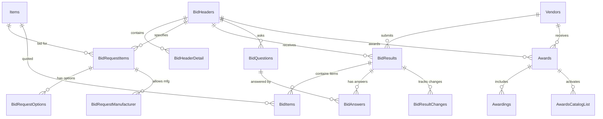

# EDS Database - Bidding & Procurement Domain

Generated: 2026-01-15

This document provides comprehensive documentation for all tables in the Bidding & Procurement domain, which manages competitive procurement, vendor responses, and contract awards.

**Total Tables:** 51 | **Total Rows:** ~506 million

---

## Table of Contents

1. [Domain Overview](#domain-overview)
2. [Core Tables](#core-tables)
3. [Bid Response Tables](#bid-response-tables)
4. [Bid Configuration Tables](#bid-configuration-tables)
5. [Award Tables](#award-tables)
6. [Supporting Tables](#supporting-tables)
7. [Entity Relationship Diagram](#entity-relationship-diagram)

---

## Domain Overview

The Bidding domain handles the complete competitive procurement lifecycle:

```
┌─────────────────────────────────────────────────────────────────────────────┐
│                         BIDDING LIFECYCLE                                    │
└─────────────────────────────────────────────────────────────────────────────┘

  CREATE BID          CONFIGURE           SOLICIT            RECEIVE
 ┌──────────┐       ┌──────────┐       ┌──────────┐       ┌──────────┐
 │BidHeaders│──────►│ BidRequest│──────►│BidImports│──────►│BidResults│
 │          │       │  Items    │       │          │       │          │
 └──────────┘       └──────────┘       └──────────┘       └──────────┘
      │                  │                  │                  │
      ▼                  ▼                  ▼                  ▼
 BidHeaderDetail   BidRequestOptions   VendorQuery        BidItems
 BidQuestions      BidRequestMfg       BidImportCounties  BidAnswers
 BidDocument       BidProductLines                        BidResultChanges

  EVALUATE            AWARD             ACTIVATE
 ┌──────────┐       ┌──────────┐       ┌──────────┐
 │BidResults│──────►│  Awards  │──────►│CrossRefs │
 │(scored)  │       │          │       │(pricing) │
 └──────────┘       └──────────┘       └──────────┘
      │                  │                  │
      ▼                  ▼                  ▼
 BidMSRPResults    Awardings          Catalog
 BidHeaderCheckList AwardsCatalogList Items (updated)
```

### Key Business Processes

| Process | Tables Involved | Description |
|---------|-----------------|-------------|
| Bid Creation | BidHeaders, BidHeaderDetail, BidRequestItems | Create bid solicitation |
| Item Specification | BidRequestItems, BidRequestOptions, BidProductLines | Define what's being bid |
| Vendor Solicitation | BidImports, VendorQuery | Invite vendors to respond |
| Response Collection | BidResults, BidItems, BidAnswers | Capture vendor pricing |
| Evaluation | BidResultsChangeLog, BidHeaderCheckList | Score and compare bids |
| Award | Awards, Awardings, AwardsCatalogList | Grant contracts |

---

## Core Tables

### BidHeaders

**Rows:** ~12,943 | **Purpose:** Master bid solicitation records

The BidHeaders table is the primary record for each competitive bid solicitation. Every bid starts here.

| Column | Type | Description |
|--------|------|-------------|
| BidHeaderId | int PK | Unique bid identifier |
| BidNumber | varchar | Human-readable bid number |
| BidType | int | Type of bid (see BidTypes) |
| CategoryId | int FK | Product category being bid |
| BidDate | datetime | When bid opens |
| DueDate | datetime | Response deadline |
| ExpirationDate | datetime | When pricing expires |
| Active | tinyint | 1=Active, 0=Inactive |
| DistrictId | int FK | Sponsoring district |
| Description | varchar | Bid title/description |

**Relationships:**
- Parent of: BidHeaderDetail, BidRequestItems, BidResults, BidQuestions, BidHeaderDocument
- References: Category, District

**Business Rules:**
- Each bid has a lifecycle: Draft → Open → Closed → Awarded
- Bids can be annual (renewing) or one-time
- Multiple districts can share bid results

---

### BidHeaderDetail

**Rows:** ~150,042,303 | **Purpose:** Detailed bid specifications per item

This is the largest bidding table, storing the granular specifications for each item in each bid.

| Column | Type | Description |
|--------|------|-------------|
| BidHeaderDetailId | int PK | Unique identifier |
| BidHeaderId | int FK | Parent bid |
| ItemId | int FK | Product being bid |
| Quantity | int | Estimated annual quantity |
| UnitId | int FK | Unit of measure |
| Description | varchar | Item description |
| Specifications | varchar | Detailed specifications |

**Relationships:**
- Parent: BidHeaders
- References: Items, Units

**Performance Notes:**
- Highly indexed for bid processing queries
- Consider partitioning by BidHeaderId or date

---

### BidRequestItems

**Rows:** ~59,081,643 | **Purpose:** Items included in bid request

Links items to bid requests, specifying what products vendors should quote.

| Column | Type | Description |
|--------|------|-------------|
| BidRequestItemId | int PK | Unique identifier |
| BidHeaderId | int FK | Parent bid |
| ItemId | int FK | Product to bid |
| Active | tinyint | 1=Active |
| BidRequest | varchar | Request number |
| Status | varchar | Item status |
| Comments | varchar | Notes/comments |

**Relationships:**
- Parent: BidHeaders
- References: Items
- Child: BidRequestOptions, BidRequestManufacturer

---

### BidResults

**Rows:** ~119,213,109 | **Purpose:** Vendor bid submissions

Stores vendor responses to bids - the pricing they submit.

| Column | Type | Description |
|--------|------|-------------|
| BidResultsId | int PK | Unique submission ID |
| BidHeaderId | int FK | Which bid |
| VendorId | int FK | Submitting vendor |
| BidImportId | int FK | Import batch |
| BidPrice | money | Submitted price |
| Active | tinyint | Current/valid submission |
| SubmitDate | datetime | When submitted |
| StatusId | int FK | Submission status |

**Relationships:**
- Parent: BidHeaders, Vendors, BidImports
- Child: BidItems, BidAnswers, BidResultsChangeLog

**Business Rules:**
- Multiple submissions per vendor allowed (latest Active=1)
- Price changes tracked in BidResultsChangeLog
- Status tracks evaluation state

---

### BidItems

**Rows:** ~43,145,798 | **Purpose:** Line-item pricing from vendors

Individual item prices within a vendor's bid submission.

| Column | Type | Description |
|--------|------|-------------|
| BidItemId | int PK | Unique identifier |
| BidResultsId | int FK | Parent submission |
| ItemId | int FK | Product |
| BidPrice | money | Vendor's price |
| VendorItemCode | varchar | Vendor's SKU |
| Description | varchar | Vendor's description |
| ManufacturerId | int FK | Manufacturer |
| UnitId | int FK | Unit of measure |

**Relationships:**
- Parent: BidResults
- References: Items, Manufacturers, Units

---

## Bid Response Tables

### BidAnswers

**Rows:** ~552,470 | **Purpose:** Vendor responses to bid questions

When bids include questions (certifications, capabilities, etc.), vendor answers are stored here.

| Column | Type | Description |
|--------|------|-------------|
| BidAnswerId | int PK | Unique identifier |
| BidQuestionId | int FK | The question |
| BidResultsId | int FK | Vendor's submission |
| Answer | varchar | Vendor's response |
| AnswerDate | datetime | When answered |

---

### BidResultChanges

**Rows:** ~18,229,521 | **Purpose:** Audit trail of bid modifications

Tracks every change to bid submissions for compliance and audit.

| Column | Type | Description |
|--------|------|-------------|
| BidResultChangeId | int PK | Unique identifier |
| BidResultsId | int FK | Affected submission |
| ChangeType | varchar | Type of change |
| OldValue | varchar | Previous value |
| NewValue | varchar | New value |
| ChangeDate | datetime | When changed |
| ChangedBy | int FK | User who changed |

---

### BidResultsChangeLog

**Rows:** ~238,978 | **Purpose:** Summary change log

Higher-level change tracking for bid results.

---

### BidAnswersJournal

**Rows:** ~1,264,733 | **Purpose:** History of answer changes

Audit trail for bid question answer modifications.

---

## Bid Configuration Tables

### BidQuestions

**Rows:** ~23,509 | **Purpose:** Questions included in bids

Bids can include questions vendors must answer (certifications, warranties, etc.).

| Column | Type | Description |
|--------|------|-------------|
| BidQuestionId | int PK | Unique identifier |
| BidHeaderId | int FK | Parent bid |
| QuestionText | varchar | The question |
| QuestionType | int | Type (Y/N, text, numeric) |
| Required | bit | Must answer? |
| SortOrder | int | Display order |

---

### BidRequestOptions

**Rows:** ~422,035 | **Purpose:** Item options/variants

Specifies acceptable options for bid items (colors, sizes, configurations).

---

### BidRequestManufacturer

**Rows:** ~104,823 | **Purpose:** Approved manufacturers

Lists which manufacturers are acceptable for bid items.

---

### BidRequestProductLines

**Rows:** ~175,875 | **Purpose:** Product line specifications

Links bid items to specific product lines.

---

### BidRequestPriceRanges

**Rows:** ~1,897,760 | **Purpose:** Price tier structures

Defines quantity-based price breaks for bid items.

---

### BidProductLines

**Rows:** ~286,318 | **Purpose:** Product lines in bids

Product line information within bid context.

---

### BidProductLinePrices

**Rows:** ~1,323,391 | **Purpose:** Product line pricing

Pricing at the product line level.

---

### BidManufacturers

**Rows:** ~252,521 | **Purpose:** Manufacturer references

Manufacturers associated with bids.

---

## Award Tables

### Awards

**Rows:** ~279,675 | **Purpose:** Bid award records

Records the granting of contracts to winning vendors.

| Column | Type | Description |
|--------|------|-------------|
| AwardId | int PK | Unique award ID |
| BidHeaderId | int FK | Source bid |
| VendorId | int FK | Winning vendor |
| AwardTypeId | int FK | Primary/Secondary |
| EffectiveDate | datetime | Start date |
| ExpirationDate | datetime | End date |
| AwardDate | datetime | When awarded |
| Active | tinyint | 1=Active |

**Award Types:**
| AwardTypeId | Description |
|-------------|-------------|
| 1 | Primary - First choice vendor |
| 2 | Secondary - Backup vendor |

---

### Awardings

**Rows:** ~11,024 | **Purpose:** Award line items

Links awards to specific items/categories being awarded.

| Column | Type | Description |
|--------|------|-------------|
| AwardingId | int PK | Unique identifier |
| AwardId | int FK | Parent award |
| ItemId | int FK | Awarded item |
| CategoryId | int FK | Awarded category |

---

### AwardsCatalogList

**Rows:** ~82,492 | **Purpose:** Catalogs included in awards

Links awards to vendor catalogs that become available.

---

### AwardTypes

**Rows:** 2 | **Purpose:** Award type definitions

| AwardTypeId | Description |
|-------------|-------------|
| 1 | Primary |
| 2 | Secondary |

---

## Supporting Tables

### BidImports

**Rows:** ~96,792 | **Purpose:** Vendor catalog imports

Tracks vendor catalog/pricing imports for bid processing.

| Column | Type | Description |
|--------|------|-------------|
| BidImportId | int PK | Import batch ID |
| VendorId | int FK | Vendor |
| BidHeaderId | int FK | Target bid |
| ImportDate | datetime | When imported |
| FileName | varchar | Source file |
| Status | varchar | Import status |

---

### BidImportCatalogList

**Rows:** ~32,921 | **Purpose:** Catalogs in import batch

---

### BidImportCounties

**Rows:** ~65,163 | **Purpose:** Geographic coverage

Counties covered by vendor in bid.

---

### BidDocument

**Rows:** ~10,558 | **Purpose:** Bid document references

Documents attached to bids (specifications, terms).

---

### BidHeaderDocument

**Rows:** ~173,275 | **Purpose:** Header-level documents

Documents linked to bid headers.

---

### BidDocumentTypes

**Rows:** ~298 | **Purpose:** Document type lookup

Types of bid documents.

---

### BidHeaderCheckList

**Rows:** ~114,944 | **Purpose:** Evaluation checklist

Checklist items for bid evaluation process.

---

### BidCalendar

**Rows:** 1 | **Purpose:** Bid calendar settings

System-wide bid calendar configuration.

---

### BidTypes

**Rows:** 2 | **Purpose:** Bid type definitions

Types of bids (e.g., Formal, Informal).

---

### BidTrades

**Rows:** ~1,710 | **Purpose:** Trade categories

Trade/industry categories for bids.

---

### BidTradeCounties

**Rows:** ~42,912 | **Purpose:** Trade by county

Geographic coverage by trade.

---

### BidPackage

**Rows:** 50 | **Purpose:** Bid packages

Grouped bid configurations.

---

### BidPackageDocument

**Rows:** ~1,430 | **Purpose:** Package documents

Documents in bid packages.

---

### BidMSRPResults

**Rows:** ~51,828 | **Purpose:** MSRP bid results

Manufacturer's suggested retail pricing responses.

---

### BidMSRPResultPrices

**Rows:** ~422,692 | **Purpose:** MSRP price details

Detailed MSRP pricing.

---

### BidMSRPResultsProductLines

**Rows:** ~110,442 | **Purpose:** MSRP by product line

MSRP results organized by product line.

---

### BidMappedItems

**Rows:** ~1,456,772 | **Purpose:** Item mapping

Maps bid items to standard items.

---

### BidMgrTagFile

**Rows:** ~4,338,798 | **Purpose:** Bid manager tags

Tag file data for bid management.

---

### BidMgrConfiguration

**Rows:** 1 | **Purpose:** Bid manager settings

Configuration for bid manager tool.

---

### BidManagers

**Rows:** 0 | **Purpose:** Bid manager assignments

Users assigned as bid managers.

---

### BidReawards

**Rows:** ~611 | **Purpose:** Re-award records

Tracking of bid re-awards after initial award.

---

### BidRequestItemMergeActions

**Rows:** ~91,008 | **Purpose:** Item merge tracking

Actions for merging duplicate bid items.

---

### BidResponses

**Rows:** 1 | **Purpose:** Response tracking

Overall response tracking.

---

### BidderCheckList

**Rows:** ~140 | **Purpose:** Bidder requirements

Checklist of bidder requirements.

---

### BidderCheckListPkgHeader

**Rows:** ~56 | **Purpose:** Checklist package headers

---

### BidderCheckListPkgDetail

**Rows:** ~1,195 | **Purpose:** Checklist package details

---

### Bids

**Rows:** ~315,965 | **Purpose:** Bid master records

Alternative/legacy bid records.

---

### BidsCatalogList

**Rows:** ~82,657 | **Purpose:** Catalogs in bids

Catalogs associated with bids.

---

## Entity Relationship Diagram



---

## Common Queries

### Find all bids for a category
```sql
SELECT bh.BidHeaderId, bh.BidNumber, bh.Description,
       bh.BidDate, bh.DueDate
FROM BidHeaders bh
WHERE bh.CategoryId = @CategoryId
  AND bh.Active = 1
ORDER BY bh.DueDate DESC;
```

### Get vendor submissions for a bid
```sql
SELECT v.Name AS VendorName, br.BidPrice, br.SubmitDate,
       COUNT(bi.BidItemId) AS ItemCount
FROM BidResults br
JOIN Vendors v ON br.VendorId = v.VendorId
LEFT JOIN BidItems bi ON br.BidResultsId = bi.BidResultsId
WHERE br.BidHeaderId = @BidHeaderId
  AND br.Active = 1
GROUP BY v.Name, br.BidPrice, br.SubmitDate;
```

### Find awards by vendor
```sql
SELECT a.AwardId, bh.BidNumber, a.EffectiveDate, a.ExpirationDate,
       at.Description AS AwardType
FROM Awards a
JOIN BidHeaders bh ON a.BidHeaderId = bh.BidHeaderId
JOIN AwardTypes at ON a.AwardTypeId = at.AwardTypeId
WHERE a.VendorId = @VendorId
  AND a.Active = 1
ORDER BY a.EffectiveDate DESC;
```

---

## Data Quality Notes

1. **Duplicate Submissions:** Vendors may submit multiple times; only latest Active=1 record is current
2. **Historical Preservation:** Old bid data preserved for audit (don't delete)
3. **Price Consistency:** BidPrice in BidResults should match sum of BidItems
4. **Date Validation:** DueDate must be after BidDate; ExpirationDate after award

---

## Archive Strategy

| Table | Retention | Archive Method |
|-------|-----------|----------------|
| BidHeaders | Permanent | Keep in main table |
| BidResults | 7 years | Archive to BidResults_Archive |
| BidItems | 7 years | Archive with parent |
| BidResultChanges | 3 years | Purge after audit period |

---

## Change History

| Date | Change | Author |
|------|--------|--------|
| 2026-01-15 | Initial Bidding domain documentation | Phase 2 Documentation |
