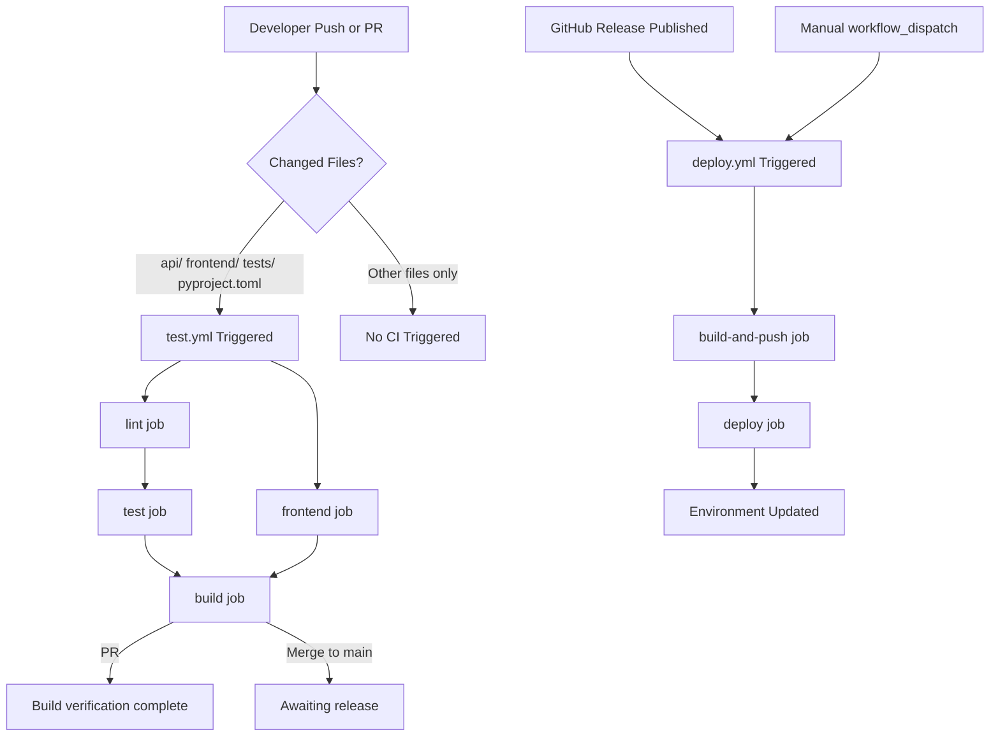
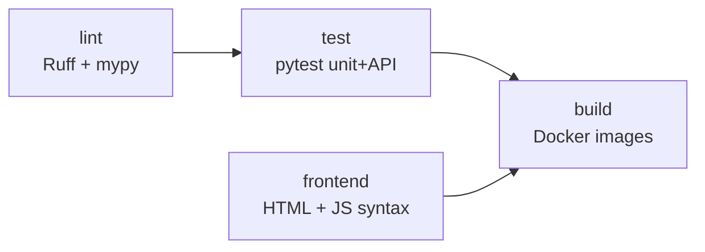
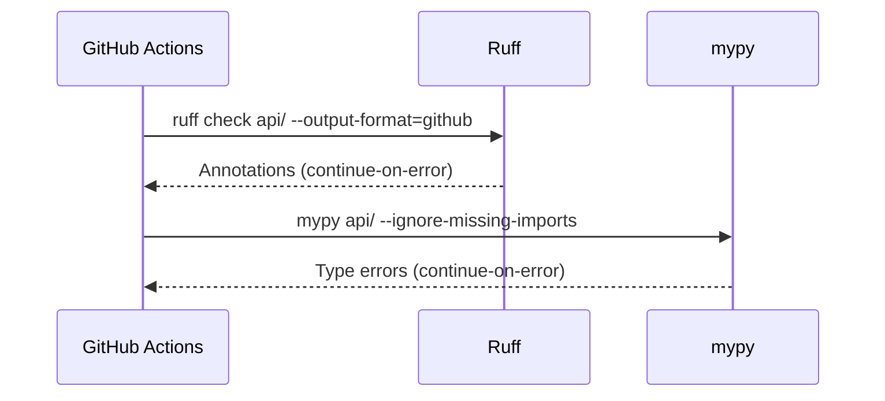
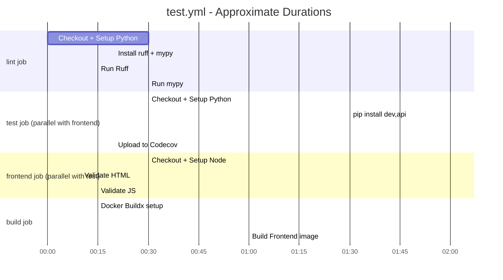
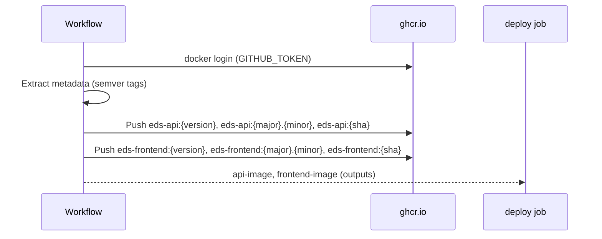
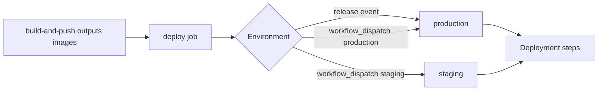
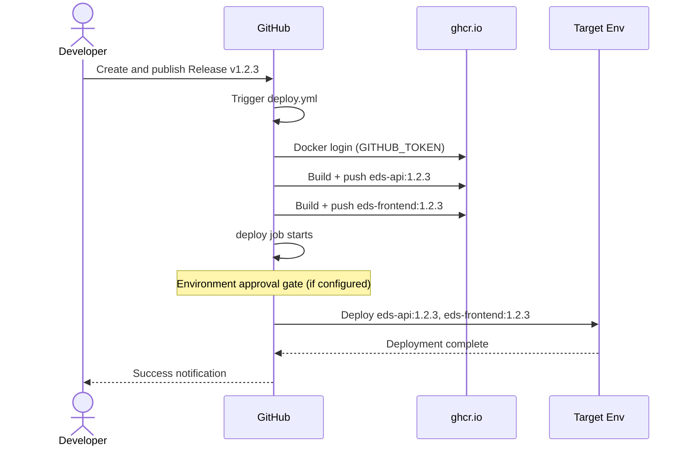

# EDS CI/CD Pipeline

Documentation for the Continuous Integration and Continuous Deployment pipeline for the EDS Universal Requisition system.

**Related documents:** [TESTING_REFERENCE.md](TESTING_REFERENCE.md) | [TESTING.md](TESTING.md) | [DEPLOYMENT.md](DEPLOYMENT.md) | [DEVELOPMENT.md](DEVELOPMENT.md)

---

## Table of Contents

1. [Pipeline Overview](#1-pipeline-overview)
2. [Test Workflow (test.yml)](#2-test-workflow-testyml)
3. [Deploy Workflow (deploy.yml)](#3-deploy-workflow-deployyml)
4. [Environment Configuration](#4-environment-configuration)
5. [Container Registry](#5-container-registry)
6. [Troubleshooting CI Failures](#6-troubleshooting-ci-failures)
7. [Local Pre-Push Verification](#7-local-pre-push-verification)
8. [Adding New Workflow Steps](#8-adding-new-workflow-steps)

---

## 1. Pipeline Overview

EDS uses two GitHub Actions workflows:

| Workflow | File | Trigger | Purpose |
|----------|------|---------|---------|
| Tests | `.github/workflows/test.yml` | Push/PR to `main` or `develop` | Lint, test, build verification |
| Deploy | `.github/workflows/deploy.yml` | Published release or manual dispatch | Build, push images, deploy |

### High-Level Flow



### Dependency Graph (test.yml)



The `build` job only runs when both `test` and `frontend` succeed. `lint` runs first, and its results are informational (both Ruff and mypy use `continue-on-error: true`).

---

## 2. Test Workflow (test.yml)

**File:** `.github/workflows/test.yml`

### Trigger Conditions

```yaml
on:
  push:
    branches: [main, develop]
    paths:
      - 'api/**'
      - 'frontend/**'
      - 'tests/**'
      - 'pyproject.toml'
      - '.github/workflows/test.yml'
  pull_request:
    branches: [main, develop]
```

The path filter on `push` events means the pipeline is not triggered for documentation-only changes (e.g., edits to `docs/`). Pull requests always trigger the full workflow regardless of changed paths.

### Job: lint

**Runner:** `ubuntu-latest` | **Python:** 3.11



Both linting tools use `continue-on-error: true`. This means the `test` job proceeds even if linting fails. Lint results are visible as annotations in the GitHub PR but do not block the pipeline.

**Why `continue-on-error`?** The linting rules and type annotations are being incrementally adopted. Blocking the pipeline on every type warning would be disruptive. Review lint annotations separately.

**Installed packages:** `ruff`, `mypy` (intentionally minimal — no project dependencies needed for linting)

### Job: test

**Runner:** `ubuntu-latest` | **Python:** 3.11 | **Needs:** `lint`

**Step: Install dependencies**

```bash
pip install ".[dev,api]"
```

This installs the project in editable mode with both the `dev` extra (pytest, pytest-cov, httpx) and the `api` extra (FastAPI, uvicorn, pydantic, ollama, elasticsearch).

**Step: Run tests with coverage**

```bash
pytest tests/ -m "not e2e and not integration" \
  --cov=api \
  --cov-report=xml \
  --cov-report=term-missing \
  -v
```

This runs all unit and API tests while explicitly excluding:
- `e2e` — requires a live browser and running server
- `integration` — requires a real SQL Server connection

The `-v` flag produces per-test output visible in the Actions log. Coverage is reported to the terminal and saved to `coverage.xml`.

**Step: Upload coverage to Codecov**

```yaml
- uses: codecov/codecov-action@v4
  with:
    files: ./coverage.xml
    fail_ci_if_error: false
    verbose: true
```

`fail_ci_if_error: false` ensures that a Codecov API outage does not fail the CI run. Coverage trends are tracked in Codecov but are not a hard gate.

### Job: frontend

**Runner:** `ubuntu-latest` | **No Python needed**

Runs in parallel with the `test` job. Only `test` depends on `lint`; the `frontend` job runs independently with no dependencies.

**Step: Validate HTML**

A shell loop checks every `.html` file in `frontend/` for:
- `<!DOCTYPE html>` declaration
- `<html` opening tag

Failures are printed as warnings rather than causing job failure.

**Step: Validate JavaScript files**

Uses Node.js 20 with `node --check` to perform syntax-only validation of all `.js` files in `frontend/js/`. This catches syntax errors without running the scripts.

```bash
for file in frontend/js/*.js; do
    node --check "$file"
done
```

### Job: build

**Runner:** `ubuntu-latest` | **Needs:** `test` AND `frontend`

Verifies that Docker images build successfully. Images are built but not pushed (no registry login, `push: false`).

**Docker layer caching** uses GitHub Actions Cache (`type=gha`) for both images. This significantly reduces build times on repeated runs by reusing unchanged layers.

```yaml
- name: Build API image
  uses: docker/build-push-action@v5
  with:
    context: .
    file: docker/Dockerfile.api
    push: false
    tags: eds-api:test
    cache-from: type=gha
    cache-to: type=gha,mode=max
```

**Why build in test workflow?** Image builds catch packaging issues (missing files, broken dependencies) before they reach the deploy workflow. A build failure here is much cheaper to debug than a deployment failure.

### Complete Test Workflow Timeline



Total wall-clock time: approximately 9–12 minutes, depending on cache warm state.

---

## 3. Deploy Workflow (deploy.yml)

**File:** `.github/workflows/deploy.yml`

### Trigger Conditions

```yaml
on:
  release:
    types: [published]
  workflow_dispatch:
    inputs:
      environment:
        description: 'Deployment environment'
        required: true
        default: 'staging'
        type: choice
        options:
          - staging
          - production
```

The deploy workflow runs only when:
1. A GitHub Release is published (automated deployment to production), or
2. A developer manually triggers it via `workflow_dispatch` (for staging deploys or emergency production deploys)

### Job: build-and-push

**Runner:** `ubuntu-latest` | **Permissions:** `contents: read`, `packages: write`

**Registry:** GitHub Container Registry (`ghcr.io`)



**Image Tagging Strategy**

Three tags are produced for each image on every release:

| Tag Pattern | Example | Purpose |
|------------|---------|---------|
| `{version}` (semver) | `1.2.3` | Exact version, pinnable |
| `{major}.{minor}` | `1.2` | Minor series, auto-updates patch |
| `{sha}` | `a3f8c21` | Git commit SHA, for audit trail |

```yaml
tags: |
  type=semver,pattern={{version}}
  type=semver,pattern={{major}}.{{minor}}
  type=sha,prefix=
```

This tagging strategy allows Kubernetes deployments to pin to either an exact version (`1.2.3`) or a rolling minor series (`1.2`).

**Layer Caching**

Same GHA cache strategy as the test workflow, using `mode=max` which caches all layers including intermediate ones.

**Outputs**

The `api-image` and `frontend-image` outputs pass the full image tag (e.g., `ghcr.io/org/eds-api:1.2.3`) to the dependent `deploy` job.

### Job: deploy

**Runner:** `ubuntu-latest` | **Needs:** `build-and-push` | **Environment:** `production` or `staging`



**GitHub Environment Protection**

The `deploy` job uses a named GitHub Environment (`production` or `staging`). Environments can have:
- Required reviewers (manual approval gate before deployment proceeds)
- Environment-specific secrets
- Deployment URL (shown in the PR/commit status)

The `url: ${{ vars.DEPLOYMENT_URL }}` references an environment-level variable.

**Current Deploy Step**

The actual deployment steps are marked as a placeholder in the workflow:

```yaml
- name: Deployment placeholder
  run: |
    echo "Add your deployment commands here"
    echo "Example: ssh deploy@server 'cd /app && docker-compose pull && docker-compose up -d'"
```

To complete the deployment automation, replace this step with your target platform's deployment commands. Common patterns:

```yaml
# Docker Compose on a VM
- name: Deploy via SSH
  uses: appleboy/ssh-action@v1
  with:
    host: ${{ secrets.DEPLOY_HOST }}
    username: ${{ secrets.DEPLOY_USER }}
    key: ${{ secrets.SSH_PRIVATE_KEY }}
    script: |
      cd /app/eds
      docker-compose pull
      docker-compose up -d --remove-orphans

# Kubernetes (AKS)
- name: Deploy to AKS
  run: |
    az login --service-principal \
      -u ${{ secrets.AZURE_CLIENT_ID }} \
      -p ${{ secrets.AZURE_CLIENT_SECRET }} \
      --tenant ${{ secrets.AZURE_TENANT_ID }}
    az aks get-credentials --resource-group eds-prod-rg --name eds-aks-prod
    kubectl set image deployment/eds-api \
      api=${{ needs.build-and-push.outputs.api-image }}
    kubectl set image deployment/eds-frontend \
      frontend=${{ needs.build-and-push.outputs.frontend-image }}
    kubectl rollout status deployment/eds-api
    kubectl rollout status deployment/eds-frontend
```

For AKS deployment details, see [kubernetes-clusters.md](kubernetes-clusters.md).

### Complete Deploy Workflow Flow



---

## 4. Environment Configuration

### GitHub Repository Secrets

These secrets must be configured in the GitHub repository settings under Settings → Secrets and variables → Actions.

| Secret | Used In | Description |
|--------|---------|-------------|
| `GITHUB_TOKEN` | deploy.yml | Auto-provided by GitHub. Used for GHCR login. No configuration needed. |

For the placeholder deployment steps, add secrets appropriate to your target platform:

| Secret (Example) | Purpose |
|-----------------|---------|
| `DEPLOY_HOST` | SSH deployment target hostname |
| `DEPLOY_USER` | SSH user for deployment |
| `SSH_PRIVATE_KEY` | Private key for SSH authentication |
| `AZURE_CLIENT_ID` | AKS service principal ID |
| `AZURE_CLIENT_SECRET` | AKS service principal secret |
| `AZURE_TENANT_ID` | Azure tenant ID |
| `AZURE_SUBSCRIPTION_ID` | Azure subscription ID |

### GitHub Environment Variables

Environment-specific variables (not secrets) are set per environment (staging, production):

| Variable | Example Value | Description |
|----------|--------------|-------------|
| `DEPLOYMENT_URL` | `https://eds.example.com` | Shown in deployment status |

### Runtime Application Secrets

These are not in the GitHub workflow but must be configured in the deployment target's environment (`.env` file, Kubernetes secrets, or Azure Key Vault):

| Variable | Required | Description |
|----------|----------|-------------|
| `DB_SERVER` | Yes | SQL Server hostname/IP |
| `DB_DATABASE_CATALOG` | Yes | Catalog database name (`EDS`) |
| `DB_USERNAME` | Yes | SQL Server username |
| `DB_PASSWORD` | Yes | SQL Server password |
| `EDS_ENV` | Yes | `production` for live deployments |
| `EDS_CORS_ORIGINS` | In production | Comma-separated allowed origins |
| `EDS_RATE_LIMIT` | No | Requests per minute (default: 120) |
| `EDS_BEHIND_PROXY` | No | `true` if behind a load balancer |
| `ANTHROPIC_API_KEY` | For AI chat | Claude API key (enables AI chat feature) |
| `OPENAI_API_KEY` | For AI search | OpenAI API key (alternative LLM provider) |

See [CONFIGURATION.md](CONFIGURATION.md) for complete configuration reference.

### Environment Protection Rules

For production deployments, configure the `production` environment with required reviewers:

1. Go to Settings → Environments → production
2. Enable "Required reviewers"
3. Add team members who must approve before deployment proceeds
4. Set "Deployment branches" to `main` only

---

## 5. Container Registry

Images are pushed to GitHub Container Registry at `ghcr.io`.

### Image Repositories

| Image | Registry Path |
|-------|-------------|
| API | `ghcr.io/{org}/{repo}/eds-api` |
| Frontend | `ghcr.io/{org}/{repo}/eds-frontend` |

### Pulling Images

```bash
# Log in to GHCR (requires GitHub token with read:packages scope)
echo $GITHUB_TOKEN | docker login ghcr.io -u USERNAME --password-stdin

# Pull a specific release
docker pull ghcr.io/org/eds/eds-api:1.2.3
docker pull ghcr.io/org/eds/eds-frontend:1.2.3

# Pull the latest minor of 1.2
docker pull ghcr.io/org/eds/eds-api:1.2
```

### Image Size and Build Context

The API Dockerfile is at `docker/Dockerfile.api` and the frontend at `docker/Dockerfile.frontend`. The build context is the repository root (`.`).

For local builds:

```bash
docker build -f docker/Dockerfile.api -t eds-api:local .
docker build -f docker/Dockerfile.frontend -t eds-frontend:local .
```

---

## 6. Troubleshooting CI Failures

### Failure: "lint" job — Ruff or mypy errors

Both tools use `continue-on-error: true` so they do not block the pipeline. However, review the annotations in the PR diff view.

To reproduce locally:

```bash
pip install ruff mypy
ruff check api/
mypy api/ --ignore-missing-imports
```

Common ruff issues:
- Unused imports (`F401`): remove the import or add `# noqa: F401`
- Line too long (`E501`): break the line or add to `ruff.toml` ignore list
- Undefined name: usually indicates a missing import

### Failure: "test" job — pytest failures

**View the failure:** In the Actions run, expand the "Run tests with coverage" step. Look for `FAILED` lines.

**Reproduce locally:**

```bash
pip install -e ".[dev,api]"
pytest tests/ -m "not e2e and not integration" -v
```

**Common causes:**

| Error | Cause | Fix |
|-------|-------|-----|
| `ModuleNotFoundError: No module named 'api'` | Package not installed | `pip install -e ".[dev,api]"` |
| `429 Too Many Requests` in API test | Rate limit not bypassed | Verify `os.environ["EDS_RATE_LIMIT"] = "999999"` is in `tests/conftest.py` before any imports |
| `StopIteration` in mock | `side_effect` list too short | Add more entries to the list to match the number of `fetchone` calls |
| `AssertionError: assert 401 == 200` | Auth dependency mock not applied | Check patch target matches the route module |
| `ImportError` for `api.routes.reports` | New route file not in `api/routes/__init__.py` | Add the import to the routes package |

### Failure: "test" job — Codecov upload error

Codecov failures use `fail_ci_if_error: false` and do not block the pipeline. Check the Codecov dashboard separately. Common issues:
- Codecov token not configured (for private repos): add `CODECOV_TOKEN` to repository secrets
- Transient API timeout: retry the job

### Failure: "frontend" job — JavaScript syntax error

```bash
# Reproduce locally
node --check frontend/js/auth.js
```

The error output will include the file path and line number. Fix the syntax error and push again.

### Failure: "frontend" job — HTML validation warning

HTML validation currently only warns (does not fail the job). If you see warnings, add the missing `<!DOCTYPE html>` or `<html` tag.

### Failure: "build" job — Docker build error

```bash
# Reproduce locally
docker build -f docker/Dockerfile.api -t eds-api:test . 2>&1
docker build -f docker/Dockerfile.frontend -t eds-frontend:test . 2>&1
```

Common causes:
- New Python package dependency not in `requirements.txt` or `pyproject.toml`
- A file referenced in the Dockerfile (`COPY`, `ADD`) does not exist at the given path
- Base image unavailable (transient DockerHub/GHCR rate limit): retry the job

### Failure: "build-and-push" job — GHCR login failed

The deploy workflow uses `GITHUB_TOKEN` (auto-provided). If the login fails:
- Verify the job has `permissions: packages: write`
- Check that GHCR is enabled for the repository (Settings → Packages)

### Failure: "deploy" job — Environment approval pending

If the `production` environment requires reviewers, the job will pause. Go to the Actions run, find the "Deploy to production" job, and click "Review deployments" to approve.

### Re-running a Failed Job

In the GitHub Actions UI:
1. Navigate to the failed workflow run
2. Click "Re-run failed jobs" (top right)
3. For transient failures (network timeouts, rate limits), this often resolves the issue

---

## 7. Local Pre-Push Verification

Run these checks locally before pushing to avoid common CI failures.

### Quick Check (< 2 minutes)

```bash
# Install dependencies
pip install -e ".[dev,api]"

# Run unit and API tests only
pytest tests/ -m "not e2e and not integration" -x -q
```

The `-x` flag stops on the first failure. The `-q` flag reduces output verbosity.

### Full Check (< 10 minutes)

```bash
# Lint
pip install ruff mypy
ruff check api/
mypy api/ --ignore-missing-imports

# Tests with coverage
pytest tests/ -m "not e2e and not integration" \
  --cov=api --cov-report=term-missing

# Frontend validation
for file in frontend/js/*.js; do
  node --check "$file"
done

# Docker build verification
docker build -f docker/Dockerfile.api -t eds-api:local . --quiet
docker build -f docker/Dockerfile.frontend -t eds-frontend:local . --quiet
```

### E2E Check (requires running server, ~5 minutes additional)

```bash
# Terminal 1: Start the server
uvicorn api.main:app --port 8000

# Terminal 2: Run E2E tests
pytest tests/e2e/ -m e2e --base-url http://localhost:8000 -v

# Visual regression (compare against baselines)
pytest tests/e2e/test_visual_regression.py \
  --base-url http://localhost:8000
```

### Pre-Release Checklist

Before creating a GitHub Release:

- [ ] All CI checks green on `main`
- [ ] E2E tests pass locally against the production build
- [ ] Visual regression baselines are current (no unexpected diffs)
- [ ] `CHANGELOG.md` or release notes updated
- [ ] Version number updated in `pyproject.toml` if applicable
- [ ] Docker images build successfully locally

---

## 8. Adding New Workflow Steps

### Adding a New Test Category

If you add a new pytest marker (e.g., `performance`), register it in `pyproject.toml`:

```toml
markers = [
    ...
    "performance: marks performance benchmark tests",
]
```

Then update the `test.yml` exclusion pattern if needed:

```yaml
run: |
  pytest tests/ -m "not e2e and not integration and not performance" \
    --cov=api --cov-report=xml -v
```

### Adding a Security Scan

To add a dependency vulnerability scan (e.g., with `safety`), insert a new step in the `lint` job:

```yaml
- name: Check for known vulnerabilities
  run: |
    pip install safety
    safety check --full-report
  continue-on-error: true
```

### Adding Container Image Scanning

To scan built images for CVEs (e.g., with Trivy), add a step after the Docker build in the `build` job:

```yaml
- name: Run Trivy vulnerability scanner
  uses: aquasecurity/trivy-action@master
  with:
    image-ref: eds-api:test
    format: sarif
    output: trivy-results.sarif
    severity: CRITICAL,HIGH

- name: Upload Trivy scan results
  uses: github/codeql-action/upload-sarif@v3
  with:
    sarif_file: trivy-results.sarif
```

### Adding a Staging Smoke Test

After deploying to staging, run a quick smoke test against the live endpoint:

```yaml
- name: Smoke test staging deployment
  run: |
    sleep 30  # Wait for deployment to complete
    curl -f ${{ vars.DEPLOYMENT_URL }}/api/health || exit 1
    curl -f ${{ vars.DEPLOYMENT_URL }}/api/status || exit 1
    echo "Smoke tests passed"
```

### Caching pip Dependencies

The test workflow already uses `cache: 'pip'` in `actions/setup-python@v5`. This caches the pip download cache (not the virtualenv). For faster installs, consider also caching the virtualenv:

```yaml
- name: Cache virtualenv
  uses: actions/cache@v4
  with:
    path: .venv
    key: venv-${{ runner.os }}-${{ hashFiles('pyproject.toml') }}

- name: Install dependencies
  run: |
    python -m venv .venv
    . .venv/bin/activate
    pip install ".[dev,api]"
```

---

## Appendix: Workflow File Reference

### .github/workflows/test.yml — Full Structure

```
name: Tests
on: push (main/develop, path-filtered), pull_request (main/develop)

jobs:
  lint         (ubuntu-latest, python 3.11)
    - checkout
    - setup-python (cache: pip)
    - install ruff, mypy
    - ruff check api/ (continue-on-error)
    - mypy api/ (continue-on-error)

  test         (ubuntu-latest, python 3.11, needs: lint)
    - checkout
    - setup-python (cache: pip)
    - pip install ".[dev,api]"
    - pytest -m "not e2e and not integration" --cov=api --cov-report=xml -v
    - codecov upload (fail_ci_if_error: false)

  frontend     (ubuntu-latest, needs: none — parallel with test)
    - checkout
    - validate HTML (bash loop, warnings only)
    - setup-node (v20)
    - node --check on all frontend/js/**/*.js

  build        (ubuntu-latest, needs: [test, frontend])
    - checkout
    - setup docker buildx
    - build eds-api:test (push: false, GHA cache)
    - build eds-frontend:test (push: false, GHA cache)
```

### .github/workflows/deploy.yml — Full Structure

```
name: Deploy
on: release (published), workflow_dispatch (staging|production)

env:
  REGISTRY: ghcr.io
  API_IMAGE_NAME: {repo}/eds-api
  FRONTEND_IMAGE_NAME: {repo}/eds-frontend

jobs:
  build-and-push  (ubuntu-latest, permissions: packages:write)
    outputs: api-image, frontend-image
    - checkout
    - setup docker buildx
    - login to ghcr.io (GITHUB_TOKEN)
    - metadata action for API (semver + sha tags)
    - metadata action for frontend (semver + sha tags)
    - build + push eds-api (GHA cache)
    - build + push eds-frontend (GHA cache)

  deploy          (ubuntu-latest, needs: build-and-push)
    environment: production | staging (with URL)
    - checkout
    - deployment notification (echo)
    - PLACEHOLDER: add real deployment commands here
```

---

*This document covers the CI/CD pipeline as of March 2026. Workflow files live at `/C:/EDS/.github/workflows/test.yml` and `/C:/EDS/.github/workflows/deploy.yml`.*
