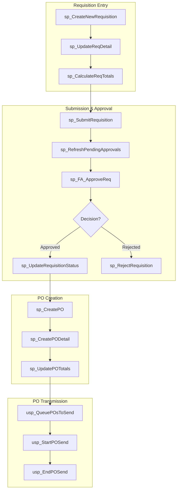
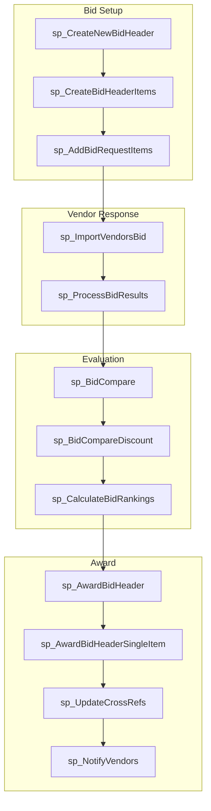
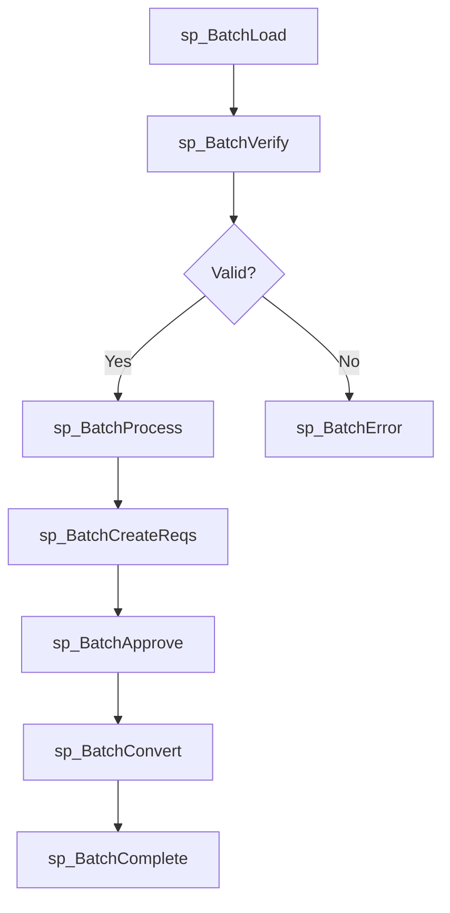
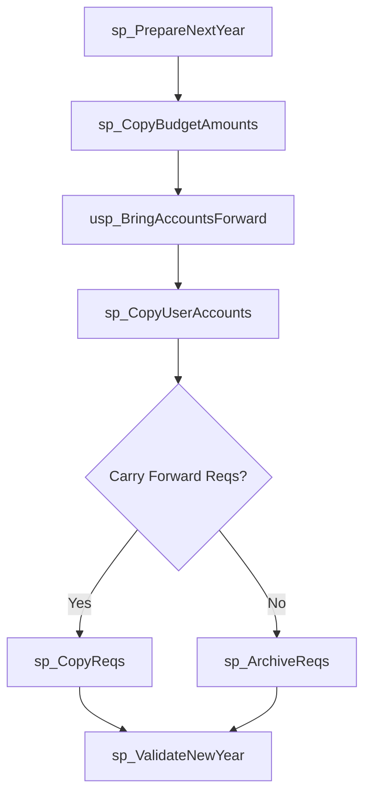
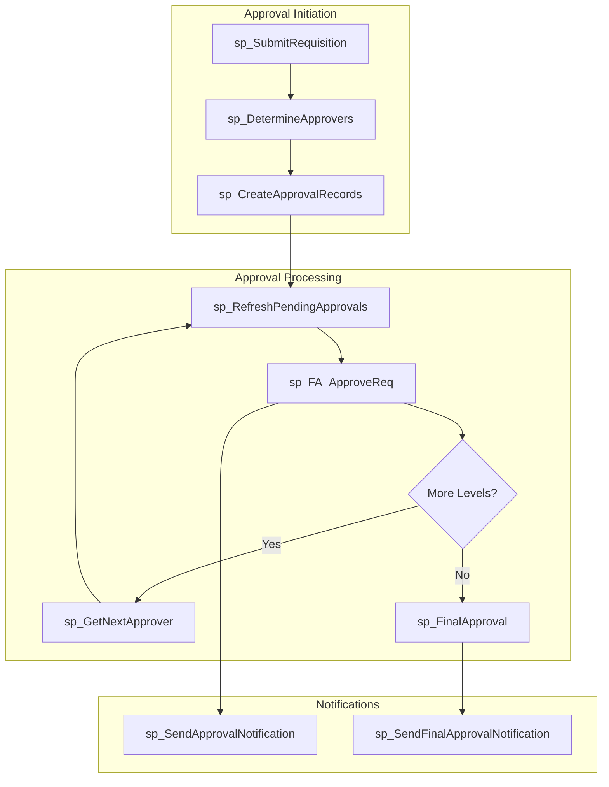
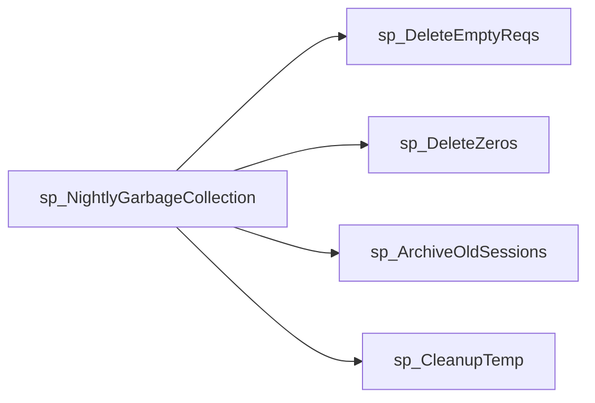
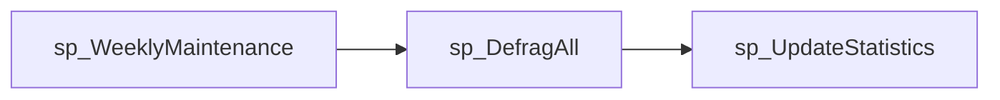
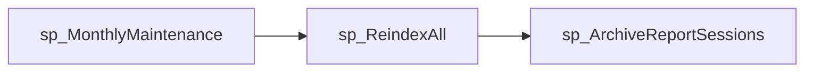

# EDS Database - Stored Procedure Dependencies

Generated: 2026-01-15 (consolidated with EDS_SP_DEPENDENCIES.md)

This document maps the dependencies between stored procedures, showing call chains, table access patterns, and workflow orchestration.

---

## Overview

The EDS database contains 395 stored procedures with complex interdependencies. Understanding these dependencies is critical for:
- Impact analysis before code changes
- Performance tuning
- Debugging cascading failures
- Batch job orchestration

### Summary Metrics

| Metric | Count |
|--------|-------|
| Total Stored Procedures | 395 |
| SPs that call other SPs | 129 |
| Root SPs (callers, not called) | 72 |
| Leaf SPs (don't call others) | 264 |
| Unique table accesses | 156 |

### Most Accessed Tables

Tables accessed by the most stored procedures:

| Table | SPs Accessing |
|-------|---------------|
| Requisitions | 147 |
| Budgets | 99 |
| Detail | 93 |
| Users | 85 |
| BidHeaders | 80 |
| District | 71 |
| Items | 62 |
| SessionTable | 61 |
| Category | 55 |
| CrossRefs | 48 |
| School | 48 |
| Bids | 47 |
| UserAccounts | 46 |
| Vendors | 45 |
| PO | 45 |
| BidItems | 44 |
| Catalog | 40 |
| BidResults | 40 |
| Approvals | 39 |
| BudgetAccounts | 38 |
| Accounts | 37 |
| BidImports | 34 |
| BidRequestItems | 33 |
| ReportSessionLinks | 32 |
| Units | 26 |

---

## Procedure Classification

### By Call Pattern

| Category | Description | Count |
|----------|-------------|-------|
| **Root Procedures** | Entry points - called by applications, not by other SPs | 72 |
| **Orchestrator Procedures** | Call multiple child procedures | ~50 |
| **Worker Procedures** | Called by orchestrators, do specific work | ~150 |
| **Leaf Procedures** | Don't call other procedures | 264 |

### By Domain

| Domain | Count | Key Entry Points |
|--------|-------|------------------|
| Requisitions | ~45 | sp_CreateNewRequisition, sp_SubmitRequisition |
| Approvals | ~25 | sp_FA_ApproveReq, sp_RefreshPendingApprovals |
| PO Processing | ~35 | sp_CreatePO, usp_QueuePOsToSend |
| Bidding | ~60 | sp_CreateNewBidHeader, sp_AwardBidHeader |
| Batch Processing | ~20 | sp_BatchLoad, sp_BatchProcess |
| Catalog/Items | ~30 | sp_CatalogImport, sp_UpdateListPrices |
| User Management | ~25 | sp_FA_AttemptLogin, sp_UAList |
| Maintenance | ~20 | sp_DefragAll, sp_NightlyGarbageCollection |
| Reporting | ~35 | sp_FA_CreateReportSession, sp_ReportReqData |
| Other | ~69 | Various utility procedures |

---

## Core Workflow Dependencies

### 1. Order Processing Chain

The primary workflow from requisition creation to PO transmission.



**Key Tables Accessed:**
- Requisitions (15.8M rows)
- Detail (30.8M rows)
- Approvals (4.0M rows)
- PO (2.4M rows)
- PODetailItems (4.7M rows)

---

### 2. Bid Award Chain

The workflow from bid creation to award.



**Key Tables Accessed:**
- BidHeaders (4.2M rows)
- BidHeaderDetail (123.8M rows)
- BidResults (2.0M rows)
- BidResultsDetail (17.2M rows)
- Awards (1.9M rows)
- CrossRefs (150.6M rows)

---

### 3. Batch Processing Chain

High-volume order batch processing.



**Key Tables Accessed:**
- BatchHeader
- BatchDetail
- Requisitions
- Detail
- PO

---

### 4. Year-End Processing Chain

Annual budget rollover.



**Key Tables Accessed:**
- Budgets (16K rows)
- BudgetAccounts (1.4M rows)
- UserAccounts
- Requisitions
- Archive tables

---

## Procedure Dependency Matrix

### High-Impact Root Procedures

These procedures are entry points that trigger cascading operations.

| Procedure | Calls | Tables Modified | Risk Level |
|-----------|-------|-----------------|------------|
| `sp_CreatePO` | 5+ | PO, PODetailItems, Detail, Requisitions | HIGH |
| `sp_AwardBidHeader` | 4+ | Awards, BidHeaders, CrossRefs | HIGH |
| `sp_BatchProcess` | 8+ | Multiple | HIGH |
| `sp_SubmitRequisition` | 3+ | Requisitions, Approvals | MEDIUM |
| `sp_CreateNewRequisition` | 2+ | Requisitions, Detail | MEDIUM |
| `sp_CatalogImport` | 5+ | Items, CrossRefs, Catalog | HIGH |

### Shared Worker Procedures

These procedures are called by multiple parents.

| Procedure | Called By | Purpose |
|-----------|-----------|---------|
| `sp_UpdateRequisitionStatus` | 5+ procedures | Status transitions |
| `sp_RefreshPendingApprovals` | 3+ procedures | Approval refresh |
| `sp_CalculateReqTotals` | 4+ procedures | Total calculation |
| `sp_UpdateCrossRefs` | 3+ procedures | Pricing updates |
| `sp_SendEmail` | 10+ procedures | Notifications |
| `sp_LogActivity` | 20+ procedures | Audit logging |

---

## Table Access Dependencies

### Most Accessed Tables

Tables modified by the most procedures (high change frequency).

| Table | Procedures Accessing | Read/Write |
|-------|---------------------|------------|
| Requisitions | 45+ | R/W |
| Detail | 40+ | R/W |
| PO | 25+ | R/W |
| CrossRefs | 30+ | R/W |
| Approvals | 20+ | R/W |
| SessionTable | 50+ | R |
| StatusTable | 40+ | R |

### Critical Update Chains

When these tables are modified, related procedures must be considered.

```
Requisitions UPDATE
    ├── sp_UpdateRequisitionStatus (status changes)
    ├── sp_CalculateReqTotals (totals)
    ├── sp_UpdateReqBudgetAccount (budget)
    └── Trigger: trgRequisitions_Update

Detail UPDATE
    ├── sp_UpdateReqDetail (line items)
    ├── sp_DeleteDetail (removal)
    ├── sp_RecalculateLineTotal (pricing)
    └── Trigger: trgDetail_Update

PO UPDATE
    ├── sp_FA_UpdatePOStatus (status)
    ├── sp_UpdatePOTotals (totals)
    ├── sp_CancelPO (cancellation)
    └── Trigger: trgPO_Update
```

---

## Approval Workflow Dependencies

The approval system has complex conditional dependencies.



### Approval Level Hierarchy

| Level | Role | Procedures |
|-------|------|------------|
| 0 | No Approval | Direct to sp_CreatePO |
| 1-3 | School Level | sp_FA_ApproveReq (loops) |
| 4-6 | District Level | sp_FA_ApproveReq (loops) |
| 7-9 | Admin Level | sp_FA_ApproveReq (loops) |
| 10-11 | Super Admin | sp_FA_ApproveReq (final) |

---

## Transaction Boundaries

### Atomic Operations

These procedure chains execute within single transactions.

| Chain Start | Includes | Rollback Risk |
|-------------|----------|---------------|
| sp_CreatePO | sp_CreatePODetail, sp_UpdateRequisitionStatus | HIGH if fails mid-chain |
| sp_AwardBidHeader | sp_UpdateCrossRefs, sp_UpdateAwards | HIGH |
| sp_BatchConvert | Multiple PO creations | VERY HIGH |

### Non-Atomic Operations

These chains have separate transactions (partial completion possible).

| Chain Start | Risk |
|-------------|------|
| sp_CatalogImport | May partially import |
| sp_BatchProcess | May partially process |
| sp_NightlyGarbageCollection | Safe partial completion |

---

## Error Handling Dependencies

### Error Propagation

```
Parent Procedure
    ├── Child Procedure 1 ──► Error raised
    │       └── Parent catches or propagates
    ├── Child Procedure 2 ──► Skipped if error not caught
    └── Child Procedure 3 ──► Skipped if error not caught
```

### Critical Error Points

| Procedure | Error Impact | Recovery |
|-----------|-------------|----------|
| sp_CreatePO | Orphaned PO records | Manual cleanup |
| sp_AwardBidHeader | Incomplete awards | sp_RollbackAward |
| sp_BatchProcess | Partial batch | Restart from checkpoint |
| sp_CatalogImport | Partial catalog | Re-import |

---

## Maintenance Procedure Dependencies

### Nightly Jobs



### Weekly Jobs



### Monthly Jobs



---

## Impact Analysis Guide

### Before Modifying a Procedure

1. **Check Callers**: Use `sp_depends` or query `sys.sql_expression_dependencies`
2. **Check Callees**: Review procedure body for EXEC statements
3. **Check Table Access**: Identify tables modified
4. **Check Triggers**: Tables may have triggers that fire

### Example Impact Analysis

```sql
-- Find what calls a procedure
SELECT DISTINCT
    OBJECT_SCHEMA_NAME(d.referencing_id) AS CallerSchema,
    OBJECT_NAME(d.referencing_id) AS CallerName
FROM sys.sql_expression_dependencies d
WHERE d.referenced_entity_name = 'sp_UpdateRequisitionStatus';

-- Find what a procedure calls
SELECT DISTINCT
    d.referenced_entity_name AS CalledObject,
    o.type_desc AS ObjectType
FROM sys.sql_expression_dependencies d
LEFT JOIN sys.objects o ON d.referenced_id = o.object_id
WHERE OBJECT_NAME(d.referencing_id) = 'sp_CreatePO';
```

---

## Performance-Critical Chains

### Long-Running Chains

| Chain | Typical Duration | Optimization |
|-------|-----------------|--------------|
| sp_BatchProcess → sp_BatchConvert | 30+ minutes | Batch size limits |
| sp_CatalogImport | 15+ minutes | Off-hours execution |
| sp_DefragAll | 60+ minutes | Maintenance window |
| sp_ReindexAll | 120+ minutes | Maintenance window |

### High-Frequency Chains

| Chain | Calls/Hour | Optimization |
|-------|-----------|--------------|
| sp_FA_AttemptLogin → session chain | 500+ | Indexed lookups |
| sp_RefreshPendingApprovals | 200+ | Caching |
| sp_CalculateReqTotals | 1000+ | Minimize recalcs |

---

## Recommended Changes Process

1. **Document Current State**: Map all callers/callees
2. **Test in Isolation**: Unit test the procedure
3. **Test in Chain**: Integration test with callers
4. **Monitor After Deploy**: Watch for cascading failures
5. **Have Rollback Plan**: Know how to revert

---

## Detailed Dependency Counts

### SPs with Most Dependencies

| Procedure | Total Deps | SP Calls | Tables | Views |
|-----------|------------|----------|--------|-------|
| sp_AwardBidHeader | 36 | 2 | 30 | 4 |
| sp_BatchVerify | 24 | 0 | 24 | 0 |
| sp_BatchVerifyBook | 23 | 0 | 23 | 0 |
| sp_VendorOverrideLine | 22 | 0 | 22 | 0 |
| usp_GetPOs | 22 | 1 | 21 | 0 |
| usp_SetPricing | 22 | 2 | 18 | 2 |
| sp_SearchItemsByReqHK | 21 | 0 | 21 | 0 |
| usp_GetVendorPricing | 21 | 2 | 17 | 2 |
| usp_SetPricing_SearchDataDB | 21 | 2 | 17 | 2 |
| sp_CreateOrderBook | 20 | 1 | 19 | 0 |
| sp_CreateOrderBookTest | 19 | 0 | 19 | 0 |
| sp_CreatePO_Saved062724 | 19 | 2 | 17 | 0 |
| sp_CreatePOTest | 19 | 2 | 17 | 0 |
| sp_FA_CreatePO | 19 | 1 | 18 | 0 |
| sp_BatchVerifyForce | 18 | 0 | 18 | 0 |
| sp_CreatePO | 18 | 2 | 16 | 0 |
| sp_DistrictRequisitionDetail | 18 | 1 | 15 | 2 |
| sp_VendorOverride | 18 | 0 | 18 | 0 |
| sp_VendorOverrideOld | 18 | 0 | 18 | 0 |
| sp_CreateOrderBook03 | 17 | 1 | 16 | 0 |

---

## Change History

| Date | Change | Author |
|------|--------|--------|
| 2026-03-05 | Consolidated EDS_SP_DEPENDENCIES.md metrics | Documentation cleanup |
| 2026-01-15 | Initial procedure dependency map | Phase 3 Documentation |

