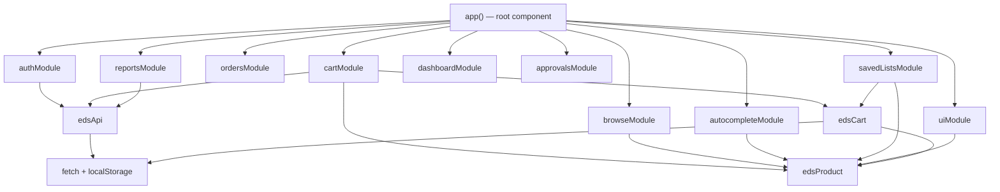
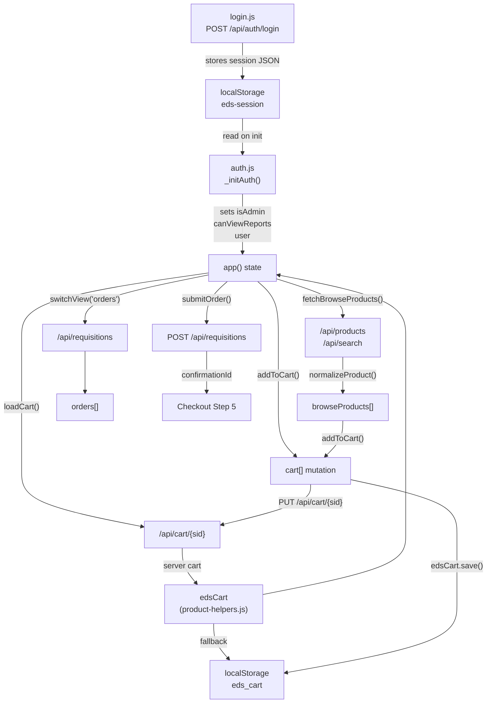
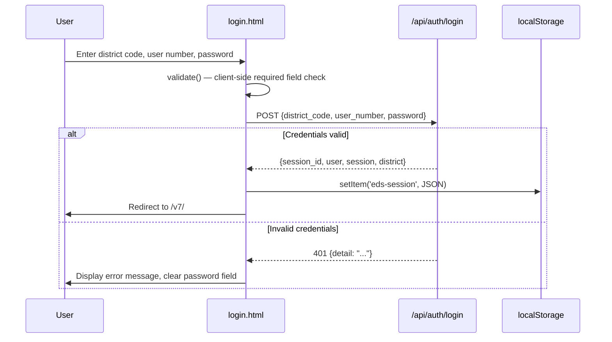
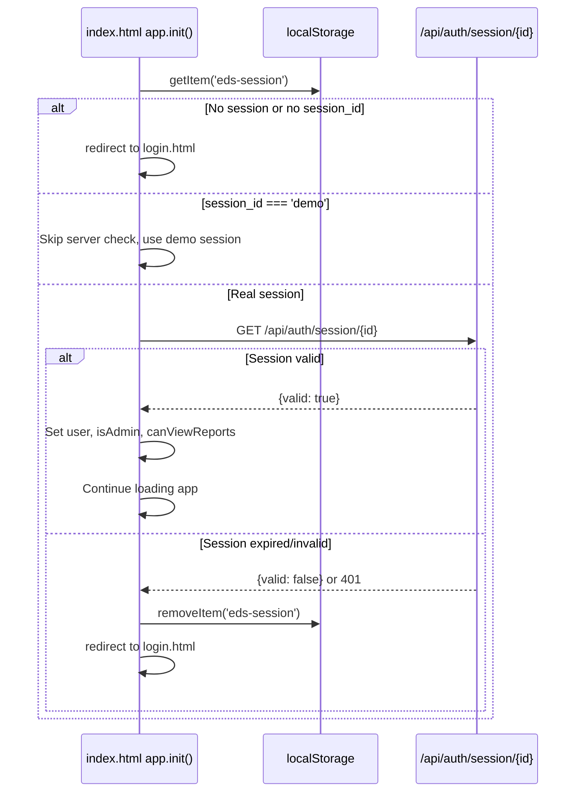
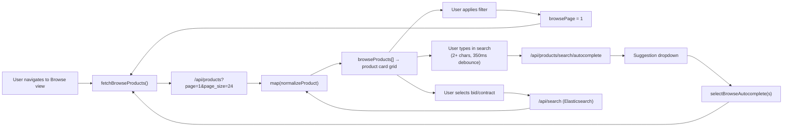
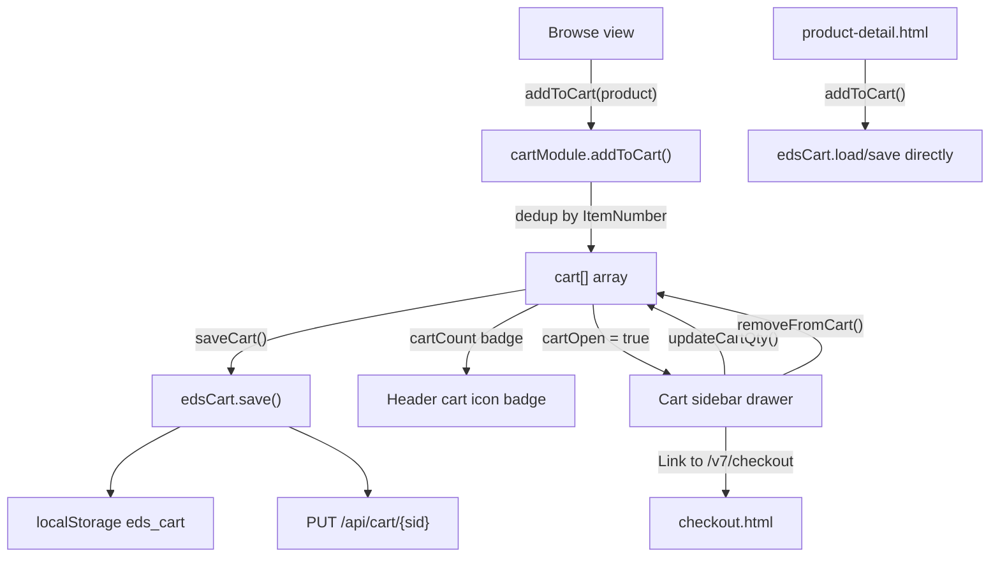
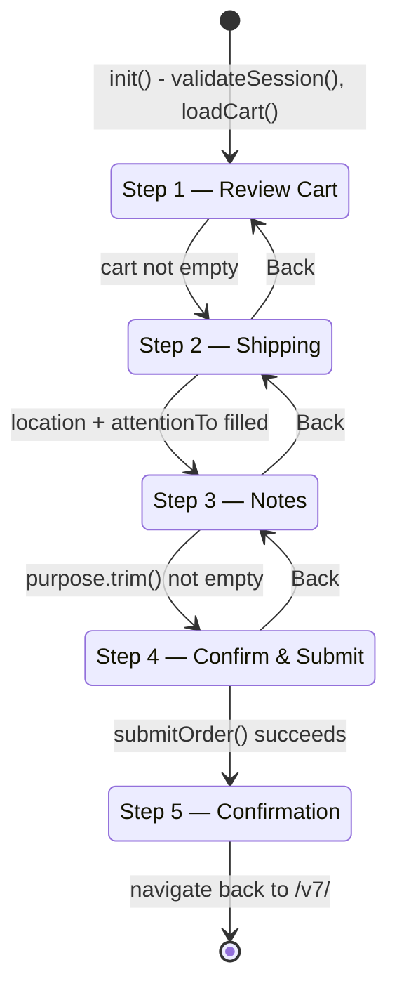
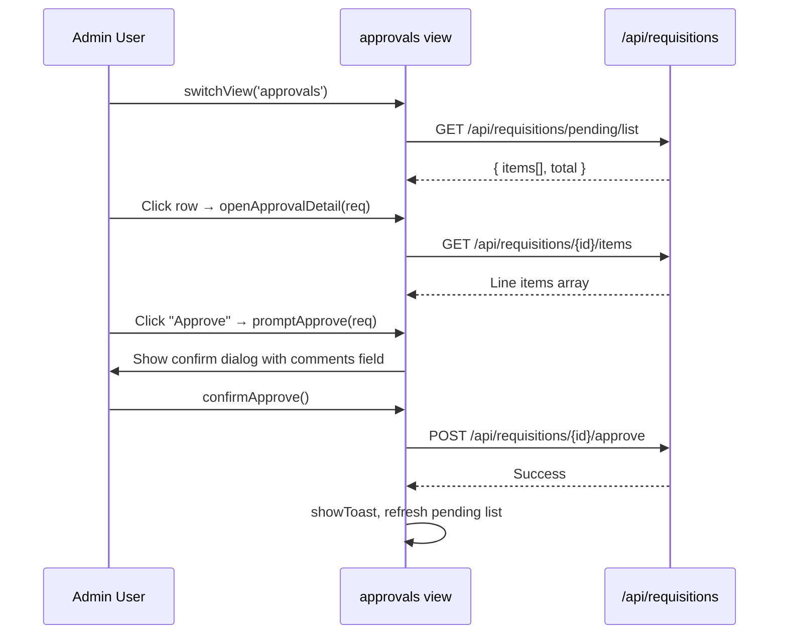

# EDS Frontend Architecture Guide

**Version**: Design System v7
**Framework**: Alpine.js 3.14.8 (CDN)
**Last Updated**: March 2026

---

## Table of Contents

1. [Overview](#overview)
2. [Page Inventory](#page-inventory)
3. [Application Architecture](#application-architecture)
4. [JavaScript Modules](#javascript-modules)
5. [State Management](#state-management)
6. [Authentication Flow](#authentication-flow)
7. [API Client](#api-client)
8. [Cart Persistence Model](#cart-persistence-model)
9. [Product Field Normalization](#product-field-normalization)
10. [CSS and Design System](#css-and-design-system)
11. [Key Workflows](#key-workflows)
12. [Role-Based UI](#role-based-ui)
13. [Performance Patterns](#performance-patterns)
14. [Known Issues and Technical Debt](#known-issues-and-technical-debt)

---

## Overview

The EDS frontend is a multi-page application built with Alpine.js that implements the Universal Requisition System — a K-12 e-procurement interface allowing school staff to browse catalogs, build carts, and submit purchase requisitions.

The architecture is deliberately lightweight: no build step, no bundler, no npm. Every page loads Alpine.js and its companion scripts directly from CDN and from flat `.js` files served by the FastAPI backend. This keeps deployment simple (static files in `/frontend/`) and lets the Python backend serve everything through a single origin, avoiding CORS complexity in production.

### Key Architectural Decisions

**Module composition over stores.** Rather than Alpine's `Alpine.store()` global stores, the main application uses a composition pattern: each concern (auth, cart, browse, orders) is a plain JavaScript function that returns an object. The `app()` root function in `app.js` spreads all these modules together with `...authModule()`, `...cartModule()`, etc. This gives a single flat Alpine component with all state and methods accessible as `this.property`, while keeping the source files organized by concern.

**Dual-mode cart persistence.** The cart is written to both `localStorage` and the server (`PUT /api/cart/{session_id}`) on every mutation. On page load, the server copy is fetched first; `localStorage` is the fallback. This means a user who opens a second browser tab sees the same cart.

**Session in localStorage.** After login, the full session object from `/api/auth/login` is stored as JSON in `localStorage` under the key `eds-session`. Every page reads this key on initialization to validate the session. The session is not stored in a cookie.

**No client-side router.** The main application (`index.html`) uses a single-page pattern internally, but navigation between the main app and the checkout or product-detail pages uses full page navigations (`window.location.href`). There is no history API routing.

---

## Page Inventory

The frontend consists of four HTML pages, each with a distinct role:

| Page | File | Alpine Root Component | Purpose |
|------|------|-----------------------|---------|
| Main Application | `index.html` | `app()` | Browse, dashboard, orders, approvals, reports, saved lists |
| Login | `login.html` | `loginForm()` | Authentication entry point |
| Checkout | `checkout.html` | `checkout()` | Multi-step requisition submission |
| Product Detail | `product-detail.html` | `productDetail()` | Single-product view with add-to-cart |

### index.html

The primary application shell. It hosts a persistent sidebar navigation, a sticky header with global search and cart button, and a content area that switches between views based on `activeView` state. The body element carries `x-data="app()" x-init="init()"`, making the entire page a single Alpine component.

The Alpine Focus plugin (`@alpinejs/focus`) is loaded alongside the core Alpine library to support `x-trap` keyboard focus management in modals and cart drawers.

Views rendered inside the content area (controlled by `x-if="ready && activeView === 'X'"` blocks):

- **dashboard** — Stats, budget progress, approval queue, recent activity
- **browse** — Product catalog with filters, pagination, and autocomplete
- **orders** — User's requisition history with status tabs
- **templates** — Pre-built order templates organized by category
- **savedLists** — User-created named shopping lists (localStorage)
- **approvals** — Admin-only pending requisition review queue
- **reports** — Spending analytics with period selection and CSV/PDF export

### login.html

Standalone page with inline CSS only — it does not load the design system. Uses a centered card layout over an EDS-branded gradient background. The Alpine component (`loginForm()`) handles field validation, the `POST /api/auth/login` call, and redirect to `/v7/` on success. If a valid session already exists in `localStorage`, the page redirects immediately on `init()`.

### checkout.html

A five-step wizard covering: (1) cart review, (2) shipping information, (3) requisition notes, (4) final review, (5) confirmation. Each step is a separate `<div x-show="step === N">` block. The `checkout()` component validates the session via `auth-guard.js` on `init()`, loads the cart from the server, and on step 4 submission posts to `POST /api/requisitions`.

The steps bar only renders for steps 1–4; the confirmation step (5) hides it.

### product-detail.html

Reads the `?id=` URL parameter, fetches the product from `GET /api/products/{id}`, and displays a two-column layout with image placeholder, product metadata, quantity input, and add-to-cart button. Uses `auth-guard.js` for session validation and the shared `edsCart` and `edsProduct` utilities to write to the cart without requiring the full `app()` component.

---

## Application Architecture

### Script Loading Order

Each page defines its own script stack. The order is significant because later scripts depend on earlier ones:

**login.html:**
```
config.js → login.js
```

**checkout.html:**
```
config.js → api-client.js → product-helpers.js → auth-guard.js → checkout.js
```

**product-detail.html:**
```
config.js → api-client.js → product-helpers.js → auth-guard.js → product-detail.js
```

**index.html:**
```
config.js → api-client.js → product-helpers.js →
auth.js → cart.js → browse.js → autocomplete.js → orders.js →
saved-lists.js → ui.js → dashboard.js → approvals.js → reports.js → app.js
```

`app.js` must load last because it references functions from all other module files.

### Module Composition Diagram



### View Switching

Navigation between views is handled by `switchView(view)` in `app.js`. The function sets `activeView` and triggers lazy data loads: the browse view only fetches products on first access, the approvals view re-fetches pending items each time it is opened, and the reports view re-fetches if the period has changed.

```javascript
switchView(view) {
    this.activeView = view;
    if (view === 'browse' && this.browseProducts.length === 0) this.fetchBrowseProducts();
    if (view === 'approvals' && this.isAdmin) this.fetchPendingApprovals();
    if (view === 'reports' && this.canViewReports) this.fetchReportsData();
}
```

---

## JavaScript Modules

### config.js

**File:** `frontend/js/config.js`
**Purpose:** Global constants loaded before all other scripts.

Defines two globals:

- `API_BASE` — Empty string in production (same-origin requests), `window.location.origin` for localhost development. All `fetch` calls in module files prefix URLs with `${API_BASE}` so the code works in both environments.
- `formatPriceShared(val)` — Price formatting function (`$X.XX`) used by standalone pages that cannot access the Alpine `formatPrice()` method.

### api-client.js

**File:** `frontend/js/api-client.js`
**Purpose:** Centralized HTTP client wrapping `fetch` with auth headers, retry logic, and error notifications.

Exposes a singleton `edsApi` object with methods: `get`, `post`, `put`, `del`, `download`, `getSessionId`.

Key behaviors:
- Reads `session_id` from `localStorage('eds-session')` on every call and injects it as `X-Session-ID` header.
- In demo mode (`session_id === 'demo'`), also injects `X-Demo-Approval-Level` from the session object.
- On HTTP 5xx responses, retries up to `MAX_RETRIES = 2` times with exponential backoff (1s, 2s).
- On 4xx responses, does not retry and surfaces `err.detail` or `err.message` via `showToast()`.
- Returns a normalized result object: `{ ok, status, error, data }` — callers check `result.ok` rather than catching exceptions.
- The `download()` helper handles `Content-Disposition` parsing to trigger browser file downloads for CSV and PDF exports.

The global `showToast` is bridged: module code calls `this.showToast()` via Alpine's `this` context, but the api-client file defines a no-op fallback `var showToast = function() {}` for standalone pages where Alpine's `uiModule` is not loaded.

### product-helpers.js

**File:** `frontend/js/product-helpers.js`
**Purpose:** Field-name normalization for products and cart persistence utilities.

Exposes two singleton utility objects:

**`edsProduct`** — Normalizes inconsistent API field names into a stable shape before any product object touches application state. All product objects in `cart`, `browseProducts`, `recentlyViewed`, and saved lists pass through `edsProduct.normalize()`.

| Method | Purpose |
|--------|---------|
| `normalize(p)` | Returns a new object with canonical field names |
| `getId(item)` | Extracts `ItemNumber` from any field variant |
| `getName(item)` | Extracts `Description` from any field variant |
| `getPrice(item)` | Extracts `Price` as a float from any field variant |
| `getVendor(item)` | Extracts `VendorName` from any field variant |

**`edsCart`** — Cart storage and server sync.

| Method | Purpose |
|--------|---------|
| `load()` | Read cart array from `localStorage` |
| `save(cart)` | Write to `localStorage` and PUT to server |
| `loadFromServer()` | Fetch from server, fall back to `localStorage` |
| `itemCount(cart)` | Sum of all `item.quantity` values |
| `total(cart)` | Sum of `price * quantity` for all items |
| `clear()` | Remove from `localStorage` |

### auth-guard.js

**File:** `frontend/js/auth-guard.js`
**Purpose:** Session validation for standalone pages (checkout, product-detail).

Exposes two functions:

- `validateSession(redirectUrl)` — Async. Reads `eds-session` from `localStorage`, calls `GET /api/auth/session/{id}` to verify the session is still valid server-side, and redirects to `redirectUrl` on any failure. Demo sessions (`session_id === 'demo'`) skip the server call. Returns the parsed session object on success, or `null` (after redirect) on failure.
- `getSessionId()` — Synchronous helper to extract `session_id` from `localStorage`.

### auth.js

**File:** `frontend/js/auth.js`
**Purpose:** Authentication state and session lifecycle for the main `app()` component.

Returns `authModule()` which is spread into `app()`. Key state: `user`, `isAdmin`, `canViewReports`, `showUserMenu`.

The module determines admin status by checking `approval_level` from the session object (the canonical EDS indicator — values ≥ 1 grant admin). If `approval_level` is absent, it falls back to `role` string matching (`admin`, `administrator`, `approver`, `manager`).

`_startSessionCheck()` sets a 5-minute interval that first calls `POST /api/auth/session/{id}/touch` (to reset the server-side inactivity timer), then `GET /api/auth/session/{id}` to verify the session is still valid. On failure, it clears the interval, removes the `eds-session` key, and redirects to login.

`logout()` calls `POST /api/auth/logout` before clearing localStorage and redirecting, ensuring the server invalidates the session.

User display name resolution tries multiple field combinations to handle both PascalCase (`FirstName`, `LastName`) and snake_case (`first_name`, `last_name`) variants from different login flows.

### login.js

**File:** `frontend/js/login.js`
**Purpose:** Login page Alpine component.

The `loginForm()` function returns the Alpine component for the login page. Fields: `districtCode` (forced uppercase via `@input` handler), `userNumber`, `password`. The `validate()` method runs client-side required-field checks before posting.

On successful login, the raw API response is stored verbatim in `localStorage('eds-session')` and the user is redirected to `/v7/`. The password field is cleared on both success and failure to prevent it being visible after an error.

### cart.js

**File:** `frontend/js/cart.js`
**Purpose:** Cart mutation operations for the main app component.

Returns `cartModule()`. All mutations go through `saveCart()`, which updates `cartCount` and calls `edsCart.save()`.

`addToCart(product, silent)` deduplicates by `ItemNumber`: if the item is already in the cart, it increments the quantity; otherwise it pushes a new entry. `trackRecentlyViewed()` is called unconditionally on every add. Only `showToast()` is gated by `!silent`.

The `cartTotal` getter is intentionally defined in `app.js` rather than here. Alpine.js flattens getters to static values when spread via `...cartModule()`, so computed getters must be declared on the root object that receives the spread.

### browse.js

**File:** `frontend/js/browse.js`
**Purpose:** Product catalog browsing with filtering and pagination.

Returns `browseModule()`. State includes `browseProducts`, `browsePage`, `browsePageSize` (24), `browseTotal`, `browseTotalPages`, and filter inputs: `browseQuery`, `browseCategory`, `browseVendor`, `browseBidId`, `browseMinPrice`, `browseMaxPrice`, `browseSortBy`.

Key behavior: when `browseBidId` is set, the endpoint switches from `/api/products` to `/api/search` (which queries the Elasticsearch index for bid-specific pricing). This is the only place the ES search endpoint is used from the frontend.

`_buildBrowseParams(page)` assembles query string parameters from the current filter state. Sort-by values like `price_asc` are split on `_` to extract `sort_by=price` and `sort_order=asc`.

`browseLoadMore()` appends to `browseProducts` rather than replacing (infinite scroll pattern used in mobile view). `browseGoToPage(page)` replaces the current product set (paginated list pattern used in desktop view).

Both `browseActiveFilters` (computed active filter chip list) and `browsePageNumbers` (smart page range with ellipsis logic) are getters defined in `app.js` for the spread-compatibility reason described under `cart.js`.

### autocomplete.js

**File:** `frontend/js/autocomplete.js`
**Purpose:** Debounced type-ahead suggestions for both the global header search and the browse panel search.

Returns `autocompleteModule()`. Two independent debounce-and-abort controller pairs handle global and browse contexts separately.

Both use a 350ms debounce and create an `AbortController` per request, cancelling the previous request if the user types again before it completes. Minimum query length is 2 characters.

On selection:
- `selectGlobalAutocomplete(s)` sets `browseQuery`, clears global search, switches to the browse view, and fetches products.
- `selectBrowseAutocomplete(s)` sets `browseQuery` and re-fetches browse results directly.

Both paths call `GET /api/products/search/autocomplete?q=&limit=N`.

### orders.js

**File:** `frontend/js/orders.js`
**Purpose:** Requisition history fetching and detail view.

Returns `ordersModule()`. Fetches from `GET /api/requisitions?session_id={sid}`.

`orderCount` is the count of orders not in terminal states (`Fulfilled`, `Cancelled`, `Rejected`). This value drives the badge on the sidebar Orders nav item.

`openOrderDetail(order)` fetches line items from `GET /api/requisitions/{id}/items?session_id={sid}` and opens a detail panel. The `filteredOrders` getter that drives the status tab filtering lives in `app.js` due to the getter spread limitation.

### approvals.js

**File:** `frontend/js/approvals.js`
**Purpose:** Approval workflow for admin users.

Returns `approvalsModule()`. Only active when `isAdmin` is true. Fetches from `GET /api/requisitions/pending/list` with pagination.

Approve and reject operations use two-step confirmation dialogs (`promptApprove` / `confirmApprove`, `promptReject` / `confirmReject`). The reject flow enforces a minimum 10-character reason string before allowing submission.

The approve action POSTs to `/api/requisitions/{id}/approve` with `session_id` and optional `comments`. The reject action POSTs to `/api/requisitions/{id}/reject` with `session_id` and required `reason` (these are distinct field names). On success, the pending approvals list is refreshed and `showToast()` is called.

`approvalTimeAgo(dateStr)` formats timestamps as relative time strings ("2h ago", "Yesterday") for display in the approval queue.

### saved-lists.js

**File:** `frontend/js/saved-lists.js`
**Purpose:** Named shopping lists stored in localStorage, and template-to-cart operations.

Returns `savedListsModule()`. Saved lists are arrays of product snapshots stored in `localStorage('eds_saved_lists')`. They are not synced to the server.

`saveCurrentList()` snapshots the current cart contents using the canonical `edsProduct` accessors, replacing any existing list with the same name.

`addTemplateToCart(tpl)` handles server-side templates (from `GET /api/templates`). It merges items by `item_code` match — if a template item already exists in the cart, its quantity is incremented rather than adding a duplicate.

### ui.js

**File:** `frontend/js/ui.js`
**Purpose:** Cross-cutting UI utilities: toast notifications, swipe gestures, recently viewed products, price formatting, and product display helpers.

Returns `uiModule()`.

**Toast system:** `showToast(msg, icon, color)` pushes a toast object into `this.toasts` with an auto-dismiss after 3 seconds. The toast stack is capped at 5 concurrent toasts; older ones are dropped. Each toast has a unique `id` counter for stable removal.

**Swipe gestures:** `setupSwipeGestures()` attaches passive touch event listeners to `document`. A swipe right from the left edge (within 30px) opens the mobile sidebar; a swipe left closes it. The 60px threshold prevents accidental triggers.

**Recently viewed:** `trackRecentlyViewed(product)` maintains a 10-item deque in `localStorage('eds_recently_viewed')`, prepending the new item and deduplicating by `ItemNumber`.

**Category icon/color mapping:** `getCategoryIcon(product)` and `getCategoryColor(product)` derive Font Awesome icon classes and hex colors from product category strings, used in product card placeholder images.

**Product URL generation:** `getProductUrl(product)` constructs the `/v7/product-detail.html?id=X` URL for linking to the standalone product detail page.

### dashboard.js

**File:** `frontend/js/dashboard.js`
**Purpose:** Dashboard summary data fetching, budget visualization helpers, and alert management.

Returns `dashboardModule()`. Fetches a single endpoint `GET /api/dashboard/summary` that returns a consolidated payload including: `alerts`, `budget`, `department_budget`, `pending_approvals`, `order_counts`, `approver_info`, `recent_activity`.

**Auto-refresh:** `startDashboardRefresh()` sets a 5-minute polling interval that only fires when `activeView === 'dashboard'`, avoiding unnecessary API calls when the user is on another view.

**Budget visualization:** `budgetBarColor()` returns 3 colors based on spending percentage (primary for < 75%, warning for 75–89%, accent/critical for ≥ 90%). `budgetStatusLabel()` returns 4 labels (Healthy < 50%, On Track 50–75%, Warning 75–90%, Critical ≥ 90%). Identical helper pairs exist for department-level budget (`deptBudgetBarColor`, `deptBudgetStatusLabel`).

**Alert management:** Alerts from the dashboard payload can be dismissed by clicking an X button, which adds their index to `dismissedAlerts`. Approval-related alerts are additionally filtered out for non-admin users via `visibleAlerts()`.

### reports.js

**File:** `frontend/js/reports.js`
**Purpose:** Spending analytics, vendor/category drilldowns, and CSV/PDF export.

Returns `reportsModule()`. Visible to admins and users with `reports_viewer`, `department_head`, or `principal` roles.

**Period selection:** Supports `current` (current budget year), `previous`, `ytd`, and `custom` (date range picker). On period change, `reportsLoaded` is set to false to force a re-fetch.

**Data structure from `/api/reports/summary`:** `summary`, `vendor_spend[]`, `category_spend[]`, `monthly_trend[]`, `recent_orders[]`, `budget_departments[]`.

**Drilldown:** `reportsDrillVendor(vendor)` and `reportsDrillCategory(category)` fetch vendor- or category-specific data from `/api/reports/drilldown/vendor` and `/api/reports/drilldown/category`. The result object is tagged with `._type` so the template can render vendor-specific vs. category-specific content in the same drilldown panel.

**Export:** CSV export calls `GET /api/reports/export?period=X&section=Y` and uses `URL.createObjectURL()` to trigger a download. PDF export follows the same pattern against `GET /api/reports/export/pdf`.

**Formatting helpers:** `reportsFmtCurrency(val)` abbreviates large values (e.g., `$1.2M`, `$450K`). `reportsTrendHeight(val)` and `reportsTrendColor(val)` normalize monthly trend values to CSS height percentages and color intensities for a CSS-only bar sparkline.

### product-detail.js

**File:** `frontend/js/product-detail.js`
**Purpose:** Standalone product detail page component.

The `productDetail()` function returns the Alpine component for `product-detail.html`. It validates the session via `validateSession()`, extracts the `?id=` parameter, and calls `GET /api/products/{id}`.

`addToCart()` reads the cart directly from `edsCart.load()` (bypassing the `app()` component that is not present on this page), mutates it, and writes back with `edsCart.save()`. The button shows a green "Added!" state for 2 seconds via `justAdded` flag.

`goBack()` uses `history.back()` if the referrer is within `/v7`, otherwise navigates to `/v7/`. This preserves browse filter state if the user came from the browse view.

### checkout.js

**File:** `frontend/js/checkout.js`
**Purpose:** Multi-step checkout wizard component.

The `checkout()` function returns the Alpine component for `checkout.html`. Validates session on `init()` and pre-fills `shipping.attentionTo` from `session.first_name` + `session.last_name`.

The `submitOrder()` method builds the requisition payload from cart items (using `edsProduct.getId`, `edsProduct.getPrice`, `edsProduct.getName` accessors), shipping fields, and notes fields, then posts to `POST /api/requisitions` with `X-Session-ID` header. On success, it clears `localStorage('eds_cart')` and advances to step 5 (confirmation).

Location options (`locations[]`) are currently hardcoded. This is a known limitation — they should be fetched from an API or populated from the user's district configuration.

---

## State Management

### Flat Component Model

The main application uses Alpine's `x-data="app()"` on the `<body>` element, making the entire page DOM one Alpine scope. State is read and written via `this.property` in methods. All child elements can reference top-level state directly in template expressions.

Because Alpine spreads module return values as plain object properties, computed properties (JavaScript `get` accessors) do not survive spreading — they become static snapshot values at spread time. The workaround is declaring all getters in the root `app()` function directly, while keeping logic in module helper functions:

```javascript
// In app.js — getter survives spread because it is on the root object
get cartTotal() {
    return edsCart.total(this.cart);  // delegates to shared utility
},

// In app.js — calls browseModule() state via this
get browseActiveFilters() {
    const filters = [];
    if (this.browseCategory) filters.push({ ... });
    ...
}
```

### localStorage Keys

| Key | Content | Written By | Read By |
|-----|---------|-----------|---------|
| `eds-session` | Full login response JSON | `login.js` on success | Every page on init |
| `eds_cart` | Array of cart item objects | `edsCart.save()` | `edsCart.load()`, `edsCart.loadFromServer()` |
| `eds_recently_viewed` | Array of up to 10 product objects | `ui.js` `trackRecentlyViewed()` | `ui.js` `loadRecentlyViewed()` |
| `eds_saved_lists` | Array of saved list objects | `saved-lists.js` | `saved-lists.js` `_initSavedLists()` |

### Data Flow Diagram



---

## Authentication Flow

### Login Sequence



### Session Validation on App Load



### Session Keep-Alive

After successful initialization, `_startSessionCheck()` runs every 5 minutes:

1. `POST /api/auth/session/{id}/touch` — resets the server-side 2-hour inactivity timer
2. `GET /api/auth/session/{id}` — verifies the session is still valid (8-hour maximum age)

If either check fails, the interval is cleared and the user is redirected to login.

### Standalone Page Auth Guard

`checkout.html` and `product-detail.html` use the simpler `validateSession()` function from `auth-guard.js` instead of the full `authModule`. The call happens at the top of each component's `init()` method. If the session is invalid, the function redirects and returns `null`; `init()` checks for null and returns early before loading any page data.

### Demo Mode

A demo persona system allows switching user roles without a real login. Demo sessions use `session_id: 'demo'` and skip the server-side validation calls. Two personas are defined in `app.js`:

```javascript
_demoPersonas: {
    approver: { session_id: 'demo', user: { name: 'Demo Admin', role: 'admin' }, session: { approval_level: 2 }, district: { code: 'DEMO', name: 'Demo District' } },
    teacher:  { session_id: 'demo', user: { name: 'Demo Teacher', role: 'teacher' }, session: { approval_level: 0 }, district: { code: 'DEMO', name: 'Demo District' } }
}
```

Dispatching a `demo-switch` custom event on the app element switches the session and reloads the page.

---

## API Client

### Request Pattern

All requests through `edsApi` receive a consistent result envelope:

```javascript
// On success
{ ok: true,  status: 200, error: null, data: { ... } }

// On HTTP error
{ ok: false, status: 404, error: "Product not found", data: null }

// On network error
{ ok: false, status: 0, error: "Network error...", data: null }
```

Callers check `result.ok` and branch accordingly. The client surfaces error messages automatically via `showToast()` unless the call is made with `{ silent: true }`.

### Auth Header Injection

Every request receives:
- `Content-Type: application/json`
- `X-Session-ID: {session_id}` — the backend's `get_current_user` dependency reads this header

In demo mode, `X-Demo-Approval-Level` is also injected so the backend can simulate role-appropriate responses.

### Retry Behavior

| Scenario | Retry? | Delay |
|----------|--------|-------|
| HTTP 5xx | Yes, up to 2 times | 1s, then 2s |
| HTTP 4xx | No | — |
| Network error | Yes, up to 2 times | 1s, then 2s |
| AbortError | No | — |

### File Download Helper

`edsApi.download(url, defaultFilename)` handles blob responses by:
1. Fetching the URL with auth headers
2. Converting the response to a blob
3. Creating a temporary `<a>` element with `URL.createObjectURL(blob)`
4. Extracting the filename from the `Content-Disposition` response header
5. Programmatically clicking the link and revoking the object URL

This pattern is used by standalone pages (checkout, product-detail) for file downloads. The reports module does not use `edsApi.download()` — it makes direct `fetch()` calls with custom headers and handles blob/URL creation inline.

---

## Cart Persistence Model

The cart uses a write-through local-first persistence strategy:

```
User action → cart[] mutation → localStorage write → server PUT (async)
```

On page load, the server copy is fetched first and used if non-empty; otherwise the local copy is used. This gives resilience against temporary server connectivity issues while keeping carts synchronized across browser tabs and devices when the server is available.

```javascript
// edsCart.loadFromServer() — server-first with localStorage fallback
async loadFromServer() {
    const localCart = this.load();                           // read localStorage
    const sid = edsApi.getSessionId();
    if (!sid) return localCart;                             // no session = local only

    try {
        const r = await fetch('/api/cart/' + sid);
        if (r.ok) {
            const d = await r.json();
            if (d.cart && d.cart.length) {
                localStorage.setItem(STORAGE_KEY, JSON.stringify(d.cart));
                return d.cart;                              // server copy wins
            }
        }
    } catch { /* network error */ }
    return localCart;                                       // fall back to local
}
```

On logout, `localStorage.removeItem('eds_cart')` is called explicitly. The server cart is not cleared on logout; this is intentional — a returning user recovers their cart from the server.

---

## Product Field Normalization

A long-standing inconsistency in the EDS backend means the same product concept appears under different field names depending on which API endpoint returned it. The `edsProduct.normalize()` function is the single point of truth for resolving these differences.

### Field Name Mapping

| Canonical Frontend Field | Products API (`/api/products`) | Search API (`/api/search`) | Cart API | Notes |
|--------------------------|-------------------------------|---------------------------|----------|-------|
| `ItemNumber` | `id` | `id` | `ItemNumber` or `item_number` | Primary identifier |
| `Description` | `name` | `name` | `Description` or `name` | Display name |
| `Price` | `unit_price` | `unit_price` | `Price`, `price`, or `UnitPrice` | Three possible names |
| `VendorName` | `vendor` | `vendor` | `vendor` or `VendorName` | |
| `category` | `category` | `category` | `category` | |
| `unit_of_measure` | `unit_of_measure` | `unit_of_measure` | N/A | |

The root cause is that the Cart API stores whatever object shape the frontend sends (the backend `CartPayload.cart` is `List[dict]` with no validation). The short-term fix documented in `frontend/FIELD_NAMING_MAP.md` is to normalize on the frontend before storing; the long-term fix is backend schema enforcement.

### Usage Pattern

```javascript
// Correct — normalize before storing in state
this.browseProducts = (d.products || []).map(p => this.normalizeProduct(p));

// Correct — use accessor to read from any cart item
const price = edsProduct.getPrice(item);   // handles Price, price, UnitPrice, unit_price

// Incorrect — direct field access is unreliable across API sources
const price = item.Price;  // may be undefined if item came from search API
```

---

## CSS and Design System

### Design System Architecture

The design system is implemented as `frontend/css/design-system.css` — a single CSS file loaded by all pages except `login.html` (which uses inline styles). It is named "Design System v7" and uses CSS custom properties (variables) as design tokens throughout.

There is no build step. There is no Tailwind CDN — the class names in the HTML look utility-like but are all defined manually in the design system file. This was a deliberate choice to avoid the CDN overhead of a full Tailwind distribution and to keep all styles auditable in a single file.

### Brand Colors

EDS brand colors are expressed as full 50–900 scales:

| Token | Hex | Usage |
|-------|-----|-------|
| `--color-primary-500` | `#1c1a83` | EDS Navy — primary buttons, sidebar brand, prices, focus rings |
| `--color-secondary-400` | `#4a4890` | EDS Indigo — secondary UI elements, hover states |
| `--color-accent-500` | `#b70c0d` | EDS Red — errors, rejection states, destructive actions, cart badge |
| `--color-success-500` | `#28a745` | Approved states, healthy budget, submit button |
| `--color-warning-500` | `#f59e0b` | Pending states, budget warning |

The shorthand `--eds-primary` maps to `--color-primary-500` and is used in JavaScript `showToast()` calls.

### Typography

Two font families loaded from Google Fonts:
- **DM Sans** — `--font-display` — Used for headings (`h1`–`h6`), brand names, section titles, card headers
- **Inter** — `--font-body` — Used for all body text, inputs, buttons, badges

Monospace (`--font-mono`) is declared as JetBrains Mono / Fira Code but not loaded externally; it falls back to system monospace. Used only for SKU/item number display.

Font sizes are defined as named scale variables (`--text-xs` through `--text-5xl`) rather than raw `rem` values, allowing consistent size references across HTML and CSS.

### Component Classes

Key reusable component classes defined in the design system:

| Class | Purpose |
|-------|---------|
| `.btn`, `.btn-primary`, `.btn-ghost`, `.btn-sm`, `.btn-icon` | Button variants |
| `.card`, `.card-interactive` | Card containers |
| `.input`, `.input-icon-wrapper` | Form inputs |
| `.badge`, `.badge-primary`, `.badge-success`, `.badge-warning`, `.badge-accent`, `.badge-neutral` | Status badges |
| `.avatar`, `.avatar-sm`, `.avatar-md` | User initials avatars |
| `.product-card`, `.product-card-body`, `.product-card-footer` | Product grid card |
| `.product-list-item` | Product list row |
| `.sidebar`, `.sidebar-nav-item`, `.sidebar-section-label` | Sidebar navigation |
| `.app-layout`, `.main-content`, `.top-header`, `.page-content` | App shell layout |
| `.autocomplete-dropdown`, `.autocomplete-item` | Search autocomplete |
| `.spinner` | Loading indicator |
| `.modal-content-responsive` | Modal dialogs |

### Z-Index Scale

Layers are managed through tokens to prevent stacking conflicts:

```
--z-base: 1       (default content)
--z-dropdown: 100  (autocomplete, user menu)
--z-sticky: 200    (sidebar, top header)
--z-overlay: 300   (modal backdrop)
--z-modal: 400     (modal dialog)
--z-popover: 500   (popovers)
--z-toast: 600     (toast notifications)
--z-tooltip: 700   (tooltips)
```

### Responsive Layout

The sidebar is `position: fixed; width: 260px` on desktop. On mobile, it is translated off-screen by default and toggled by `mobileMenuOpen` state. The `setupSwipeGestures()` function enables swipe-to-open from the left edge.

The `main-content` area has `margin-left: 260px` on desktop and `margin-left: 0` with the sidebar overlapping on mobile.

Product grids use CSS `auto-fit` columns with `minmax(220px, 1fr)`, naturally reflowing on narrow viewports.

---

## Key Workflows

### Product Browsing



**Filter options available:**
- Category (dropdown from `GET /api/categories`)
- Vendor (dropdown from `GET /api/vendors`)
- Contract/Bid (dropdown from `GET /api/bids?active_only=true`)
- Free-text search (query parameter)
- Price range (min/max)
- Sort by name, price ascending, price descending

Active filters are shown as removable chips above the product grid, using `browseActiveFilters` computed getter.

### Cart Management



The cart drawer is a sliding panel controlled by `cartOpen` boolean state. It shows cart items, quantity controls, totals, and a "Proceed to Checkout" link that navigates to `checkout.html`.

### Checkout Wizard



Form validation is inline: the "Next" button is `disabled` when required fields are empty, using Alpine `:disabled` bindings rather than a separate validate call. The only procedural validation is in step 3 (purpose min-length) and the reject dialog (10-character minimum reason).

### Approval Workflow



---

## Role-Based UI

Role determination happens in `authModule._initAuth()` and produces two boolean flags: `isAdmin` and `canViewReports`.

| Role Indicator | isAdmin | canViewReports |
|----------------|---------|----------------|
| `approval_level >= 1` (from session) | true | true |
| role = `admin` or `administrator` or `approver` or `manager` | true | true |
| role = `reports_viewer` or `department_head` or `principal` | false | true |
| Any other role (e.g., `teacher`) | false | false |

These flags control:
- Sidebar: Admin section and Approvals nav item only render with `x-if="isAdmin"`
- Sidebar: Reports nav item renders with `x-if="canViewReports"`
- Sidebar badges: Pending approval count badge only renders when `pendingApprovalCount > 0 && isAdmin`
- Dashboard: Approval queue card only renders when `isAdmin && dashboardApproverInfo`
- Dashboard: Approval-related alerts filtered for non-admins in `visibleAlerts()`
- User menu: Shows "Administrator" or "User" based on `isAdmin`

---

## Performance Patterns

### Debouncing and Abort Controllers

Autocomplete uses 350ms debounce + `AbortController` to cancel stale requests. Without the abort controller, a fast typer could receive suggestions out of order as earlier slow responses arrive after later fast ones.

```javascript
browseAutocomplete() {
    clearTimeout(this.browseAutocompleteTimer);
    if (this._browseAbort) { this._browseAbort.abort(); this._browseAbort = null; }
    this.browseAutocompleteTimer = setTimeout(() => {
        this._doBrowseAutocomplete(q);
    }, 350);
}
```

### Lazy View Loading

Data is fetched only when a view is first accessed, not on app initialization. `fetchBrowseProducts()` runs only when the user navigates to browse (and only if `browseProducts.length === 0`). `fetchPendingApprovals()` runs each time approvals is opened (to always show current data). `fetchReportsData()` caches with `reportsLoaded` flag and re-fetches only on period change.

### Parallel Data Fetching

The main `fetchData()` function in `app.js` runs multiple fetches in parallel via `Promise.all`:

```javascript
await Promise.all([
    this.fetchProducts(),
    this.fetchVendors(),
    this.fetchCategories(),
    this.fetchOrders(),
    this.fetchBids(),
    this.fetchDashboardSummary()
]);
```

### Dashboard Polling

The dashboard auto-refreshes every 5 minutes via `setInterval`, but only if `activeView === 'dashboard'` — polling stops when the user navigates away and resumes when they return. Similarly, the session check runs every 5 minutes regardless of view.

### Loading States

Alpine `x-cloak` hides the entire body until Alpine initializes, preventing flash of unstyled template syntax. The app renders a spinner while `ready === false` (during the auth + initial data fetch phase). Individual data sections use skeleton shimmer placeholders while loading.

---

## Known Issues and Technical Debt

### Cart Field Name Inconsistency

The Cart API (`PUT/GET /api/cart/{session_id}`) stores and returns items in whatever shape was POSTed. This means a cart built from browse products has different field names than a cart built from a template. The frontend works around this with `edsProduct.normalize()` on every read, but the fix is incomplete — the checkout page accesses `item.Description` and `item.Price` directly in some template expressions rather than always using the helper functions.

**See:** `frontend/FIELD_NAMING_MAP.md`

### Getter Spread Limitation

Alpine.js `x-data` with object spreading loses computed getters. The workaround (declaring getters in `app.js`) is functional but creates a coupling — module files contain comments like `// NOTE: cartTotal getter lives in app.js`. Adding new computed properties requires remembering to put them in `app.js`, not in the module file where the related state lives.

### Hardcoded Checkout Locations

The `locations[]` array in `checkout.js` is hardcoded with five generic school building types. Real districts need their specific buildings and delivery addresses populated. This should be fetched from `/api/locations` or derived from the district record on session.

### Template API Direct Fetch

In `app.js`, `fetchTemplates()` and `saveCartAsTemplate()` use `fetch()` directly rather than going through `edsApi`. This bypasses the retry logic and auth header injection from the API client. These should be migrated to `edsApi.get()` and `edsApi.post()`.

### Error Handling Inconsistency

Most modules surface errors via `showToast()`. The `submitOrder()` function in `checkout.js` falls back to `alert()` on error because the checkout page runs outside the `app()` component that provides `showToast`. A local toast implementation should be added to the checkout page.

### No CSRF Protection

The application relies entirely on `X-Session-ID` header for request authentication. Since `localStorage` is not accessible by cross-origin scripts and the API checks the header (not a cookie), CSRF is not a practical risk in the current architecture. However, if session handling ever migrates to HttpOnly cookies, CSRF protection would need to be added.

### Product Images

No product images are displayed anywhere in the application. Product cards and the detail page show Font Awesome icon placeholders colored by category. The `product-card-image` CSS class and `` handling in the design system are defined but not exercised because the backend does not return image URLs in product API responses.
